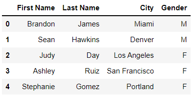
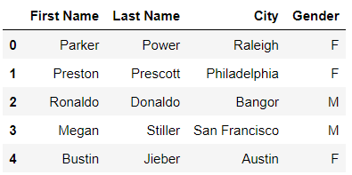

# Chapter 11. 가져오기와 내보내기


## 01. JSON


### 1.1 불러오기


### 데이터셋

* 노벨상 수상자
* JSON은 다음과 같이 구성되있다
  * 최상위 "prizes"
  * "year", "category", ("laureates", "overallMotivation")
  * "laureates", "overallMotivation"는 있는 경우가 있고 없는 경우가 있다
  * "laureates"는 리스트를 값으로 가진다

```
{
  "prizes": [
    {
      "year": "2019",
      "category": "chemistry",
      "laureates": [
        {
          "id": "976",
          "firstname": "John",
          "surname": "Goodenough",
          "motivation": "\"for the development of lithium-ion batteries\"",
          "share": "3"
        }
      ]
    },
```

```
{
	"year": "1972",
    "category": "peace",
    "overallMotivation": "\"No Nobel Prize was awarded this year. The prize money 		for 1972 was allocated to the Main Fund.\""
},
```


```python
nobel = pd.read_json('nobel.json')
nobel.head()
```


### (예시1)

* 중첩된 데이터 레코드를 단일 1차원 리스트로 변형하는 과정을 평탄화(flattening) 또는 정규화(normalizing)이라고 한다. 
* json_normalize 메서드가 있다. nobel DataFrame에서 딕셔너리를 하나 뽑아서 정규화를 해보자

```python
chemistry_2019 = nobel.loc[0, 'prizes']
chemistry_2019
```

```
{'year': '2019',
 'category': 'chemistry',
 'laureates': [{'id': '976',
   'firstname': 'John',
   'surname': 'Goodenough',
   'motivation': '"for the development of lithium-ion batteries"',
   'share': '3'},
  {'id': '977',
   'firstname': 'M. Stanley',
   'surname': 'Whittingham',
   'motivation': '"for the development of lithium-ion batteries"',
   'share': '3'},
  {'id': '978',
   'firstname': 'Akira',
   'surname': 'Yoshino',
   'motivation': '"for the development of lithium-ion batteries"',
   'share': '3'}]}
```


```python
pd.json_normalize(data = chemistry_2019)
```


* record_path 매개변수는 중첩된 레코드를 정규화할 수 있다

```python
pd.json_normalize(data = chemistry_2019, record_path = 'laureates')
```


* 판다스는 중첩된 'laureates' 딕셔너리를 새로운 열로 확장했지만 이번에는 기존의 year와 category 열이 사라졌다.이러한 최상위 키-값 쌍을 유지하려면 이름을 담은 리스트를 meta라는 매개변수에 전달해야 한다

```python
pd.json_normalize(
    data = chemistry_2019,
    record_path = 'laureates',
    meta = ['year', 'category']
)
```


### (예시2)

* 한 행이 아니라 전체 열에 적용해보자

```python
pd.json_normalize(
    data = nobel['prizes'],
    record_path = 'laureates',
    mata = ['year', 'category']
)
```

```
KeyError
```


* 판다스는 KeyError 예외를 발생시킨다. prized Series에 있는 딕셔너리 중 일부는 'laureates'라는 키가 없기 때문이다

* 딕셔너리에 laureates 키가 없으면 setdefault 메서드를 사용하여 빈 리스트를 값으로 갖는 키를 추가힌다

```python
def add_laureates_key(entry):
    entry.setdefault('laureates', [])
    
nobel['prizes'].apply(add_laureates_key)
```

```
0      None
1      None
2      None
3      None
4      None
       ... 
641    None
642    None
643    None
644    None
645    None
Name: prizes, Length: 646, dtype: object
```


```
pd.json_normalize(
    data = nobel['prizes'],
    record_path = 'laureates',
    mata = ['year', 'category']
)
```


### (정리)


|      메서드      |         설명         |
| :--------------: | :------------------: |
|   read_json()    | JSON 파일을 가져온다 |
| json_normalize() |     JSON 정규화      |
|   setdefault()   |   디폴트 값을 생성   |

* json_normalize()

|  매개변수   |                        설명                        |
| :---------: | :------------------------------------------------: |
|    data     |                                                    |
| record_path |               중첩된 레코드를 정규화               |
|    mata     | record_path 사용시, 기존  열 중 유지하려는 열 지정 |


### 1.2 내보내기


### 데이터셋

* 노벨상 수상자(winners)


### (예시)

* orient 매개변수는 데이터를 변환하는 형식을 사용자 정의한다


* 키-값으로 구성된 JSON

```python
winners.head(2).to_json(orient = 'records')
```

```
'[{"id":"976","firstname":"John","surname":"Goodenough","motivation":"\\"for the development of lithium-ion batteries\\"","share":"3","year":"2019","category":"chemistry"},{"id":"977","firstname":"M. Stanley","surname":"Whittingham","motivation":"\\"for the development of lithium-ion batteries\\"","share":"3","year":"2019","category":"chemistry"}]'
```


* 별도의 열, 인덱스와 데이터 키가 있는 딕셔너리

```py
winners.head(2).to_json(orient = 'split')
```

```
'{"columns":["id","firstname","surname","motivation","share","year","category"],"index":[0,1],"data":[["976","John","Goodenough","\\"for the development of lithium-ion batteries\\"","3","2019","chemistry"],["977","M. Stanley","Whittingham","\\"for the development of lithium-ion batteries\\"","3","2019","chemistry"]]}'
```


* JSON 파일의 이름을 to_json 메서드의 첫번째 인수로 전달한다

```python
winners.to_json('winners.json', orient = 'records')
```


### (정리)

|  메서드   |         설명         |
| :-------: | :------------------: |
| to_json() | JSON 파일을 내보낸다 |

| 매개변수 |          설명          |
| :------: | :--------------------: |
|  orient  | 데이터를 변환하는 형식 |


## 02. CSV


### 1.1 불러오기


### (예시)

* URL을 read_csv 메서드에 첫번째  인수로 전달해도 좋다. 판다스는 자동으로 데이터셋을 받아서 DataFrame으로 가져옵니다. 실시간 데이터를 분석해야 하는 경우 유용하다

```python
url = 'https://data.cityofnewyork.us/resource/25th-nujf.csv'
baby_names = pd.read_csv(url)
baby_names.head()
```


### 1.2 내보내기


### (예시)

```python
baby_names.head(10).to_csv()
```

```
',brth_yr,gndr,ethcty,nm,cnt,rnk\r\n0,2019,FEMALE,ASIAN AND PACIFIC ISLANDER,Chloe,131,1\r\n1,2019,FEMALE,ASIAN AND PACIFIC ISLANDER,Olivia,109,2\r\n2,2019,FEMALE,ASIAN AND PACIFIC ISLANDER,Mia,88,3\r\n3,2019,FEMALE,ASIAN AND PACIFIC ISLANDER,Sophia,71,4\r\n4,2019,FEMALE,ASIAN AND PACIFIC ISLANDER,Emma,71,4\r\n5,2019,FEMALE,ASIAN AND PACIFIC ISLANDER,Amelia,60,5\r\n6,2019,FEMALE,ASIAN AND PACIFIC ISLANDER,Charlotte,57,6\r\n7,2019,FEMALE,ASIAN AND PACIFIC ISLANDER,Emily,53,7\r\n8,2019,FEMALE,ASIAN AND PACIFIC ISLANDER,Grace,48,8\r\n9,2019,FEMALE,ASIAN AND PACIFIC ISLANDER,Isabella,43,9\r\n'
```


* index 매개변수에 False를 전달하며 인덱스를 제외할 수 있다
* 각 \n 기호 뒤의 숫자 값(0, 1, 2 등)에 주목하자

``` python
baby_names.head(10).to_csv(index = False)
```

```
'brth_yr,gndr,ethcty,nm,cnt,rnk\r\n2019,FEMALE,ASIAN AND PACIFIC ISLANDER,Chloe,131,1\r\n2019,FEMALE,ASIAN AND PACIFIC ISLANDER,Olivia,109,2\r\n2019,FEMALE,ASIAN AND PACIFIC ISLANDER,Mia,88,3\r\n2019,FEMALE,ASIAN AND PACIFIC ISLANDER,Sophia,71,4\r\n2019,FEMALE,ASIAN AND PACIFIC ISLANDER,Emma,71,4\r\n2019,FEMALE,ASIAN AND PACIFIC ISLANDER,Amelia,60,5\r\n2019,FEMALE,ASIAN AND PACIFIC ISLANDER,Charlotte,57,6\r\n2019,FEMALE,ASIAN AND PACIFIC ISLANDER,Emily,53,7\r\n2019,FEMALE,ASIAN AND PACIFIC ISLANDER,Grace,48,8\r\n2019,FEMALE,ASIAN AND PACIFIC ISLANDER,Isabella,43,9\r\n'
```


* columns 매개변수에 리스트를 전달하여 내보낼  열을 지정할 수 있다 

```python
baby_names.to_csv(
    'NYC_Baby_Names.csv',
    index = False,
    columns = ['gndr', 'nm', 'cnt']
)
```


## 03. 엑셀

* 판다스는 엑셀과 상호작용하려면 xlrd와 openpyxl 라이브러리가 필요하다


## 3.1 가져오기


### (예시1)

* 워크시트가 하나인 경우

```python
pd.read_excel('Single Worksheet.xlsx')
```




```python
pd.read_excel(
    io = 'Single Worksheet.xlsx',
    usecols = ['City', 'First Name', 'Last Name'],
    index_col = 'City'
)
```


### (예시2)

* 워크시트가 여러 개인 경우


* Multiple Worksheets.xlsx 통합문서를 보면 Data 1, Data 2, Data 3이라는 세 가지 워크시트가 있다. 기본적으로 판다스는 통합문서의 첫번째 워크시트만 가져온다

```python
pd.read_excel('Multiple Worksheets.xlsx')
```


* 특정 워크시트의 인덱스 위치나 이름을 sheet_name 매개변수에 전달하여 특정 워크시트를 가져올 수도 있습니다

```python
# 다음 두 줄은 결과가 동일합니다.
pd.read_excel('Multiple Worksheets.xlsx', sheet_name = 0)
pd.read_excel('Multiple Worksheets.xlsx', sheet_name = 'Data 1')
```


* 여러 장을 가져올 경우, 딕셔너리로 반환한다

```python
pd.read_excel(
    'Multiple Worksheets.xlsx',
    sheet_name = ['Data 1', 'Data 3']
)
```

```
{'Data 1':   First Name Last Name           City Gender
 0    Brandon     James          Miami      M
 1       Sean   Hawkins         Denver      M
 2       Judy       Day    Los Angeles      F
 3     Ashley      Ruiz  San Francisco      F
 4  Stephanie     Gomez       Portland      F,
 'Data 3':   First Name  Last Name     City Gender
 0     Robert     Miller  Seattle      M
 1       Tara     Garcia  Phoenix      F
 2    Raphael  Rodriguez  Orlando      M}
```


* 모든 워크시트를 가져오려면 sheet_name 매개변수에 인수로 None을 전달한다

```python
workbook = pd.read_excel(
    'Multiple Worksheets.xlsx', sheet_name = None
)

workbook
```

```
{'Data 1':   First Name Last Name           City Gender
 0    Brandon     James          Miami      M
 1       Sean   Hawkins         Denver      M
 2       Judy       Day    Los Angeles      F
 3     Ashley      Ruiz  San Francisco      F
 4  Stephanie     Gomez       Portland      F,
 'Data 2':   First Name Last Name           City Gender
 0     Parker     Power        Raleigh      F
 1    Preston  Prescott   Philadelphia      F
 2    Ronaldo   Donaldo         Bangor      M
 3      Megan   Stiller  San Francisco      M
 4     Bustin    Jieber         Austin      F,
 'Data 3':   First Name  Last Name     City Gender
 0     Robert     Miller  Seattle      M
 1       Tara     Garcia  Phoenix      F
 2    Raphael  Rodriguez  Orlando      M}
```


* 워크시트에 접근하려면 딕셔너리의 키에 접근하면 된다

```python
workbook['Data 2']
```




### 3.2 내보내기


### 데이터셋

* baby_names


```python
girls = baby_names[baby_names['gndr'] == 'FEMALE']
boys = baby_names[baby_names['gndr'] == 'MALE']
```


### (예시)

```python
excel_file = pd.ExcelWriter('Baby_Names.xlsx')
```


* to_excel 메서드의 첫번째 매개변수 excel_writer는 ExcelWriter 객체를 전달 받는다. 메서드의 sheet_name 매개변수는 워크시트의 이름을 문자열로 받는다. 마지막으로 index 매개변수에 인수로 False를 전달하여 DataFrame의 인덱스를 제외할 수 있다.

```python
girls.to_excel(
    excel_writer = excel_file, sheet_name = 'Girls', index = False
)
```


* 열의 하위 집합만 내보내려면 columns 매개변수에 사용자 정의 리스트를 전달한다. 

```python
boys.to_excel(
    excel_file,
    sheet_name = 'Boys',
    index = False,
    columns = ['nm', 'cnt', 'rnk']
)
```

```python
excel_file.save()
```

