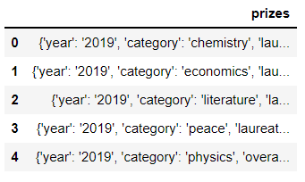
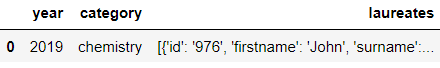
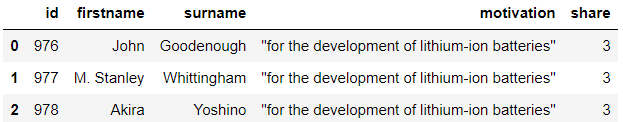
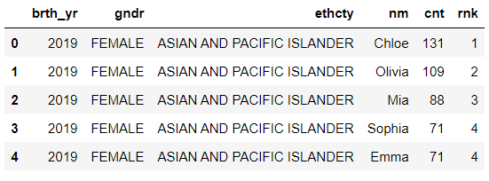
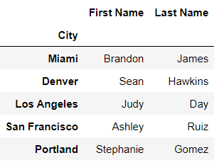
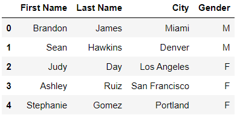

# Chapter 11. 날짜 및 시간 다루기


## 01. Timestamp 객체


### 1.1 파이썬의 날짜/시간

```python
import datetime as dt
import pandas as pd
```


- date 모듈은 하나의 날짜를 모델링합니다. 객체는 시간을 저장하지 않습니다. date 클래스의 생성자는 년, 월, 일의 순서대로 year, month, day 매개변수를 받을 수 있습니다. 모든 매개 변수에는 정수 인수를 넣어야합니다.

```python
# 다음 두 줄은 결과가 동일합니다.
birthday = dt.date(1991, 4, 12)
birthday = dt.date(year = 1991, month = 4, day = 12)
birthday
```

```
datetime.date(1991, 4, 12)
```

- date 객체는 생성자의 인수를 속성으로 저장합니다. year, month, day 속성을 사용하여 해당 값에 접근할 수 있습니다.

```python
birthday.year
```

```
1991
```

```python
birthday.month
```

```
4
```

```python
birthday.day
```

```
12
```

- date 객체는 불변 객체로 생성한 후에는 내부 상태를 변경할 수 없습니다. date의 속성을 덮어 쓰려고 하면 파이썬은 AttributeError 예외를 발생시킵니다

```python
birthday.month = 10
```

```
AttributeError
```


- date와 대응하는 time 클래스는 하루 중 특정 시간을 모델링합니다. 날짜는 중요하지 않습니다. time의 생성자의 처음 세 매개변수는 순서대로 시, 분, 초를 나타내는 hour, minute, second이며 인수 유형은 정수입니다. date 객체와 마찬가지로 time 객체는 변경할 수 없습니다.

```python
# 다음 두 줄을 결과가 동일합니다.
alarm_clock = dt.time(6, 43, 25)
alarm_clock = dt.time(hour = 6, minute = 43, second = 25)
alarm_clock
```

```
datetime.time(6, 43, 25)
```

- 세 매개변수의 기본 인수는 모두 0입니다. 인수 없이 time 객체를 인스턴스화하면 자정(오전 12:00:00, 0시 0분 0초)을 나타냅니다

```python
dt.time()
```

```
datetime.time(0, 0)
```

- 다음 예제에서는 minute 매개변수에는 값을 전달하지 않습니다. time 객체는 minute 값을 0으로 대체합니다.

```python
dt.time(hour = 9, second = 42)
```

```
datetime.time(9, 0, 42)
```

- time 생성자는 24시간제를 사용합니다. 오후 또는 저녁 시간을 나타내고 싶다면 12보다 크거나 같은 시간 값을 전달해야 합니다.

```python
dt.time(hour = 19, minute = 43, second = 22)
```

```
datetime.time(19, 43, 22)
```

- time 객체는 생성자의 인수를 객체의 속성으로 저장합니다. hour, minute, second 속성을 사용하여 해당 값에 접근할 수 있습니다.

```python
alarm_clock.hour
```

```
6
```

```python
alarm_clock.minute
```

```
43
```

```python
alarm_clock.second
```

```
25
```


- datetime객체는 날짜와 시간을 모두 포함합니다.

```python
# 다음 두 줄은 결과가 동일합니다.
moon_landing = dt.datetime(1969, 7, 20, 22, 56, 20)
moon_landing = dt.datetime(
    year = 1969,
    month = 7,
    day = 20,
    hour = 22,
    minute = 56,
    second = 20
)

moon_landing
```

```
datetime.datetime(1969, 7, 20, 22, 56, 20)
```

- year, month, day 매개변수는 필수 항목입니다. 시간과 관련된 속성은 선택사항이며 기본값은 0입니다.

```python
dt.datetime(2020, 1, 1)
```

```
datetime.datetime(2020, 1, 1, 0, 0)
```


- datetime 모듈에서 마지막으로 주목할만한 객체는 시간차를 모델링하는 timedelta입니다. 생성자의 매개변수에는 weeks, days, hours가 있습니다. 모든 매개변수는 선택사항이며 기본값은 0입니다. 생성자는 시간의 길이를 합하여 총 시간을 계산합니다.

```python
dt.timedelta(
    weeks = 8,
    days = 6,
    hours = 3,
    minutes = 58,
    seconds = 12
)
```

```
datetime.timedelta(days=62, seconds=14292)
```


### 1.2 판다스의 날짜/시간

- 파이썬의 datetime 모듈은 몇 가지 아쉬운 점이 있습니다.
  - 날짜/시간을 다루려면 많은 수의 모듈을 알아야 합니다. 여기서는 datetime만 소개했지만 달력, 시간변환. 유틸리티 기능 등 추가 모듈을 사용할 수 있습니다.
  - 기억해야하는 클래스가 많습니다.
  - 시간대 로직을 위한 어려운 객체 API를 알아야 합니다.
- 판다스는 파이썬의 datetime 객체를 대체하기 위해 Timestamp 객체를 도입했습니다. Timestamp와 datetime 객체는 형제라고 볼 수 있습니다. 메서드에 인수에 전달하는 것처럼 두 객체는 판다스 생태계에서 상황에 따라 서로 바꿔서 사용할 수 있습니다. Series가 파이썬의 리스트를 확장한 것처럼 Timestamp는 기본 datetime 객체에 몇 가지 기능을 추가한 객체입니다.
- Timestamp 생성자는 판다스의 최상위 수준에서 사용할 수 있으며 datetime 생성자와 매개변수가 동일합니다. 날짜와 관련된 세 가지 매개변수(년, 월, 일)가 필요합니다. 시간과 관련된 매개변수는 선택사항이며 기본값은 0입니다.

```python
# 다음 두 줄은 결과가 동일합니다.
pd.Timestamp(1991, 4, 12)
pd.Timestamp(year = 1991, month = 4, day = 12)
```

```
Timestamp('1991-04-12 00:00:00')
```

- 판다스는 두 객체가 동일한 정보를 저장하는 경우 Timestamp를 date의 datetime과 같다고 간주합니다.

```python
(pd.Timestamp(year = 1991, month = 4, day = 12) == dt.date(year = 1991, month = 4, day = 12))
```

```
True
```

```python
(pd.Timestamp(year = 1991, month = 4, day = 12, minute = 2) == dt.datetime(year = 1991, month = 4, day = 12, minute = 2))
```

```
True
```

- 날자 또는 시간이 다르다면 두 객체는 동일하지 않습니다.

```python
(pd.Timestamp(year = 1991, month = 4, day = 12, minute = 2) == dt.datetime(year = 1991, month = 4, day = 12, minute = 1))
```

```
False
```

- Timestamp 생성자는 매우 유연하여 다양한 입력을 허용합니다. 다음은 생성자에 정수 시퀀스 대신 문자열을 전달하는 예제입니다. 텍스트는 일반적인 YYYY-MM-DD 형식으로 날짜를 나타냅니다. 판다스는 입력된 문자열로부터 월, 일, 년을 올바르게 인식합니다.

```python
pd.Timestamp('2015-03-31')
```

```
Timestamp('2015-03-31 00:00:00')
```

```python
pd.Timestamp('2015/03/31')
```

```
Timestamp('2015-03-31 00:00:00')
```

```python
pd.Timestamp('03/31/2015')
```

```
Timestamp('2015-03-31 00:00:00')
```

- 시간도 다양한 형식으로 나타낼 수 있습니다.

```python
pd.Timestamp('2021-03-08 08:35:15')
```

```
Timestamp('2021-03-08 08:35:15')
```

```python
pd.Timestamp('2021-03-08 6:13:29 PM')
```

```
Timestamp('2021-03-08 18:13:29')
```

- 마지막으로 Timestamp 생성자는 파이썬의 기본 date, time, datetime 객체도 허용합니다.

```python
pd.Timestamp(dt.datetime(2000, 2, 3, 21, 35, 22))
```

```
Timestamp('2000-02-03 21:35:22')
```

- Timestamp 객체는 hour, minute, second와 같은 모든 datetime 속성을 제공합니다.

```python
my_time = pd.Timestamp(dt.datetime(2000, 2, 3, 21, 35, 22))
print(my_time.year)
print(my_time.month)
print(my_time.day)
print(my_time.hour)
print(my_time.minute)
print(my_time.second)
```

```
2000
2
3
21
35
22
```


## 02. 다중 Timestamp를 저장하는 DatetimeIndex

- 인덱스는 판다스 자료구조에 붙여지는 식별자 레이블 컬렉션을 의미합니다.  지금까지 사용한 것 중 가장 일반적인 인덱스는 오름차순 또는 내림차순으로 정렬된 숫자 값의 시퀀스인 RaneIndex입니다. index 속성을 사용하여 Series 또는 DataFrame의 인덱스에 접근할 수 있습니다.

```python
pd.Series([1, 2, 3]).index
```

```
RangeIndex(start=0, stop=3, step=1)
```

- 판다스는 Index 객체를 사용하여 문자열 레이블 컬렉션을 저장합니다. 다음 예제를 보면 Series의 내용에 따라 판다스가 붙이는 인덱스 객체가 달라지는 점을 알 수 있습니다.

```python
pd.Series([1, 2, 3], index = ['A', 'B', 'C']).index
```

```
Index(['A', 'B', 'C'], dtype='object')
```

- DatetimeIndex는 Timestamp 객체를 저장하는 인덱스입니다. Series 생성자의 index 매개변수에 Timestamp 리스트를 전달하면 판다스는 Series에 DatetimeIndex를 인덱스로 설정합니다.

```python
timestamps = [
    pd.Timestamp('2020-01-01'),
    pd.Timestamp('2020-02-01'),
    pd.Timestamp('2020-03-01')
]
pd.Series([1, 2, 3], index = timestamps).index
```

```
DatetimeIndex(['2020-01-01', '2020-02-01', '2020-03-01'], dtype='datetime64[ns]', freq=None)
```

- 판다스는 index 매개변수에 파이썬의 datetime 객체 리스트를 전달하는 경우에도 DatetimeIndex를 사용합니다.

```python
datetimes = [
    dt.datetime(2020, 1, 1),
    dt.datetime(2020, 2, 1),
    dt.datetime(2020, 3, 1)
]
pd.Series([1, 2, 3], index = datetimes).index
```

```
DatetimeIndex(['2020-01-01', '2020-02-01', '2020-03-01'], dtype='datetime64[ns]', freq=None)
```

- DatetimeIndex 자체를 생성할 수도 있습니다. 해당 생성자는 판다스의 최상위 수준에서 사용할 수 있습니다. 생성자의 data 매개변수는 모든 반복 가능한 날짜 컬렉션을 인수로 허용합니다. 날짜를 문자열, 날짜/시간, Timestamp 또는 심지어 혼합 데이터 유형으로 전달할 수 있습니다. 판다스는 모든 값을 동등하게 Timestamp로 변환하고 인덱스에 저장합니다.

```python
string_dates = ['2018/01/02', '2016/04/12', '2009/09/07']
pd.DatetimeIndex(string_dates)
```

```
DatetimeIndex(['2018-01-02', '2016-04-12', '2009-09-07'], dtype='datetime64[ns]', freq=None)
```

```python
mixed_dates = [
    dt.date(2018, 1, 2),
    '2016/04/12',
    pd.Timestamp(2009, 9, 7)
]
dt_index = pd.DatetimeIndex(mixed_dates)
dt_index
```

```
DatetimeIndex(['2018-01-02', '2016-04-12', '2009-09-07'], dtype='datetime64[ns]', freq=None)
```

```python
s = pd.Series(data = [100, 200, 300], index = dt_index)
s
```

```
2018-01-02    100
2016-04-12    200
2009-09-07    300
dtype: int64
```

- 판다스에서는 날짜/시간 값을 문자열이 아닌 Timestamp로 저장해야만 날짜 및 시간과 관련된 연산을 적용할 수 있습니다. 예를 들어 판다스는 '2018-01-02'와 같은 문자열에서 요일을 추론할 수 없습니다. 왜냐하면 판다스는 해당 문자열을 실제 날짜가 아니라 숫자와 대시 기호의 모음으로 간주하기 때문입니다. 

- sort_index 메서드를 사용하여 DatetimeIndex를 오름차순 또는 내림차순으로 정렬할 수 있습니다.

```python
s.sort_index()
```

```
2009-09-07    300
2016-04-12    200
2018-01-02    100
dtype: int64
```

- 판다스는 날짜/시간을 정렬할 때 날짜와 시간을 모두 고려합니다. 2개의 Timestamp의 날짜가 같다면 판다스는 시간, 분, 초, 등을 비교합니다.

```python
morning = pd.Timestamp('2020-01-01 11:23:22 AM')
evening = pd.Timestamp('2020-01-01 11:23:22 PM')

morning < evening
```

```
True
```


## 03. 열 또는 인덱스 값을 날짜/시간으로 변환

- disney.csv 데이터셋은 디즈니의 약 60년치 주가 모음입니다. 각 행은 날짜(Date), 그 날의 주식 최고가(High), 최저가(Low), 시가(Open), 종가(Close)를 나타냅니다.

```python
disney = pd.read_csv('disney.csv')
disney.head()
```



- read_csv 함수는 기본적으로 숫자가 아닌 열의 모든 값을 문자열로 가져옵니다. DataFrame의 dtypes 속성에 접근하여 열의 데이터 유형을 볼 수 있습니다. Date 열의 데이터 유형은 문자열을 나타내는 판다스의 데이터 유형인 'object' 입니다.

```python
disney.dtypes
```

```
Date      object
High     float64
Low      float64
Open     float64
Close    float64
dtype: object
```

- read_csv 함수의 parse_dates 매개변수를 사용할 수 있습니다.

```python
disney = pd.read_csv('disney.csv', parse_dates = ['Date'])
```

- 또 다른 방법으로 to_datetime 변환함수를 사용할 수 있습니다. 이 함수는 반복 가능한 객체(예를 들어 파이썬의 리스트, 튜플 , Series 또는 인덱스)를 받아서 해당 값을 datetime으로 변환하고 DatetimeIndex에 값을 담아 반환합니다.

```python
string_dates = ['2015-01-01', '2016-02-02', '2017-03-03']
dt_index = pd.to_datetime(string_dates)
dt_index
```

```
DatetimeIndex(['2015-01-01', '2016-02-02', '2017-03-03'], dtype='datetime64[ns]', freq=None)
```

- disney DataFrame의 Date Series를 to_datetime 함수에 전달하겠습니다.

```python
pd.to_datetime(disney['Date']).head()
```

```
0   1962-01-02
1   1962-01-03
2   1962-01-04
3   1962-01-05
4   1962-01-08
Name: Date, dtype: datetime64[ns]
```

```python
disney['Date'] = pd.to_datetime(disney['Date'])
```

```python
disney.dtypes
```

```
Date     datetime64[ns]
High            float64
Low             float64
Open            float64
Close           float64
dtype: object
```


## 04. DatetimeProperties 객체

- 날짜/시간 Series는 DatetimeProperties 객체에 접근할 수 있는 특별한 속성 dt를 가집니다.

```python
disney['Date'].dt
```

```
<pandas.core.indexes.accessors.DatetimeProperties object at 0x0000013EFD640160>
```

- DatetimeProperties 객체의 속성에 접근하고 메서드를 호출하여 열의 datetime에서 정보를 추출할 수 있습니다. 날짜/시간의 dt 속성은 문자열의 str 속성과 같은 역활을 합니다. str 속성이 궁금하다면 6장을 참고하세요. 두 속성 모두 특정 유형의 데이터를 조작하는데 특화되어 있습니다.
- 먼저 각 날짜에서 일을 가져오는 day 속성을 사용하여 DatetimeProperties 객체를 살펴보겠습니다.

```python
disney['Date'].head(3)
```

```
0   1962-01-02
1   1962-01-03
2   1962-01-04
Name: Date, dtype: datetime64[ns]
```

```python
disney['Date'].dt.day.head()
```

```
0    2
1    3
2    4
3    5
4    8
Name: Date, dtype: int64
```

```python
disney['Date'].dt.month.head(3)
```

```
0    1
1    1
2    1
Name: Date, dtype: int64
```

- 파이썬이나 판다스가 일반적으로 첫번째 항목에 0을 할당하는 것과는 다르게 month 속성을 월 값을 1부터 할당합니다.

```python
disney['Date'].dt.year.head(3)
```

```
0    1962
1    1962
2    1962
Name: Date, dtype: int64
```

- dayofweek 속성은 날짜의 요일에 대한 숫자를 담은 Series를 반환합니다. 0은 월요일, 1은 화요일과 같은 규칙으로 숫자가 할당되며 마지막으로 6은 일요일을 나타냅니다. 

```python
disney['Date'].dt.dayofweek.head()
```

```
0    1
1    2
2    3
3    4
4    0
Name: Date, dtype: int64
```

- 숫자 대신 요일의 이름을 출력하고 싶다면 day_name 메서드를 사용할 수 있습니다. 하지만 구문을 사용할 때 주의할 점이 있습니다. Series 자체가 아니라 dt 객체에서 메서드를 호출해야합니다.

```python
disney['Date'].dt.day_name().head()
```

```
0      Tuesday
1    Wednesday
2     Thursday
3       Friday
4       Monday
Name: Date, dtype: object
```

- dt 속성 및 메서드를 다른 판다스 기능과 연결하여 고급 분석을 수행할 수 있습니다.  다음 예제는 디즈니 주식의 요일별 평균 수익율을 계산하겠습니다.

```python
disney['Day of Week'] = disney['Date'].dt.day_name()
```

```python
group = disney.groupby('Day of Week')
```

```python
group.mean()
```



- day_name 메서드와 대응하는 month_name 메서드는 날짜의 월 이름이 포함된 Series를 반환합니다.

```python
disney['Date'].dt.month_name().head()
```

```
0    January
1    January
2    January
3    January
4    January
Name: Date, dtype: object
```

- dt 객체의 일부 속성을 불리언을 반환합니다. 각 분기가 시작될 때 디즈니의 주식 가격을 살펴 보고 싶다고 가정하겠습니다. 사업 연도의 4분기는 1월 1일, 4월 1일, 7월 1일, 10월 1일에 시작 됩니다. is_quarter_start 속성은 행의 날짜가 분기의 시작 날짜와 같으면 True인 불리언 Series를 반환합니다.

```python
disney['Date'].dt.is_quarter_start.tail()
```

```
14722    False
14723    False
14724    False
14725     True
14726    False
Name: Date, dtype: bool
```

```python
disney[disney['Date'].dt.is_quarter_start].head()
```



- is_quarter_end 속성을 사용하면 분기 마지막 날에 해당하는 날짜를 가져올 수 있습니다.

```python
disney[disney['Date'].dt.is_quarter_end].head()
```


- 분기 관련된 속성과 대응하는 is_month_start 및 is_month_end 속성은 날짜가 월의 시작 또는 끝인지 확인합니다.

```python
disney[disney['Date'].dt.is_month_start].head()
```


```python
disney[disney['Date'].dt.is_month_end].head()
```



- 날짜가 연도의 첫날이면 is_year_start 속성은 True를 반환합니다. 다음 예제는 빈 DataFrame을 반환합니다. 주식 시장은 신정에 문을 닫으므로 조건을 만족하는 날짜는 데이터셋에 없습니다.

```python
disney[disney['Date'].dt.is_year_start].head()
```


- is_year_start과 대응하는 is_year_end 속성은 날짜가 연도의 마지막 날이면 True를 반환합니다.

```python
disney[disney['Date'].dt.is_year_end].head()
```




## 05. 일정 시간의 덧셈과 뺄셈

- DateOffset 객체를 사용하여 일관된 시간을 더하거나 뺄 수 있습니다. years, month, days 등의 매개변수를 허용합니다.

```python
pd.DateOffset(year = 3, month = 4, days = 5)
```

```
<DateOffset: days=5, month=4, year=3>
```


```python
disney['Date'].head()
```

```
0   1962-01-02
1   1962-01-03
2   1962-01-04
3   1962-01-05
4   1962-01-08
Name: Date, dtype: datetime64[ns]
```

- 예를 들어 기록 보관 시스템이 오작동해서 Date 열의 날짜가 5일 차이 난다고 가정하겠습니다. + 기호와 DateOffset 객체를 사용하여 날짜/시간 Series의 각 날짜에 일관된 시간을 추가할 수 있습니다. 더하기 기호는 '미래로 이동'을 의미합니다.

```python
(disney['Date'] + pd.DateOffset(days = 5)).head()
```

```
0   1962-01-07
1   1962-01-08
2   1962-01-09
3   1962-01-10
4   1962-01-13
Name: Date, dtype: datetime64[ns]
```

- 빼기 기호(-)는 '과거로 이동'을 의미합니다.

```python
(disney['Date'] - pd.DateOffset(days = 3)).head()
```

```
0   1961-12-30
1   1961-12-31
2   1962-01-01
3   1962-01-02
4   1962-01-05
Name: Date, dtype: datetime64[ns]
```

- 실습의 출력에는 표시되지 않지만 Timestamp 객체는 날짜와 더불어 내부적으로 시간도 저장합니다. Date 열의 값을 날짜/시간으로 변환할 때 판다스는 각 날짜의 시간을 자정으로 가정합니다. 다음은 DateOffset 생성자에 시간 매개변수를 추가하여 Date의 각 날짜/시간에 일관된 시간을 추가하는 예제입니다.

```python
(disney['Date'] + pd.DateOffset(days = 10, hours = 6)).head()
```

```
0   1962-01-12 06:00:00
1   1962-01-13 06:00:00
2   1962-01-14 06:00:00
3   1962-01-15 06:00:00
4   1962-01-18 06:00:00
Name: Date, dtype: datetime64[ns]
```

- 판다스는 시간을 뺄 때도 더할 때와 동일한 논리를 적용합니다.

```python
(disney['Date'] - pd.DateOffset(years = 1, months = 3, days = 10, hours = 6, minutes = 3)).head()
```

```
0   1960-09-21 17:57:00
1   1960-09-22 17:57:00
2   1960-09-23 17:57:00
3   1960-09-24 17:57:00
4   1960-09-27 17:57:00
Name: Date, dtype: datetime64[ns]
```


## 06. 날짜 오프셋

- DateOffset 객체는 각 날짜에 일정한 시간을 더하거나 뺄 때 유용합니다. 실제로 데이터를 분석할 때는 정해진 값으로 계산하는 일보다 동적으로 값을 계산하는 경우가 많습니다. 각 날짜를 현재 달의 마지막 날짜로 올린다고 가정하겠습니다. 각 날짜는 월말의 일수가 다르므로 일관된 DateOffset을 더하는 것으로 해결할 수 없습니다.

- 판다스는 시간 기반의 계산을 동적으로 하기 위해 미리 빌드된 여러 오프셋 객체를 제공합니다. 이러한 객체는 라이브러리에서 제공하는 offset.py 모듈에 정의되어 있습니다. 객체에 접근하려면 pd.offsets를 접두사로 붙여야 합니다.
- 오프셋 객체의 한 가지 예로 MonthEnd를 살펴보겠습니다. 이 객체는 각 날짜를 다음 달 말일로 올립니다.

```python
disney['Date'].tail()
```

```
14722   2020-06-26
14723   2020-06-29
14724   2020-06-30
14725   2020-07-01
14726   2020-07-02
Name: Date, dtype: datetime64[ns]
```

- 판다스의 오프셋 객체에 덧셈과 뺄셈 구문을 적용할 수 있습니다 다음은 각 날짜/시간을 월의 말일로 올린 새로운 Series를 반환하는 예제입니다. 더하기 기호는 시간을 앞으로 이동하므로 다음 달의 말일로 이동합니다.

```python
(disney['Date'] + pd.offsets.MonthEnd()).tail()
```

```
14722   2020-06-30
14723   2020-06-30
14724   2020-07-31
14725   2020-07-31
14726   2020-07-31
Name: Date, dtype: datetime64[ns]
```

- 모든 날짜는 의도한 방향으로 최소한 하루 이상씩은 움직여야 합니다. 판다스는 날짜를 같은 날짜로 올릴 수 없습니다. 따라서 날짜가 이미 월의 말일인 경우 라이브러리는 해당 날짜를 다음 달의 말일로 올립니다. 판다스는 인덱스 위치 14724에서 2020-06-30을 다음 달 말일인 2020-07-31로 올립니다.
- 빼기의 경우도 동일합니다.

```python
(disney['Date'] - pd.offsets.MonthEnd()).tail()
```

```
14722   2020-05-31
14723   2020-05-31
14724   2020-05-31
14725   2020-06-30
14726   2020-06-30
Name: Date, dtype: datetime64[ns]
```

- MonthEnd와 대응하는 MonthBegin 오프셋은 월의 첫 번째 날짜로 올립니다.

```python
(disney['Date'] + pd.offsets.MonthBegin()).tail()
```

```
14722   2020-07-01
14723   2020-07-01
14724   2020-07-01
14725   2020-08-01
14726   2020-08-01
Name: Date, dtype: datetime64[ns]
```

- MonthBegin 오프셋을 빼기 기호와 함께 사용하면 날짜를 월의 시작일로 내릴 수 있습니다. 판다스는 날짜를 같은 날짜로 올리거나 내릴 수 없습니다. 따라서 한 달을 더 내려 이전 달의 첫 번재 날짜로 변환됩니다.

```python
(disney['Date'] - pd.offsets.MonthBegin()).tail()
```

```
14722   2020-06-01
14723   2020-06-01
14724   2020-06-01
14725   2020-06-01
14726   2020-07-01
Name: Date, dtype: datetime64[ns]
```

- 비지니스와 관련된 시간을 계산할 때 사용하는 특별한 오프셋 그룹도 있습니다. 이 그룹의 이름은 ' B'로 시작합니다. 예를 들어 업무상 월말(BMonthEnd) 오프셋은 해당 월의 마지막 영업일로 올립니다. 영업일은 월요일, 화요일, 수요일, 목요일, 금요일로 일주일에 5일만 해당합니다.
- 다음 세 날짜는 각각 목요일, 금요일, 토요일에 해당합니다.

```python
may_dates = ['2020-05-28', '2020-05-29', '2020-05-30']
end_of_may = pd.Series(pd.to_datetime(may_dates))
end_of_may
```

```
0   2020-05-28
1   2020-05-29
2   2020-05-30
dtype: datetime64[ns]
```

- MonthEnd와 BMonthEnd 오프셋을 비교하겠습니다. MonthEnd 오프셋을 더하기 기호와 함께 사용하면 판다스는 세 날짜를 모두 5월의 마지막 날인 2020-05-31로 올립니다. 해당 날짜가 영업일인지 주말인지 여부는 중요하지 않습니다.

```python
end_of_may + pd.offsets.MonthEnd()
```

```
0   2020-05-31
1   2020-05-31
2   2020-05-31
dtype: datetime64[ns]
```

- BMonthEnd 오프셋은 다른 결과를 반환합니다. 2020년 5월 마지막 영업일은 5월 29일 금요일 입니다. 판다스는 날짜를 같은 날짜로 반올림 할 수 없기 때문에 2020-06-30 화요일로 올립니다. 

```python
end_of_may + pd.offsets.BMonthEnd()
```

```
0   2020-05-29
1   2020-06-30
2   2020-06-30
dtype: datetime64[ns]
```

- pd.offsets 모듈은 분기, 사업 분기, 연도, 사업 연도 등의 시작과 끝으로 날짜를 올리거나 내리는 다양한 오프셋을 제공합니다.


## 07. Timedelta 객체

- 파이썬의 기본 timedelta  객체를 살펴보았습니다. timedelta는 시간차(두 시간 사이의 차이)를 모델링합니다. 1시간과 같은 단위는 특정 날짜나 시간이 없는 시간의 길이를 나타냅니다. 판다스는 자체 Timedelta 객체를 사용하여 시간차를 모델링합니다.
- timedelta와 Timedelta 객체는 혼동하기 쉽습니다. timedelta는 파이썬에 내장된 반면에 Timedelta는 판다스에 내장되어 있습니다. 두 객체는 판다스로 작업할 때 서로 바꿔서 사용할 수 있습니다.

```python
duration = pd.Timedelta(
    days = 8,
    hours = 7,
    minutes = 6,
    seconds = 5
)
duration
```

```
Timedelta('8 days 07:06:05')
```

- to_timedelta 함수는 인수를 Timedelta 객체로 변환합니다. 다음 예제와 같이 to_timedelta 함수에 시간을 나타내는 문자열을 전달할 수 있습니다.

```python
pd.to_timedelta('3 hours, 5 minutes, 12 seconds')
```

```
Timedelta('0 days 03:05:12')
```

- unit 매개변수는 숫자가 나타내는 시간 단위를 정의합니다. 유효한 인수는 시를 나타내는 'hour', 일을 나타내는 'day', 분을 나타내는 'minute'입니다

```python
pd.to_timedelta(5, unit = 'hour')
```

```
Timedelta('0 days 05:00:00')
```

- 리스트와 같은 반복 가능한 객체를 to_timedelta 함수에 전달하여 해당 값을 Timedelta로 변환할 수도 있습니다. 판다스는 시간차를 저장하는 판다스 인덱스 TimedeltaIndex에 Timedelta를 저장합니다.

```python
pd.to_timedelta([5, 10, 15], unit = 'day')
```

```
TimedeltaIndex(['5 days', '10 days', '15 days'], dtype='timedelta64[ns]', freq=None)
```

- 일반적으로 Timedelta 객체는 처음부터 생성되는 경우보다 파생되는 경우가 많습니다. 예를 들어 한 Timestamp에서 다른 Timestamp를 빼면 자동으로 Timedelta가 반환됩니다.

```python
pd.Timestamp('1999-02-05') - pd.Timestamp('1998-05-24')
```

```
Timedelta('257 days 00:00:00')
```


- delivery.csv는 가상 기업의 제품 배송 정보를 나타내는 데이터셋 입니다. 각 행은 주문 날짜(order_date)와 배송 날짜(delivery_date)를 나타냅니다.

```python
deliveries = pd.read_csv('deliveries.csv')
deliveries.head()
```



- 두 열의 값을 날짜/시간으로 변환해봅시다.

```python
deliveries['order_date'] = pd.to_datetime(deliveries['order_date'])
deliveries['delivery_date'] = pd.to_datetime(deliveries['delivery_date'])
```

- for 문을 사용하여 변환할 수 도 있습니다.

```python
for column in ['order_date', 'delivery_date']:
    deliveries[column] = pd.to_datetime(deliveries[column])
```

```python
deliveries.head()
```


- 각 배송기간을 계산해봅시다.

```python
(deliveries['delivery_date'] - deliveries['order_date']).head()
```

```
0    257 days
1   2144 days
2    563 days
3   1948 days
4   1742 days
dtype: timedelta64[ns]
```

```python
deliveries['duration'] = (deliveries['delivery_date'] - deliveries['order_date'])
deliveries.head()
```


```python
deliveries.dtypes
```

```
order_date        datetime64[ns]
delivery_date     datetime64[ns]
duration         timedelta64[ns]
dtype: object
```

- Timestamp 객체에서 Timedelta를 더하거나 뺄 수 있습니다. 다음은 delivery_date 열에서 각 행의 기간을 빼는 예제입니다. 새로운 Series의 값은 order_date 열의 값과 같습니다.

```python
(deliveries['delivery_date'] - deliveries['duration']).head()
```

```
0   1998-05-24
1   1992-04-22
2   1991-02-10
3   1992-07-21
4   1993-09-02
dtype: datetime64[ns]
```

- 더하기 기호는 Timestamp에 Timedelta를 더합니다. 각 택배가 도착하는데 두 배의 시간이 필요했다면 언제 도착하게 되었을지 알아내고 싶다고 가정하겠습니다.

```python
(deliveries['delivery_date'] + deliveries['duration']).head()
```

```
0   1999-10-20
1   2004-01-18
2   1994-03-12
3   2003-03-22
4   2003-03-18
dtype: datetime64[ns]
```

- sort_values 메서드는 Timedelta Series에서 작동합니다. 다음은 duration 열을 가장 짧은 배송기간부터 가장 긴 배송 기간 순서로 정렬하는 예제입니다.

```python
deliveries.sort_values('duration')
```


- Timedelta Series에서도 수학 메서드를 사용할 수 있습니다.

```python
deliveries['duration'].max()
```

```
Timedelta('3583 days 00:00:00')
```

```python
deliveries['duration'].min()
```

```
Timedelta('8 days 00:00:00')
```

```python
deliveries['duration'].mean()
```

```
Timedelta('1217 days 22:53:53.532934128')
```

- 다음으로 배송하는데 1년 이상 걸린 택배를 찾아 DataFrame을 필터링하겠습니다. 보다 큼 기호(>)를 사용하여 각 duration 열 값을 특정 길이의 기간과 비교할 수 있습니다. 시간의 길이를 Timedelta 또는 문자열로 지정할 수 있습니다.

```python
# 다음 두 줄을 결과가 동일합니다.
(deliveries['duration'] > pd.Timedelta(days = 365)).head()
(deliveries['duration'] > '365 days').head()
```

```
0    False
1     True
2     True
3     True
4     True
Name: duration, dtype: bool
```

```python
deliveries[deliveries['duration'] > '365 days'].head()
```


- 비교하는 시간을 필요한 만큼 세분화할 수 있습니다.

```python
long_time = (deliveries['duration'] > '2000 days, 8 hours, 4 minutes')
deliveries[long_time].head()
```

