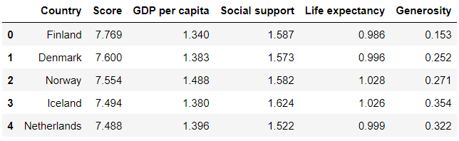

# Chapter 12. 가져오기와 내보내기

* 데이터셋은 값을 쉼표로 구분하는 CSV, 탭으로 구분하는 TSV, 엑셀 통합문서(XLSX) 등 다양한 파일 형식으로 제공됩니다. 일부 데이터 형식은 데이터를 표 형식으로 저장하지 않습니다. 대신 키-값 형식으로 관련된 데이터 컬렉션을 중첩하여 저장합니다.
* 판다스는 키-값 데이터를 테이블 형식의 데이터로 저장하거나 또는 반대로 테이블 형식의 데이터를 키-값 데이터로 저장하는 기능을 제공합니다. 


## 01. JSON 파일 읽고 쓰기

* 오늘날 사용 가능한 가장 인기 있는 키-값 저장 형식인 JSON을 살펴보겠습니다. JSON은 텍스트 데이터를 저장하고 전송하기 위한 형식입니다. 자바 스크립트 프로그래밍 언어가 JSON 구문에 영감을 주긴 하지만 JSON 자체는 언어 독립적입니다. 오늘날 파이썬을 포함한 대부분의 언어는 JSON을 생성하고 파싱할 수 있습니다.
* JSON 응답을 키-값 쌍으로 구성되며 여기서 키가 값의 고유 식별자 역활을 합니다. 콜론 기호(:)는 키를 값에 연결합니다.

```
'name':'Harry Potter'
```

* 키는 문자열이어야 합니다. 값은 문자열, 숫자 및 불리언을 포함한 모든 데이터 유형이 될 수 있습니다. JSON은 파이썬의 딕셔너리 객체와 유사합니다.
* JSON은 웹사이트 서버와 같은 많은 최신 API(application programing interface)에 널리 사용되는 응답 형식입니다. API의 row JSON 응답은 일반 문자열처럼 보입니다. 예를 들어 응답을 다음과 같은 형태로 구성됩니다.

```
{'name':'Harry Potter', 'age':17, 'wizard':true}
```

* 린터(linter)라는 소프트웨어 프로그램은 각 키-값 쌍을 별도의 줄에 배치하여 JSON 응답을 가독성 있는 형식으로 나타냅니다. 예를 들어 JSONLint라는 인기 있는 린터가 있습니다. JSONLint로 이전의  JSON을 처리하면 다으모가 같은 출력이 생성됩니다.

```
{
	'name': 'Harry Potter',
	'age': 17,
	'wizard': true
}
```

* 앞의 두 코드 예제는 기술적으로는 차이가 없지만 가독성 면에서 두번째 예제가 더 읽기 쉽습니다. JSON 응답에는 3개의 키-값 쌍이 있습니다.
* JSON에서는 불리언의 철자가 소문자입니다. 개념은 파이썬의 불리언과 동일합니다.

* 키는 파이썬 리스트와 동일하며 정렬된 요소 컬렉션인 배열을 가리킬 수도 있습니다. 다음 JSON 예제에서 'friends'키는 두 문자열은 담은 배열과 연결됩니다.

```
{
	'name': 'Harry Potter',
	'age': 17,
	'wizard': true,
	'friends': ['Ron Weasley', 'Hermione Granger']
}
```

* JSON은 다음 예제의 'address'와 같이 중첩된 객체 내에 추가 키-값 쌍을 저장할 수 있습니다. 파이썬 용어로는 'address'를 다른 딕셔너리에 중첩된 딕셔너리라고 설명할 수 있습니다.

```
{
	'name': 'Harry Potter',
	'age': 17,
	'wizard': true,
	'friends': ['Ron Weasley', 'Hermione Granger'],
	'address': {
		'street': '4 Privet Drive',
		'town': 'Little whinging'
	}
}
```

* 키-값 쌍을 중첩으로 저장하면 관련 필드를 그룹화하여 데이터를 단순화할 수 있습니다.


### 1.1 JSON 파일을 DataFrame으로 불러오기

* JSON은 확장자가 .json인 일반 텍스트 파일에 저장할 수 있습니다. 이 장의 prizes.json 파일은 노벨상 API에서 저장한 JSON 응답입니다.
* 다음은 JSON을 일부 발췌한 결과입니다.

```
{
  "prizes": [
    {
      "year": "2019",
      "category": "chemistry",
      "laureates": [
        {
          "id": "976",
          "firstname": "John",
          "surname": "Goodenough",
          "motivation": "\"for the development of lithium-ion batteries\"",
          "share": "3"
        },
        {
          "id": "977",
          "firstname": "M. Stanley",
          "surname": "Whittingham",
          "motivation": "\"for the development of lithium-ion batteries\"",
          "share": "3"
        },
        {
          "id": "978",
          "firstname": "Akira",
          "surname": "Yoshino",
          "motivation": "\"for the development of lithium-ion batteries\"",
          "share": "3"
        }
      ]
    },
```

* JSON에는 연도 및 범주('chemistry(화학)', 'physics(물리학)', 'literature(문학)' 등)의 각 조합을 나열하는 딕셔너리의 배열과 연결되는 최상위 키 prizes(노벨상)가 있습니다. 모든 수상자가 year(연도)와 'category(범주)' 키를 가지는 반면에 'laureates(수상자)'와  'overallMotivation(전반적인 선정 배경)' 키는 일부 수상자에만 존재합니다. 다음은 'overallMotivation' 키가 있는 딕셔너리의 예입니다.

```
{
	"year": "1972",
    "category": "peace",
    "overallMotivation": "\"No Nobel Prize was awarded this year. The prize money 		for 1972 was allocated to the Main Fund.\""
},
```

* 'laureates'키는 각각 고유한 'id', 'firstname(이름)', 'surname(성)', 'motication(선정 배경)'과 'share(공동수상)' 키가 있는 딕셔너리의 배열에 연결됩니다. 'laureates'키는 동일한 범주에서 여러 사람이 노벨상을 수상한 연도를 저장하기 위해 배열을 저장합니다. 'laureates'키는 한 해에 수상자가 한 명인 경우에도 리스트를 사용합니다. 다음의 예를 살펴보세요

```
{
    "year": "2019",
    "category": "literature",
    "laureates": [
        {
        "id": "980",
        "firstname": "Peter",
        "surname": "Handke",
        "motivation": "\"for an influential work that with linguistic ingenuity 		has explored the periphery and the specificity of human experience\"",
        "share": "1"
        }
    ]
},
```

* 판다스의 가져오기 함수에는 일관된 이름 규칙이 있습니다. 각 함수는 read라는 접두어와 파일 유형의 조합으로 구성됩니다. JSON 파일을 가져오기 위해서는 read_json 함수를 사용합니다.

```python
import pandas as pd

nobel = pd.read_json('nobel.json')
nobel.head()
```



* 파일을 판다스로 가져오는 것은 성공했지만 불행히도 좋은 형태는 아닙니다. 판다스는 JSON의 최상위 prizes 키를 열의 이름으로 설정하고 JSON에서 파싱한 각 키-값 쌍에 대한 파이썬의 딕셔너리를 생성했습니다. 하나의 행을 예시로 살펴보겠습니다.

```python
nobel.loc[2, 'prizes']
```

```
{'year': '2019',
 'category': 'literature',
 'laureates': [{'id': '980',
   'firstname': 'Peter',
   'surname': 'Handke',
   'motivation': '"for an influential work that with linguistic ingenuity has explored the periphery and the specificity of human experience"',
   'share': '1'}]}
```

```python
type(nobel.loc[2, 'prizes'])
```

```
dict
```

* 실습의 목표는 데이터를 표 형식으로 변환하는 것입니다. 그렇게 하려면 JSON의 최상위 키-값 쌍(year, category)을 추출하여 DataFrame 열을 분리해야 합니다. 또한 'laureates' 리스트의 각 딕셔너리를 순회하면서 중첩 정보를 추출해야 합니다. 각 노벨상 수상자에 대해 연도와 범주 조합과 연결된 행을 따로 나타내고자 합니다. 목표로 하는 DataFrame은 다음과 같습니다


* 중첩된 데이터 레코드를 단일 1차우너 리스트로 변형하는 과정을 평탄화(flattening) 또는 정규화(normalizing)이라고 합니다. 판다스 라이브러리에는 무거운 작업을 처리하는 내장 json_normalize 함수가 있습니다. nobel DataFrame에서 딕셔너리를 하나 뽑아서 정규화를 연습해봅시다.

```python
chemistry_2019 = nobel.loc[0, 'prizes']
chemistry_2019
```

```
{'year': '2019',
 'category': 'chemistry',
 'laureates': [{'id': '976',
   'firstname': 'John',
   'surname': 'Goodenough',
   'motivation': '"for the development of lithium-ion batteries"',
   'share': '3'},
  {'id': '977',
   'firstname': 'M. Stanley',
   'surname': 'Whittingham',
   'motivation': '"for the development of lithium-ion batteries"',
   'share': '3'},
  {'id': '978',
   'firstname': 'Akira',
   'surname': 'Yoshino',
   'motivation': '"for the development of lithium-ion batteries"',
   'share': '3'}]}
```

* chemistry_2019 딕셔너리를 json_normalize 함수의 data 매개변수에 인수로 전달합니다. 판다스는 3개의 최상위 딕셔너리 키('year', 'category', 'laureates')를 추출하여 새로운 DataFrame의 열로 분리합니다. 하지만 라이브러리는 여전히 'laureates' 리스트에 중첩된 딕셔너리를 가집니다.

```python
pd.json_normalize(data = chemistry_2019)
```


* json_normalize 함수의 record_path 매개변수를 사용하여 중첩된 'laureates' 레코드를 정규화할 수 있습니다. 딕셔너리의 어떤 키가 중첩 레코드를 갖는지 나타내는 문자열을 매개변수로 전달합니다.

```python
pd.json_normalize(data = chemistry_2019, record_path = 'laureates')
```


* 판다스는 중첩된 'laureates' 딕셔너리를 새로운 열로 확장했지만 이번에는 기존의 year와 category 열이 사라졌습니다.이러한 최상위 키-값 쌍을 유지하려면 이름을 담은 리스트를 meta라는 매개변수에 전달해야 합니다.

```python
pd.json_normalize(
    data = chemistry_2019,
    record_path = 'laureates',
    meta = ['year', 'category']
)
```


* normalize 함수는 딕셔너리 Series를 받아서 각 항목에 추출 논리를 적용할만큼 충분히 똑똑합니다. prizes Series를 함수에 전달하면 어떻게 되는지 살펴봅시다.

```python
pd.json_normalize(
    data = nobel['prizes'],
    record_path = 'laureates',
    mata = ['year', 'category']
)
```

```
KeyError
```

* 판다스는 KeyError 예외를 발생시킵니다. prized Series에 있는 딕셔너리 중 일부는 'laureates'라는 키가 없기 때문입니다. json_normalize 함수는 존재하지 않는 리스트에서 중첩된 수상자 정보를 추출할 수 없습니다. 이 문제를 해결하는 한 가지 방법은 'laureates' 키가 없는 딕셔너리를 식별하고 수동으로 키를 할당하는 것 입니다. 이러한 상황에서는 'laureates' 키 값으로 빈 리스트를 넣을 수 있습니다.
* 다음과 같은 딕셔너리가 있다고 가정하겠습니다.

```python
cheese_consumption = {
    'France': 57.9,
    'Germany': 53.2,
    'Luxebourg': 53.2
}
```

* setdefault 메서드는 딕셔너리에 키가 없는 경우에 키-값 쌍을 할당합니다. 키가 있는 경우 메서드는 기존 값을 반환합니다. 메서드의 첫번째 인수는 키이고 두번째 인수는 값입니다

```python
cheese_consumption.setdefault('France', 100)
```

```
57.9
```

```python
cheese_consumption['France']
```

```
57.9
```

* 딕셔너리에 없는 키를 추가하면 어떨까요. 'Italy' 키가 딕셔너리에 존재하지 않기 때문에 파이썬은 해당 키를 추가하고 값으로 48을 할당합니다,

```python
cheese_consumption.setdefault('Italy', 48)
```

```
48
```

```python
cheese_consumption
```

```
{'France': 57.9, 'Germany': 53.2, 'Luxebourg': 53.2, 'Italy': 48}
```

* 이 기술을 prizes에 있는 중첩 딕셔너리에 적용해봅시다. 딕셔너리에 laureates 키가 없으면 setdefault 메서드를 사용하여 빈 리스트를 값으로 갖는 키를 추가합니다. 또한 apply 메서드를 사용하면 각 Series 요소를 개별적으로 순회할 수 있습니다.

```python
def add_laureates_key(entry):
    entry.setdefault('laureates', [])
    
nobel['prizes'].apply(add_laureates_key)
```

```
0      None
1      None
2      None
3      None
4      None
       ... 
641    None
642    None
643    None
644    None
645    None
Name: prizes, Length: 646, dtype: object
```

* setdefault 메서드는 prozes에 있는 딕셔너리 자체를 변경하므로 기존의 Series를 덮어쓸 필요가 없습니다.
* 이제 모든 중첩 딕셔너리에 laureates 키가 있기 때문에 json_normalize 함수를 호출할 수 있습니다.

```python
winners = pd.json_normalize(
    data = nobel['prizes'],
    record_path = 'laureates',
    meta = ['year', 'category']
)
winners
```


### 1.2 DataFrame을 JSON 파일로 내보내기

* 이제 반대로 DataFrame을 JSON 형식으로 변환하고 JSON 파일에 쓰겠습니다. to_json 메서드는 판다스 자료구조에서 JSON 문자열을 생성합니다. 이 메서드의 orient 매개변수는 판다스가 데이터를 변환하는 형식을 사용자 정의합니다. 다음은 인수로 'records'를 전달하여 키-값 객체로 구성된 JSON 배열을 반환하는 예제입니다.

```pyrhon
winners.head(2)
```


```python
winners.head(2).to_json(orient = 'records')
```

```
'[{"id":"976","firstname":"John","surname":"Goodenough","motivation":"\\"for the development of lithium-ion batteries\\"","share":"3","year":"2019","category":"chemistry"},{"id":"977","firstname":"M. Stanley","surname":"Whittingham","motivation":"\\"for the development of lithium-ion batteries\\"","share":"3","year":"2019","category":"chemistry"}]'
```

* 반대로 인수로 'split'을 전달하여 별도의 열, 인덱스와 데이터 키가 있는 딕셔너리를 반환할 수 있습니다. 이 인수는 각 행의 항목에 대한 열 이름의 중복을 방지합니다.

```python
winners.head(2).to_json(orient = 'split')
```

```
'{"columns":["id","firstname","surname","motivation","share","year","category"],"index":[0,1],"data":[["976","John","Goodenough","\\"for the development of lithium-ion batteries\\"","3","2019","chemistry"],["977","M. Stanley","Whittingham","\\"for the development of lithium-ion batteries\\"","3","2019","chemistry"]]}'
```

* orient 매개변수에 인수로 'index', 'columns', 'values'와 'table'을 전달할 수 잇습니다.
* 원하는 JSON 형식을 찾았다면 JSON 파일의 이름을 to_json 메서드의 첫번째 인수로 전달합니다.

```python
winners.to_json('winners.json', orient = 'records')
```

* 동일한 셀을 두번 실행할 떈느 주의하세요. 파일이 경로에 존재하면 판다스는 이전 셀을 실행할 때 덮어씁니다. 라이브러리는 덮어씌운다는 경고를 표시하지 않습니다. 이러한 이우로 출력 파일은 입력 파일과 이름을 다르게 지정하는 것이 좋습니다.


## 02. CSV 파일 읽고 쓰기

* 다음 데이터셋은 뉴욕시의 아기 이름 모음입니다. 각 행은 이름(Child's First Name), 출생 연도(Year of Birth), 성별(Gender), 민족(Ethnicity), 수(Count), 인기순위(Rank)를 나타냅니다.  
* 웹 브라우저에서 웹사이트에 접속하고 CSV 파일을 컴퓨터에 내려받을 수 있습니다. 또는 URL을 read_csv 함수에 첫번째  인수로 전달해도 좋습니다. 판다스는 자동으로 데이터셋을 받아서 DataFrame으로 가져옵니다. 하드코딩된 URL은 분석을 다시 실행할 때마다 데이터셋을 수동으로 내려받지 않도록 도와주기 때문에 자주 변경되는 실시간 데이터를 분석해야 하는 경우 유용합니다

```python
url = 'https://data.cityofnewyork.us/resource/25th-nujf.csv'
baby_names = pd.read_csv(url)
baby_names.head()
```


* 링크가 유효하지 않으면 판다스는 HTTPError 예외를 발생시킵니다.

* to_csv 메서드는 사용하여 일반 CSV 파일에 baby_names DataFrame을 작성하겠습니다. 인수 없이 호출하면 이 메서드는 CSV 문자열을 주피터 노트북에 직접 출력합니다.

```python
baby_names.head(10).to_csv()
```

```
',brth_yr,gndr,ethcty,nm,cnt,rnk\r\n0,2019,FEMALE,ASIAN AND PACIFIC ISLANDER,Chloe,131,1\r\n1,2019,FEMALE,ASIAN AND PACIFIC ISLANDER,Olivia,109,2\r\n2,2019,FEMALE,ASIAN AND PACIFIC ISLANDER,Mia,88,3\r\n3,2019,FEMALE,ASIAN AND PACIFIC ISLANDER,Sophia,71,4\r\n4,2019,FEMALE,ASIAN AND PACIFIC ISLANDER,Emma,71,4\r\n5,2019,FEMALE,ASIAN AND PACIFIC ISLANDER,Amelia,60,5\r\n6,2019,FEMALE,ASIAN AND PACIFIC ISLANDER,Charlotte,57,6\r\n7,2019,FEMALE,ASIAN AND PACIFIC ISLANDER,Emily,53,7\r\n8,2019,FEMALE,ASIAN AND PACIFIC ISLANDER,Grace,48,8\r\n9,2019,FEMALE,ASIAN AND PACIFIC ISLANDER,Isabella,43,9\r\n'
```

* 기본적으로 판다스는 CSV 문자열에 DataFrame 인덱스를 포함합니다. 문자열의 시작 부분의 쉼표와 각 \n 기호 뒤의 숫자 값(0, 1, 2 등)에 주목하세요. 
* index 매개변수에 인수로 False를 전달하며 인덱스를 제외할 수 있습니다.

```python
baby_names.head(10).to_csv(index = False)
```

```
'brth_yr,gndr,ethcty,nm,cnt,rnk\r\n2019,FEMALE,ASIAN AND PACIFIC ISLANDER,Chloe,131,1\r\n2019,FEMALE,ASIAN AND PACIFIC ISLANDER,Olivia,109,2\r\n2019,FEMALE,ASIAN AND PACIFIC ISLANDER,Mia,88,3\r\n2019,FEMALE,ASIAN AND PACIFIC ISLANDER,Sophia,71,4\r\n2019,FEMALE,ASIAN AND PACIFIC ISLANDER,Emma,71,4\r\n2019,FEMALE,ASIAN AND PACIFIC ISLANDER,Amelia,60,5\r\n2019,FEMALE,ASIAN AND PACIFIC ISLANDER,Charlotte,57,6\r\n2019,FEMALE,ASIAN AND PACIFIC ISLANDER,Emily,53,7\r\n2019,FEMALE,ASIAN AND PACIFIC ISLANDER,Grace,48,8\r\n2019,FEMALE,ASIAN AND PACIFIC ISLANDER,Isabella,43,9\r\n'
```

* 원하는 파일 이름을 to_csv 메서드의 첫번째 인수로 전달하여 문자열을 CSV 파일에 쓸 수 있습니다. 이때 파일 이름에 .csv 확장자를 포함해야 합니다. 특정 경로를 지정하지 않으면 판다스는 주피터 노트북과 동일한 경로에 파일을 씁니다.

```python
baby_names.to_csv('NYC_Baby_Names.csv', index = False)
```

* 기본적으로 판다스는 모든 DataFrame열을 CSV 파일에 씁니다.  columns 매개변수에 이름을 담은 리스트를 전달하여 내보낼  열을 지정할 수 있습니다. 

```
baby_names.to_csv(
    'NYC_Baby_Names.csv',
    index = False,
    columns = ['gndr', 'nm', 'cnt']
)
```


## 03. 엑셀 통합문서에 읽고 쓰기


* 판다스는 엑셀과 상호작용하려면 xlrd와 openpyxl 라이브러리가 필요합니다.


### 3.1 엑셀 통합문서 가져오기

* 판다스의 최상위 수준에 있는 read_excel 함수는 엑셀 통합 문서를 DataFrame으로 가져옵니다. 첫번째 매개변수 io는 통합문서의 경로가 포함된 문자열을 인수로 전달받습니다. 이때 파일 이름에 .xlsx 확장자를 포함해야 합니다. 기본저으로 판다스는 통합문서의 첫번째 워크시트만 가져옵니다.

```python
pd.read_excel('Single Worksheet.xlsx')
```


* read_csv 함수는 인덱스 열을 설정하는 index_col, 일반 열을 설정하는 cols, 1열 DataFrame을 Series 객체로 강제 변환하는 squeeze를 포함하여 read_csv와 동일한 여러 매개변수를 지원합니다. 
* index_col 매개변수에 열을 전달하는 경우 usecols 리스트에도 해당 열을 포함해야 합니다.

```python
pd.read_excel(
    io = 'Single Worksheet.xlsx',
    usecols = ['City', 'First Name', 'Last Name'],
    index_col = 'City'
)
```


* 통합문서에 여러 개의 워크시트가 있다면 약간 복잡해집니다. Multiple Worksheets.xlsx 통합문서를 보면 Data 1, Data 2, Data 3이라는 세 가지 워크시트가 있습니다. 기본적으로 판다스는 통합문서의 첫번째 워크시트만 가져옵니다.

```python
pd.read_excel('Multiple Worksheets.xlsx')
```


* 통합문서를 가져오는 동안 판다스는 각 워크시트에 0부터 인덱스 위치를 할당합니다. 특정 워크시트의 인덱스 위치나 이름을 sheet_name 매개변수에 전달하여 특정 워크시트를 가져올 수도 있습니다. 매개변수의 기본 인수는 0(첫번째 워크시트)입니다. 

```python
# 다음 두 줄은 결과가 동일합니다.
pd.read_excel('Multiple Worksheets.xlsx', sheet_name = 0)
pd.read_excel('Multiple Worksheets.xlsx', sheet_name = 'Data 1')
```


* 모든 워크시트를 가져오려면 sheet_name 매개변수에 인수로 None을 전달합니다. 판다스는 각 워크시트를 별도의 DataFrame에 저장합니다. read_excel 함수는 워크시트의 이름을 키로 사용하고 각 DataFrame을 값으로 사용한 딕셔너리를 반환합니다.

```python
workbook = pd.read_excel(
    'Multiple Worksheets.xlsx', sheet_name = None
)

workbook
```

```
{'Data 1':   First Name Last Name           City Gender
 0    Brandon     James          Miami      M
 1       Sean   Hawkins         Denver      M
 2       Judy       Day    Los Angeles      F
 3     Ashley      Ruiz  San Francisco      F
 4  Stephanie     Gomez       Portland      F,
 'Data 2':   First Name Last Name           City Gender
 0     Parker     Power        Raleigh      F
 1    Preston  Prescott   Philadelphia      F
 2    Ronaldo   Donaldo         Bangor      M
 3      Megan   Stiller  San Francisco      M
 4     Bustin    Jieber         Austin      F,
 'Data 3':   First Name  Last Name     City Gender
 0     Robert     Miller  Seattle      M
 1       Tara     Garcia  Phoenix      F
 2    Raphael  Rodriguez  Orlando      M}
```

```python
type(workbook)
```

```
dict
```

* 워크시트를 나타내는 DataFrame에 접근하려면 딕셔너리의 키에 접근하면 됩니다.

```python
workbook['Data 2']
```


* 가져올 워크시트의 하위 집합을 지정하려면 인덱스 위치 또는 워크시트 이름 리스트를 sheet_name 매개변수로 전달합니다. 판다스는 이때도 딕셔너리를 반환합니다. 딕셔너리의 키는 sheet_name의 리스트에 있는 문자열과 일치합니다

```python
pd.read_excel(
    'Multiple Worksheets.xlsx',
    sheet_name = ['Data 1', 'Data 3']
)
```

```
{'Data 1':   First Name Last Name           City Gender
 0    Brandon     James          Miami      M
 1       Sean   Hawkins         Denver      M
 2       Judy       Day    Los Angeles      F
 3     Ashley      Ruiz  San Francisco      F
 4  Stephanie     Gomez       Portland      F,
 'Data 3':   First Name  Last Name     City Gender
 0     Robert     Miller  Seattle      M
 1       Tara     Garcia  Phoenix      F
 2    Raphael  Rodriguez  Orlando      M}
```

```python
pd.read_excel('Multiple Worksheets.xlsx', sheet_name = [1, 2])
```

```
{1:   First Name Last Name           City Gender
 0     Parker     Power        Raleigh      F
 1    Preston  Prescott   Philadelphia      F
 2    Ronaldo   Donaldo         Bangor      M
 3      Megan   Stiller  San Francisco      M
 4     Bustin    Jieber         Austin      F,
 2:   First Name  Last Name     City Gender
 0     Robert     Miller  Seattle      M
 1       Tara     Garcia  Phoenix      F
 2    Raphael  Rodriguez  Orlando      M}
```


### 3.2 엑셀 통합문서 내보내기

```python
baby_names.head()
```


* 데이터셋을 성별에 따라 하나씩 2개의 DataFrame으로 분할한다고 가정하겠습니다.

```python
girls = baby_names[baby_names['gndr'] == 'FEMALE']
boys = baby_names[baby_names['gndr'] == 'MALE']
```

* 엑셀 통합문서에 데이터를 작성하려면 먼저 ExcelWriter 객체를 생성해야 합니다. 이 객체는 통합문서의 기반 역활을 합니다. 이 객체로 개별 워크시트에 데이터를 작성할 수 있습니다.
* ExcelWriter 객체를 변수에 저장해야 합니다

```python
excel_file = pd.ExcelWriter('Baby_Names.xlsx')
excel_file
```

```
<pandas.io.excel._xlsxwriter.XlsxWriter at 0x2253809c9d0>
```

* 다음으로 통합문서의 개별 워크시트에 girls와 boys DataFrame을 연결해야 합니다.

* DataFrame에는 엑셀 통합문서에 쓰는 to_excel 메서드가 있습니다. 메서드의 첫번째 매개변수 excel_writer는 ExcelWriter 객체를 전달 받습니다. 메서드의 sheet_name 매개변수는 워크시트의 이름을 문자열로 받습니다. 마지막으로 index 매개변수에 인수로 False를 전달하여 DataFrame의 인덱스를 제외할 수 있습니다.

```python
girls.to_excel(
    excel_writer = excel_file, sheet_name = 'Girls', index = False
)
```

* 아직 엑셀 통합문서를 생성한 것은 아닙니다. 통합문서를 만들때 girls DataFrame을 포함하도록 ExcelWriter 객체를 연결한 것 입니다.
* 다음으로 boys DataFrma을 엑셀 통합문서에 연결하겠습니다. 이제 판다스는 두 데이터셋을 동일한 통합문서에 작성해야 한다고 이해했습니다. 또한 문자열 인수를 sheet_name 매개변수를 전달하여 워크시트의 이름을 설정합니다. 열의 하위 집합만 내보내려면 columns 매개변수에 사용자 정의 리스트를 전달합니다. 

```python
boys.to_excel(
    excel_file,
    sheet_name = 'Boys',
    index = False,
    columns = ['nm', 'cnt', 'rnk']
)
```

* 이제 엑셀 통합문서를 연결했으므로 디스크에 파일을 쓸 차례입니다. ExcelWriter 객체인 excel_file에서 save 메서드를 호출하여 최종 결과를 도출합니다

```python
excel_file.save()
```

