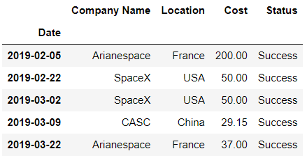
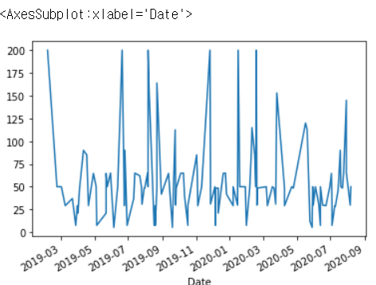
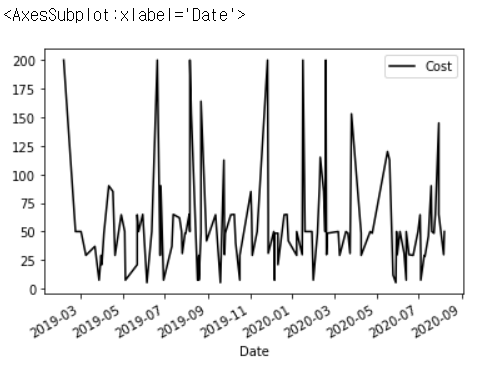
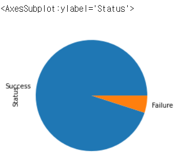
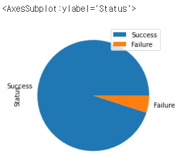

# Chapter 13. 판다스 설정


## 01. 판다스 설정 확인과 변경

- 이 장에서 사용할 데이터셋 happy.csv는 세계 국가의 행복 순위입니다. 여론조사 회사 갤럽은 UN의 지원을 받아 데이터 수집합니다. 각 행은 1인당 국내총샌상(GDP per capita), 사회적 지원(Social support), 기대 수명(Life expectancy) 및 관대성 지수(Generosity)와 함께 각 국가(Country)의 총 행복 점수(Score)를 나타냅니다.

```python
import pandas as pd
```

```python
happiness = pd.read_csv('happiness.csv')
happiness.head()
```



- 판다스는 라이브러리의 최상위 수준에 있는 options 객체에 설정을 저장합니다. 각 설정은 상위 범주에 속합니다. 판다스가 자료구조를 출력하는 형식을 설정하는 display 범주부터 살펴보겠습니다
- 최상위 describe_option 함수는 주어진 설정의 문서를 반환합니다. 설정 이름을 나타내는 문자열을 함수에 전달할 수 있습니다. display의 상위 범주 안에 중첩된 max_rows 설정을 살펴봅시다. max_rows 설정은 판다스가 DataFrame을 자르기 전에 출력할 최대 행의 수를 구성합니다.

```python
pd.describe_option('display.max_rows')
```

```
display.max_rows : int
    If max_rows is exceeded, switch to truncate view. Depending on
    `large_repr`, objects are either centrally truncated or printed as
    a summary view. 'None' value means unlimited.

    In case python/IPython is running in a terminal and `large_repr`
    equals 'truncate' this can be set to 0 and pandas will auto-detect
    the height of the terminal and print a truncated object which fits
    the screen height. The IPython notebook, IPython qtconsole, or
    IDLE do not run in a terminal and hence it is not possible to do
    correct auto-detection.
    [default: 60] [currently: 60]
```

- 문서의 끝 부분은 설정의 기본값과 현재 값을 나타냅니다.
- 판다스는 문자열 인수와 일치하는 모든 라이브러리 설정을 출력합니다. 라이브러리는 정규 표현식을 기반으로 describe_option의 인수를 사용 가능한 설정과 비교합니다. 다시 말해 정규 표현식은 텍스트 검색 패턴입니다. 다음은 인수로 'max_col'을 전달하는 예제입니다.

```python
pd.describe_option('max_col')
```

```
display.max_columns : int
    If max_cols is exceeded, switch to truncate view. Depending on
    `large_repr`, objects are either centrally truncated or printed as
    a summary view. 'None' value means unlimited.

    In case python/IPython is running in a terminal and `large_repr`
    equals 'truncate' this can be set to 0 and pandas will auto-detect
    the width of the terminal and print a truncated object which fits
    the screen width. The IPython notebook, IPython qtconsole, or IDLE
    do not run in a terminal and hence it is not possible to do
    correct auto-detection.
    [default: 20] [currently: 20]
display.max_colwidth : int or None
    The maximum width in characters of a column in the repr of
    a pandas data structure. When the column overflows, a "..."
    placeholder is embedded in the output. A 'None' value means unlimited.
    [default: 50] [currently: 50]
```

- 정규 표현식은 매력적이지만 상위 범주를 포함하여 설정의 전체 이름을 명확하게 작성하는 것을 추천합니다. 코드를 명시적으로 작성해야 오류를 줄일 수 있기 때문입니다.
- 설정의 현재 값을 가져오는 방법은 두 가지가 있습니다. 첫 번째 방법은 판다스의 최상위 수준에 있는 get_option 함수를 사용하는 것 입니다. describe_option과 마찬가지로 설정 이름을 나타내는 문자열을 인수로 전달받습니다. 두번째 방법은 최상위 pd.options 객체의 속성으로 상위 범주와 특성 설정에 접근하는 것입니다.
- 다음은 두 가지 방법을 구현한 코드 구문입니다. 두 코드 줄은 모두 max_rows 설정의 현재 값으로 60을 반환합니다. 즉, 판다스는 길이가 60행보다 큰 DataFrame의 출력을 자른다는 사실을 알 수 있습니다.

```python
# 다음 두 줄의 결과는 동일합니다.
pd.get_option('display.max_rows')
pd.options.display.max_rows
```

```
60
```

- 마찬가지로 설정 값을 변경하는 방법도 두 가지가 있습니다. 판다스의 최상위 수준에 있는 set_option 함수는 설정의 이름을 첫번째 인수로 받고 새로 설정할 값을 두번째 인수로 받습니다. 또는 pd.option 객체의 속성으로 해당 설정에 접근하여 할당 연산자로 새 값을 할당할 수 있습니다.

```python
# 다음 두 줄의 결과는 동일합니다.
pd.set_option('display.max_rows', 6)
pd.options.display.max_rows = 6
```

```python
pd.options.display.max_rows
```

```
6
```

```python
happiness.head(6)
```



- 라이브러리는 항상 자르는 부분을 기준으로 전과 후에 동일한 수의 행을 출력하고자 합니다.

```python
happiness.head(7)
```



- max_rows 설정은 출력하는 행의수를 결정합니다. 이와 대응하는 display.max_columns 설정은 출력하는 열의 최대 수를 결정합니다. 기본값은 20입니다.

```python
# 다음 두 줄을 결과가 동일합니다.
pd.get_option('display.max_columns')
pd.options.display.max_columns
```

```
20
```

- 다시 말하지만 설정에 새로운 값을 할당하려면 set_option 함수를 사용하거나 중첩된 max_columns 속성에 직접 접근할 수 있습니다.

```python
# 다음 두 줄은 결과가 동일합니다.
pd.set_option('display.max_columns', 2)
pd.options.display.max_columns = 2
```

- 최대 열 수를 짝수로 설정하면 판다스는 최대 열 수에서 잘리는 열을 제외합니다.

```python
happiness.head(7)
```


- 최대 열 수를 홀수로 설정하면 판다스는 최대 열수에 잘리는 열을 포함합니다.

```python
# 다음 두 줄은 결과가 동일합니다.
pd.set_option('display.max_columns', 5)
pd.options.display.max_columns = 5
```

```python
happiness.head()
```


- 설정을 기존 값으로 되돌리려면 해당 이름을 판다스의 최상위 수준에 있는 reset_option 함수에 전달하세요. 다음은 max_rows 설정을 초기화하는 예제입니다.

```python
pd.reset_option('display.max_rows')
```

```python
pd.get_option('display.max_rows')
```

```
60
```


## 02. 정밀도

- display.precision 설정은 부동소수점 숫자 뒤의 자리수를 결정합니다. 기본값은 6입니다.

```python
pd.describe_option('display.precision')
```

```
display.precision : int
    Floating point output precision in terms of number of places after the
    decimal, for regular formatting as well as scientific notation. Similar
    to ``precision`` in :meth:`numpy.set_printoptions`.
    [default: 6] [currently: 6]
```

- 다음은 정밀도를 2로 설정하는 예제입니다.

```python
# 다음 두 줄은 결과가 동일합니다
pd.set_option('display.precision', 2)
pd.options.display.precision = 2
```

```python
happiness.head()
```



- 정밀도 설정은 부동소수점 숫자가 표시하는 형식만 변경합니다. 판다스는 DataFrame 안에서 기존 값을 유지합니다. 이것은 loc 접근자를 사용하여 Score와 같은 부동소수점 열에서 값을 하나 추출하여 확인할 수 있습니다.

```python
happiness.loc[0, 'Score']
```

```
7.769
```


## 03. 최대 열 너비

- display.max_colwidth 설정은 판다스가 셀의 텍스트를 자르기 전에 출력할 최대 문자수를 결정합니다.

```python
pd.describe_option('display.max_colwidth')
```

```
display.max_colwidth : int or None
    The maximum width in characters of a column in the repr of
    a pandas data structure. When the column overflows, a "..."
    placeholder is embedded in the output. A 'None' value means unlimited.
    [default: 50] [currently: 50]
```

- 다음은 길이가 9글자보다 크면 텍스트를 자르도록 설정하는 예제입니다.

```python
# 다음 두 줄은 결과가 동일합니다.
pd.set_option('display.max_colwidth', 9)
pd.options.display.max_colwidth = 9
```

```python
happiness.tail()
```



- 판다스는 마지막 세 국가의 값(Afghanistan, Central African Republic과 South Sudan)을 줄입니다.


## 04. 절단 임계값

- 일부 분석에서는 값이 0에 어느정도 가까우면 중요하지 않은 값으로 간주하기도 합니다.  display.chop_threshold 설정은 부동소수점 값이 출력할 때 고려해야하는 최소 임계값을 설정합니다. 판다스는 임계값보다 작은 모든 값을 0으로 표시합니다.

```python
pd.describe_option('display.chop_threshold')
```

```
display.chop_threshold : float or None
    if set to a float value, all float values smaller then the given threshold
    will be displayed as exactly 0 by repr and friends.
    [default: None] [currently: None]
```

- 다음 예제에서는 절단 임계값을 0.25로 설정합니다.

```python
pd.set_option('display.chop_threshold', 0.25)
```

```python
happiness.tail()
```


- 위의 출력을 보면 판다스는 인덱스 154의 Life expectancy가 0.105, Generosity가 0.235이기 때문에 두 열의 값을 0.00으로 출력합니다.
- 정밀도 설정과 마찬가지로 chop_threshold는 DataFrame의 기존 값을 변경하지 않고 출력하는 형식만 변경합니다.


## 05. 설정 컨텍스트

- 지금까지 변경한 설정은 모두 전역적입니다. 변경하면 이후에 실행되는 모든 주피터 노트북 셀의 출력이 영향을 받습니다. 전역 설정은 새 값을 할당할 때까지 유지됩니다. 예를 들어 display.max_columns를 6으로 설정하면 주피터는 이후에 실행되는 모든 셀에서 DataFrame을 출력할 때 최대 6개의 열만 출력합니다.
- 때로는 하나의 셀에 대한 출력설정을 변경하고 싶을 수도 있습니다. 판다스의 최상위 option_context 함수로 하나의 셀에 대한 설정만 병경할 수 있습니다. 함수를 파이썬의 내장 키워드 with와 함께 사용하여 컨텍스트 블록을 생성합니다. 컨텍스트 블록을 임시 실행 환경이라고 생각하세요. option_context 함수는 블록의 내부 코드가 실행되는 동안 판다스 옵션에 임시로 값을 설정합니다. 전역 설정은 영향을 받지 않습니다.
- 주피터는 with 블록의 내용을 노트북 셀의 최종 구문으로 인식하지 않습니다 따라서 DataFrame을 수동으로 출력하려면 display라는 노트북 함수를 사용해야 합니다.

```python
with pd.option_context(
    'display.max_columns', 5,
    'display.max_rows', 10,
    'display.precision', 3
): 
    display(happiness)
```


- with 키워드를 사용했기 때문에 이 세가지 설정값은 전체 노트북의 설정값을 변경하지 않습니다. 전체 노트북의 설정은 기존 값을 그대로 유지합니다.
- option_context 함수는 서로 다른 행에 서로 다른 설정을 할당하고 싶을 때 유용합니다. 모든 출력 결과가 동일한 형식을 갖게 하고 싶다면 주피터 노트북 상단의 셀에서 옵션을 한번 설정하는 것이 좋습니다.

