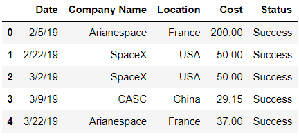
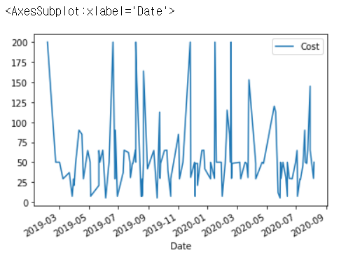
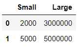
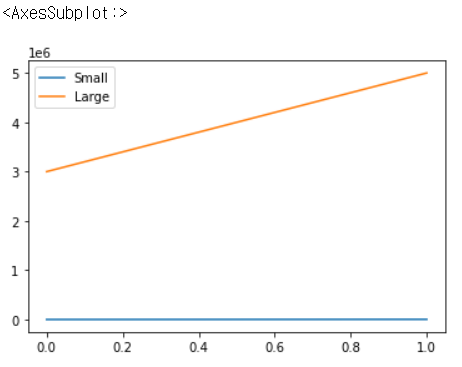
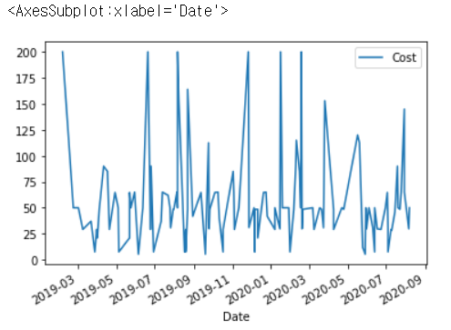
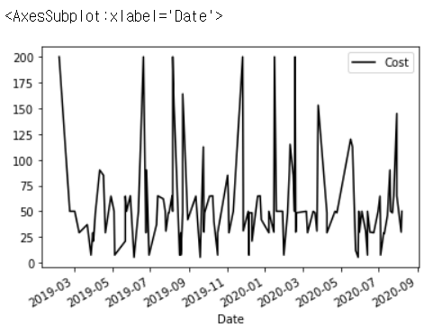
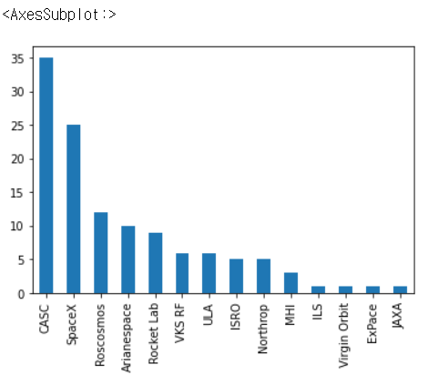
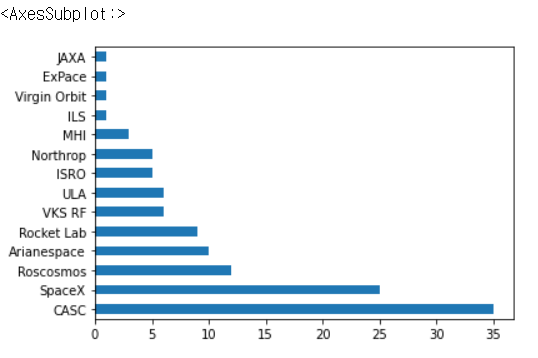
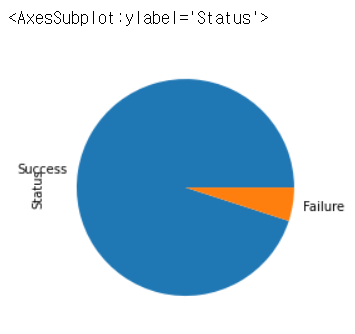
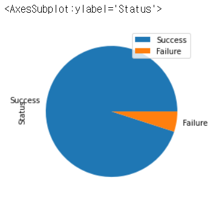

# Chapter 14. 시각화

- 판다스는 matplotlib, seaborn, ggplot을 포함하여 널리 사용되는 많은 파이썬 데이터 시각화 라이브러리와 원할하게 어우러 집니다.

- 이 장을 실습하려면 matplotlib이 설치되어있어야 합니다.


## 01. 선형 차트

- 기본적으로 주피터 노트북은 웹사이트의 팝업 창과 같은 별도의 브라우저 창에서 각 matplotlib 시각화를 렌더링합니다. 주피터가 셀의 코드 바로 아래에 시각화를 렌더링하도록 하려면 %matplotlib inline 코드를 한 줄 추가합니다. %matplotlib inline은 노트북에서 구성을 설장하는 구문 단축키인 매직 함수입니다.

```python
import pandas as pd
import matplotlib.pyplot as plt
%matplotlib inline
```

- 이 장에서 사용할 데이터셋은 space_mission.csv로 2019~2020년 100개 이상의 우주 비행 기록입니다. 각 레코드는 임무 날짜(Date), 후원 회사(Company Name), 위치(Location), 비용(Cost) 및 상태(Status, 값은 성공을 나타내는 'Success' 또는 실패를 나타내는 'Failure')로 구성됩니다.

```python
pd.read_csv('space_missions.csv').head()
```



```python
space = pd.read_csv(
    'space_missions.csv',
    parse_dates = ['Date'],
    index_col = 'Date'
)
space.head()
```


- 이 데이터셋에 있는 2년동안의 비행 비용을 그래프로 그리고 싶다고 가정하겠습니다. 시계열 그래프는 시간 경과에 따른 추세를 관찰하기 좋은 그래프 입니다. 

```python
space['Cost'].head()
```

```
Date
2019-02-05    200.00
2019-02-22     50.00
2019-03-02     50.00
2019-03-09     29.15
2019-03-22     37.00
Name: Cost, dtype: float64
```

- 판다스 자료구조에서 plot 메서드를 호출하면 시각화를 렌더링할 수 있습니다. 기본적으로 matplotlib는 선 그래프를 그립니다.

```python
space['Cost'].plot()
```


- 기본적으로 라이브러리는 x축에 인덱스 레이블(여기서는 날짜/시간)을 표시하고 y축에 Series의 값을 표시합니다. matplotlib는 또한 두 축의 값 범위를 합리적인 간격으로 표시합니다.
- space DataFrame 자체에서 plot 메서드를 호출할 수도 있습니다. 이 예제에서는 데이터셋에 숫자 열이 하나만 존재하기 때문에 판다스는 동일한 결과를 출력합니다.

```python
space.plot()
```



- DataFrame에 숫자 열이 여러 개 있다면 matplotlib는 각 열에 대해 별도의 선을 그립니다. 하지만 주의하세요. 열 사이의 값 크기에 큰 차이가 있다면 큰 값으로 인해 작은 값은 상대적으로 매우 왜소하게 표시될 수 있습니다.  다음과 같은 DataFrame이 있다고 가정합시다

```python
data = [
    [2000, 3000000],
    [5000, 5000000]
]

df = pd.DataFrame(data = data, columns = ['Small', 'Large'])
df
```



- df  DataFrame을 그릴 때 matplotlib는 Large 열의 값을 수용하도록 그래프의 단위를 조정합니다. 이렇게 되면 상대적으로 크기가 매우 작은 Small 열 값은 추세를 확인할 수 없는 형태로 표시됩니다.

```python
df.plot()
```



- 다시 space DataFrame으로 돌아가겠습니다. plot 메서드에는 matplotlib에 값을 표시해야하는 DataFrame의 열을 식별하는 y 매개변수가 있습니다. 다음은 Cost 열을 전달하는 예제입니다. 결과는 space DataFrame에서 plot을 호출한 예제와 같습니다.

```python
space.plot(y = 'Cost')
```



- colormap 매개변수를 사용하여 그래프의 색상 테마를 설정할 수 있습니다.

```python
space.plot(y = 'Cost', colormap = 'gray')
```



- colormap 매개변수의 유효한 인수 목록이 궁금하다면 colormaps 메서드를 호출하세요. 일부 테마는 최소 그래프 선 수 와 같은 특정 기준을 만족하는 경우에만 적용할 수 있습니다.

```python
print(plt.colormaps())
```

```
['Accent', 'Accent_r', 'Blues', 'Blues_r', 'BrBG', 'BrBG_r', 'BuGn', 'BuGn_r', 'BuPu', 'BuPu_r', 'CMRmap', 'CMRmap_r', 'Dark2', 'Dark2_r', 'GnBu', 'GnBu_r', 'Greens', 'Greens_r', 'Greys', 'Greys_r', 'OrRd', 'OrRd_r', 'Oranges', 'Oranges_r', 'PRGn', 'PRGn_r', 'Paired', 'Paired_r', 'Pastel1', 'Pastel1_r', 'Pastel2', 'Pastel2_r', 'PiYG', 'PiYG_r', 'PuBu', 'PuBuGn', 'PuBuGn_r', 'PuBu_r', 'PuOr', 'PuOr_r', 'PuRd', 'PuRd_r', 'Purples', 'Purples_r', 'RdBu', 'RdBu_r', 'RdGy', 'RdGy_r', 'RdPu', 'RdPu_r', 'RdYlBu', 'RdYlBu_r', 'RdYlGn', 'RdYlGn_r', 'Reds', 'Reds_r', 'Set1', 'Set1_r', 'Set2', 'Set2_r', 'Set3', 'Set3_r', 'Spectral', 'Spectral_r', 'Wistia', 'Wistia_r', 'YlGn', 'YlGnBu', 'YlGnBu_r', 'YlGn_r', 'YlOrBr', 'YlOrBr_r', 'YlOrRd', 'YlOrRd_r', 'afmhot', 'afmhot_r', 'autumn', 'autumn_r', 'binary', 'binary_r', 'bone', 'bone_r', 'brg', 'brg_r', 'bwr', 'bwr_r', 'cividis', 'cividis_r', 'cool', 'cool_r', 'coolwarm', 'coolwarm_r', 'copper', 'copper_r', 'cubehelix', 'cubehelix_r', 'flag', 'flag_r', 'gist_earth', 'gist_earth_r', 'gist_gray', 'gist_gray_r', 'gist_heat', 'gist_heat_r', 'gist_ncar', 'gist_ncar_r', 'gist_rainbow', 'gist_rainbow_r', 'gist_stern', 'gist_stern_r', 'gist_yarg', 'gist_yarg_r', 'gnuplot', 'gnuplot2', 'gnuplot2_r', 'gnuplot_r', 'gray', 'gray_r', 'hot', 'hot_r', 'hsv', 'hsv_r', 'inferno', 'inferno_r', 'jet', 'jet_r', 'magma', 'magma_r', 'nipy_spectral', 'nipy_spectral_r', 'ocean', 'ocean_r', 'pink', 'pink_r', 'plasma', 'plasma_r', 'prism', 'prism_r', 'rainbow', 'rainbow_r', 'seismic', 'seismic_r', 'spring', 'spring_r', 'summer', 'summer_r', 'tab10', 'tab10_r', 'tab20', 'tab20_r', 'tab20b', 'tab20b_r', 'tab20c', 'tab20c_r', 'terrain', 'terrain_r', 'turbo', 'turbo_r', 'twilight', 'twilight_r', 'twilight_shifted', 'twilight_shifted_r', 'viridis', 'viridis_r', 'winter', 'winter_r']
```


## 02. 막대 그래프

- plot 메서드의 kind 매개변수는 matplotlib가 렌더링하는 차트 유형을 설정합니다. 막대 그래프는 데이터셋의 고유값 수를 표시할 때 활용하기 좋습니다. 막대 그래프를 사용하여 각 회사가 후원한 우주 비행 횟수를 시각해봅시다.

```python
space['Company Name'].value_counts()
```

```
CASC            35
SpaceX          25
Roscosmos       12
Arianespace     10
Rocket Lab       9
VKS RF           6
ULA              6
ISRO             5
Northrop         5
MHI              3
ILS              1
Virgin Orbit     1
ExPace           1
JAXA             1
Name: Company Name, dtype: int64
```

- 다음으로 'bar' 인수를 kind 매개변수에 전달하여 Series에서 plot 메서드를 호출합니다. matplotlib는 x축에 인덱스 레이블을, y축에 값을 표시합니다

```python
space['Company Name'].value_counts().plot(kind = 'bar')
```



- kind 인수를 'barh'로 변경하여 세로 대신 가로 막대 그래프로 렌더링하겠습니다.

```python
space['Company Name'].value_counts().plot(kind = 'barh')
```




## 03. 파이 차트

- 파이차트는 색상 조각이 합쳐져 하나의 원형 파이를 형성하는 시각화입니다. 각 조각은 전체 양에 기여하는 비율을 시각적으로 나타냅니다.
- 파이 차트를 사용하여 성공한 비행과 실패한 비행의 비율을 비교해봅시다.

```python
space['Status'].value_counts()
```

```
Success    114
Failure      6
Name: Status, dtype: int64
```

```python
space['Status'].value_counts().plot(kind = 'pie')
```



- 시각화에 범례를 추가하려면 legend 매개변수에 인수로 True를 전달하면 됩니다.

```python
space['Status'].value_counts().plot(kind = 'pie', legend = True)
```

