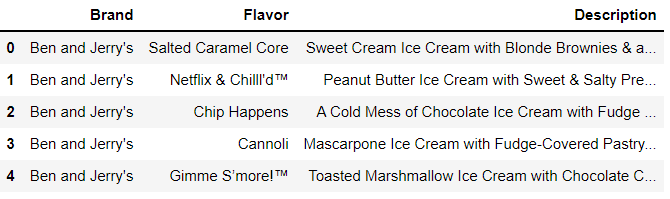
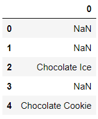

# 부록 B. 정규표현식

- 정규표현식은 텍스트 검색 패턴으로 컴퓨터가 문자열에서 찾아야 하는 논리적인 문자 시퀀스를 정의한다


## 01. 파이썬의 re 모듈 소개

```python
import re
import pandas as pd
```


### (예시1)

- search 메서드는 파이썬이 대상 문자열에서 문자 시퀀스를 찾으면 위치정보를 반환한다. 'flower'가 인덱스 위치 9에서 15 사이의 문자 범위에서 발견되었음을 나타낸다

```python
re.search('flower', 'field of flowers')
```

```
<re.Match object; span=(9, 15), match='flower'>
```


### (예시2)

- findall 메서드는 모든 일치 항목을 찾을 수 있다

```python
re.findall('flower', 'Picking flower in the flower field')
```

```
['flower', 'flower']
```


## 02. 메타문자

- 정규 표현식 안에서 검색 패턴을 정의하는 특수 기호인 메타문자를 선언할 수 있다


### (예시1)

```python
sentence = 'I went to the store and bought' \
            ' 5 apples, 4 oranges, and 15 plumns.'
```


- print() 를 감싼 이유는 주피터에서 리스트를 깔끔히 출력하기 위해서 사용했다

- 정규 표현식 인수를 로 문자열(raw string)로 전달하는 이유는 정규표현식과 이스케이프 문자 충돌을 방지하기 위해서 이다

```python
# 메타문자만 전달
print(re.findall('\d', sentence))
```

```python
# raw 문자열(raw string)로 전달
print(re.findall(r'\d', sentence))
```

```
['5', '4', '1', '5']
```


### (예시2)

- 모든 숫자

```python
print(re.findall(r'\d', sentence))
```

```
['5', '4', '1', '5']
```


- 모든 문자(문자, 공백, 쉼표 포함)

```python
print(re.findall(r'\D', sentence))
```

```
['I', ' ', 'w', 'e', 'n', 't', ' ', 't', 'o', ' ', 't', 'h', 'e', ' ', 's', 't', 'o', 'r', 'e', ' ', 'a', 'n', 'd', ' ', 'b', 'o', 'u', 'g', 'h', 't', ' ', ' ', 'a', 'p', 'p', 'l', 'e', 's', ',', ' ', ' ', 'o', 'r', 'a', 'n', 'g', 'e', 's', ',', ' ', 'a', 'n', 'd', ' ', ' ', 'p', 'l', 'u', 'm', 'n', 's', '.']
```


### (예시3)

- 모든 숫자와 문자

```python
print(re.findall(r'\w', sentence))
```

```
['I', 'w', 'e', 'n', 't', 't', 'o', 't', 'h', 'e', 's', 't', 'o', 'r', 'e', 'a', 'n', 'd', 'b', 'o', 'u', 'g', 'h', 't', '5', 'a', 'p', 'p', 'l', 'e', 's', '4', 'o', 'r', 'a', 'n', 'g', 'e', 's', 'a', 'n', 'd', '1', '5', 'p', 'l', 'u', 'm', 'n', 's']
```


- 숫자와 문자가 아닌 것 (공백, 쉼표와 마침표)

```python
print(re.findall(r'\W', sentence))
```

```
[' ', ' ', ' ', ' ', ' ', ' ', ' ', ' ', ',', ' ', ' ', ',', ' ', ' ', ' ', '.']
```


### (예시4)

- 모든 공백

```python
print(re.findall(r'\s', sentence))
```

```
[' ', ' ', ' ', ' ', ' ', ' ', ' ', ' ', ' ', ' ', ' ', ' ', ' ']
```


- 공백이 아닌 것

```python
print(re.findall(r'\S', sentence))
```

```
['I', 'w', 'e', 'n', 't', 't', 'o', 't', 'h', 'e', 's', 't', 'o', 'r', 'e', 'a', 'n', 'd', 'b', 'o', 'u', 'g', 'h', 't', '5', 'a', 'p', 'p', 'l', 'e', 's', ',', '4', 'o', 'r', 'a', 'n', 'g', 'e', 's', ',', 'a', 'n', 'd', '1', '5', 'p', 'l', 'u', 'm', 'n', 's', '.']
```


### (예시5)

- 공백으로 시작하는 문자

- 'to', 'the'의 t문자

```python
print(re.findall(r'\bt', sentence))
```

```
['t', 't']
```


- 공백으로 시작하지 않는 문자

- 'went', 'store', 'bought'의 t문자

```python
print(re.findall(r't\b', sentence))
```

```
['t', 't']
```


### (정리)

| 메타문자 |                    설명                     |
| :------: | :-----------------------------------------: |
|    \d    |                  모든 숫자                  |
|    \D    |      모든 문자 (문자, 공백, 쉼표 포함)      |
|    \w    |              모든 숫자와 문자               |
|    \W    | 숫자와 문자가 아닌 것 (공백, 쉼표와 마침표) |
|    \s    |                  모든 공백                  |
|    \S    |               공백이 아닌 것                |
|    \b    |           공백으로 시작하는 문자            |
|    \B    |         공백으로 시작하지 않는 문자         |


## 03. 고급 검색 패턴


### (예시1)

```python
soda = 'coca cola.'
```


- 점(.) 메타문자는 모든 문자를 나타낸다

```python
print(re.findall(r'.', soda))
```

```
['c', 'o', 'c', 'a', ' ', 'c', 'o', 'l', 'a', '.']
```


```python
print(re.findall(r'c.', soda))
```

```
['co', 'ca', 'co']
```


- 리터럴 점을 검색하려면 이스케이프 처리해야 한다

```python
print(re.findall(r'\.', soda))
```

```
['.']
```


### (예시2)

- 대괄호([])는 범위 또는 or을 나타낸다


- 문자 c 또는 o를 검색
- 대괄호 안의 문자 순서는 관계 없다

```python
# 다음 두 줄의 결과는 같다
print(re.findall(r'[oc]', soda))
print(re.findall(r'[co]', soda))
```


- c와 l 사이의 모든 문자를 검색

```python
# 다음 두 줄의 결과는 같다
print(re.findall(r'[cedfghijkl]', soda))
print(re.findall(r'[c-l]', soda))
```


### (예시3)

```python
word = 'bookkeeper'
```


- 중괄호({})는 횟수를 나타낸다

```python
# # 다음 두 줄의 결과는 같다
print(re.findall(r'ee', word))
print(re.findall(r'e{2}', word))
```

```
['ee']
```


- 중괄호 안에 2개의 숫자를 쉼표로 구분하여 입력할 수 있다. 첫번째 값은 등장 횟수의 하한이고 두번재 값은 등장 횟수의 상한을 설정한다

```python
print(re.findall(r'e{1,3}', word))
```

```
['ee', 'e']
```


### (정리)

| 타문자 |      설명      |
| :----: | :------------: |
|   .    |   모든 문자    |
|   []   | or범위 또는 or |
|   {}   |      횟수      |


## 04. 정규 표현식과 판다스


### 데이터셋

- 4개의 인기 브랜드의 아이스크림 맛 모음(ice_cream)


### (예시)

- Description 열에서 'Chocolate' 문자열 바로 뒤에 오는 모든 단어를 찾아보자


- str.extract 메서드는 여러 정규 표현식을 검색하는 고급 구문을 지원하며 괄호는 정규 표현식 하나로 묶는 역활을 한다.  기술적인 이유로 정규 표현식을 str.extract 메서드에 전달할 때는 괄호로 묶어야 한다

```python
ice_cream['Description'].str.extract(r'(\bChocolate\s\w+)').head()
```




- squeeze 메서드를 사용하여 단일 열 DataFrame을 Series로 강제 변환할 수 있다

```
chocolate_flavors = (
    ice_cream['Description']
    .str.extract(r'(\bChocolate\s\w+)')
    .dropna()
    .squeeze()
```


```python
chocolate_flavors.str.split(r'\s').head()
```

```
2        [Chocolate, Ice]
4     [Chocolate, Cookie]
8        [Chocolate, Ice]
9        [Chocolate, Ice]
13    [Chocolate, Cookie]
Name: 0, dtype: object
```


```python
chocolate_flavors.str.split(r'\s').str.get(1).head()
```

```
2        Ice
4     Cookie
8        Ice
9        Ice
13    Cookie
Name: 0, dtype: object
```


```python
chocolate_flavors.str.split(r'\s').str.get(1).value_counts()
```

```
Ice         11
Cookie       4
Chip         3
Sandwich     2
Cookies      2
Malt         1
Mint         1
Name: 0, dtype: int64
```

