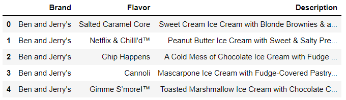
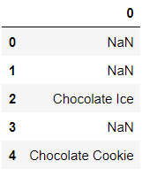
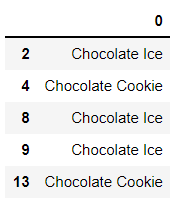

# 부록 E. 정규 표현식

- 정규표현식은 텍스트 검색 패턴으로 컴퓨터가 문자열에서 찾아야 하는 논리적인 문자 시퀀스를 정의 합니다.


## 01. 파이썬의 re 모듈 소개

```python
import re
import pandas as pd
```

- re 모듈에는 문자열에서 부분 문자열을 찾는 search 함수가 있습니다. 이 함수는 검색할 시퀀스와 시퀀스를 검색할 문자열을 나타내는 두 가지 인수를 허용합니다.

```python
re.search('flower', 'field of flowers')
```

```
<re.Match object; span=(9, 15), match='flower'>
```

- search 함수는 파이썬이 대상 문자열에서 문자 시퀀스를 찾으면 Match 객체를 반환합니다. Match 객체는 검색 패턴과 일치하는 콘텐츠와 대상 문자열의 위치정보를 저장합니다. 이전 예제의 출력 결과는 'flower'가 인덱스 위치 9에서 15 사이의 문자 범위에서 발견되었음을 나타냅니다.
- search 함수는 검색 패턴이 대상 문자열에 존재하지 않으면 None을 반환합니다. 기본적으로 주피터 노트북은 None 값에 대해 아무것도 출력하지 않습니다. 하지만 주피터가 값을 강제로 출력하게 하고 싶다면 print 함수에 search 함수의 반환값을 전달하면 됩니다.

```python
print(re.search('flower', 'Barney the Dinosaur'))
```

```
None
```

- search 함수는 대상 문자열에서 문자 시퀀스를 처음 발견한 위치의 항목만 반환합니다. findall 함수를 사용하면 모든 일치 항목을 찾을 수 있습니다.

```python
re.findall('flower', 'Picking flower in the flower field')
```

```
['flower', 'flower']
```


## 02. 메타문자

- 다음의 코드 예제는 가독성을 높이고자 문자열을 여러 줄로 나누었지만 노트북에서는 한 줄로 입력할 수 있습니다.

```python
sentence = 'I went to the store and bought' \
            ' 5 apples, 4 oranges, and 15 plumns.'
sentence
```

```
'I went to the store and bought 5 apples, 4 oranges, and 15 plumns.'
```

- 정규 표현식 안에서 검색 패턴을 정의하는 특수 기호인 메타문자를 선언할 수 있습니다. 예를 들어 \d 메타문자는 파이썬이 모든 숫자를 찾도록 지시합니다. 

```python
re.findall('\d', sentence)
```

```
['5', '4', '1', '5']
```

- 리스트에 요소가 많을 때 주피터 노트북은 각 요소를 별도의 줄에 출력하곤 합니다. 이 스타일은 출력 결과를 읽기 쉽게 만들지만 대신 화면에서 상당한 공간을 차지합니다. 주피터가 리스트를 줄 단위로 출력하도록(특정 임계값만큼 출력된 이후에만 줄 바꿈을 추가하도록) 만들고 싶다면 파이썬의 내장 print 함수로 findall 함수호출을 감싸면 됩니다. 이 절의 실습에서는 공간을 적게 차지하도록 print 함수를 사용하도하겠습니다.
- 이 절의 실습에서는 정규 표현식 인수를 findall 함수에 로 문자열(raw string)로 전달합니다. 파이썬은 로 문자열의 각 문자를 문자 그대로 해석합니다. 이렇게 하면 정규 표현식과 이스케이프 시퀀스 사이의 충동을 방지할 수 있습니다. 예를 들어 \b라는 문자 시퀀스가 있다고 가정합니다. 일반 파이썬 문자열에서는 \b가 백스페이스라는 상징적인 의미를 갖지만 정규 표현식에서는 다른 의미를 가집니다. 로 문자열을 사용하면 파이썬은 \b를 리터럴 백슬래시(\\) 문자다음에 리터럴 b 문자가 오는 것으로 처리합니다. 이 구문은 파이썬이 정규 표현식의 메타문자를 올바르게 파싱하도록 보장합니다.

```python
print(re.findall(r'\d', sentence))
```

```
['5', '4', '1', '5']
```

- \d가 모든 숫자를 의미한다면 \D는 숫자가 아닌 모든 문자를 의미합니다. 숫자가 아닌 문자는 문자, 공백, 쉼표와 기호로 구성됩니다.

```python
print(re.findall(r'\D', sentence))
```

```
['I', ' ', 'w', 'e', 'n', 't', ' ', 't', 'o', ' ', 't', 'h', 'e', ' ', 's', 't', 'o', 'r', 'e', ' ', 'a', 'n', 'd', ' ', 'b', 'o', 'u', 'g', 'h', 't', ' ', ' ', 'a', 'p', 'p', 'l', 'e', 's', ',', ' ', ' ', 'o', 'r', 'a', 'n', 'g', 'e', 's', ',', ' ', 'a', 'n', 'd', ' ', ' ', 'p', 'l', 'u', 'm', 'n', 's', '.']
```

- \w 메타문자는 문자, 숫자, 및 밑줄을 포함하는 모든 단어 문자를 의미합니다.

```python
print(re.findall(r'\w', sentence))
```

```
['I', 'w', 'e', 'n', 't', 't', 'o', 't', 'h', 'e', 's', 't', 'o', 'r', 'e', 'a', 'n', 'd', 'b', 'o', 'u', 'g', 'h', 't', '5', 'a', 'p', 'p', 'l', 'e', 's', '4', 'o', 'r', 'a', 'n', 'g', 'e', 's', 'a', 'n', 'd', '1', '5', 'p', 'l', 'u', 'm', 'n', 's']
```

- \W 메타문자는 단어 문자가 아닌 모든 문자를 나타냅니다. 단어 문자가 아닌 문자에는 공백, 쉼표와 마친표가 포함됩니다.

```python
print(re.findall(r'\W', sentence))
```

```
[' ', ' ', ' ', ' ', ' ', ' ', ' ', ' ', ',', ' ', ' ', ',', ' ', ' ', ' ', '.']
```

- \s 메타문자는 공백 문자를 검색합니다.

```python
print(re.findall(r'\s', sentence))
```

```
[' ', ' ', ' ', ' ', ' ', ' ', ' ', ' ', ' ', ' ', ' ', ' ', ' ']
```

- \S 메타문자는 공백이 아닌 문자를 검색합니다

```python
print(re.findall(r'\S', sentence))
```

```
['I', 'w', 'e', 'n', 't', 't', 'o', 't', 'h', 'e', 's', 't', 'o', 'r', 'e', 'a', 'n', 'd', 'b', 'o', 'u', 'g', 'h', 't', '5', 'a', 'p', 'p', 'l', 'e', 's', ',', '4', 'o', 'r', 'a', 'n', 'g', 'e', 's', ',', 'a', 'n', 'd', '1', '5', 'p', 'l', 'u', 'm', 'n', 's', '.']
```

- 특정 문자를 검색하려면 검색 패턴에서 문자를 그대로 선언합니다.

```python
print(re.findall(r't', sentence))
```

```
['t', 't', 't', 't', 't']
```

```python
print(re.findall(r'to', sentence))
```

```
['to', 'to']
```

- \b 메타문자는 단어의 경계를 선언합니다. 단어의 경계는 공백을 기준으로 문자가 있어야 하는 위치를 지정합니다. 다음은 '\bt'를 검색하는 예제입니다. 이 정규 표현식의 논리는 '단어의 경계 뒤에 있는 모든 t문자'또는 '공백 뒤의 모든 t문자'로 번역됩니다. 패턴은 'to'의 t, 'the'의 t와 일치합니다.

```python
print(re.findall(r'\bt', sentence))
```

- 't\b'를 사용하면 '단어의 경계 앞에 있는 모든 t문자' 또는 '공백 앞의  모든 t문자'를 검색합니다. 'went'의 t와 'bought'의 t가 검색됩니다.

```python
print(re.findall(r't\b', sentence))
```

```
['t', 't']
```

- \B 메타문자는 단어가 아닌 것의 경계를 선언합니다. 예를 들어 '\Bt'는 '단어의 경계 뒤에 오지 않는 모든 t 문자' 또는 '공백 뒤에 오지 않는 모든 t 문자'를 의미합니다. 'went', 'store', 'bought'의 t문자를 찾습니다. 파이썬은 'to', 'the'의 t 문자는 단어의 경계 뒤에 나타나기 때문에 무시합니다.

```python
print(re.findall(r'\Bt', sentence))
```

```
['t', 't', 't']
```


## 03. 고급 검색 패턴

- 점(.) 메타문자는 모든 문자와 일치합니다.

```python
soda = 'coca cola.'
soda
```

```
'coca cola.'
```

```python
print(re.findall(r'.', soda))
```

```
['c', 'o', 'c', 'a', ' ', 'c', 'o', 'l', 'a', '.']
```

- 'c.' 는 'c' 다음에 임의의 문자가 오는 문자를 검색합니다.

```python
print(re.findall(r'c.', soda))
```

```
['co', 'ca', 'co']
```

- 문자열에서 리터럴 점을 검색하려면 정규 표현식에서 백슬래시로 이스케이프 처리해야 합니다. '\\.'은 점 문자와 일치합니다.

```python
print(re.findall(r'\.', soda))
```

```
['.']
```

```python
print(re.findall(r'co', soda))
```

```
['co', 'co']
```

- 문자 c 또는 o를 검색하려면 한 쌍의 대괄호로 문자를 감싸면 됩니다.

```python
print(re.findall(r'[co]', soda))
```

```
['c', 'o', 'c', 'c', 'o']
```

- 대괄호 안의 문자 순서는 결과에 영향을 주지 않습니다.

```python
print(re.findall(r'[oc]', soda))
```

```
['c', 'o', 'c', 'c', 'o']
```

- c와 l 사이의 모든 문자를 검색하고 싶다고 가정하겠습니다.

```python
print(re.findall(r'[cedfghijkl]', soda))
```

```
['c', 'c', 'c', 'l']
```

- 더 나은 검색 방법은 대시 기호(-)를 사용하여 문자 범위를 선언하는 것 입니다. 

```python
print(re.findall(r'[c-l]', soda))
```

```
['c', 'c', 'c', 'l']
```

```python
word = 'bookkeeper'
word
```

```
'bookkeeper'
```

- 연속되는 2개의 e 문자를 검색하려면 검색 시퀀스에서 문자를 2개 이어 쓸 수 있습니다.

```python
print(re.findall(r'ee', word))
```

```
['ee']
```

- 한 싸의 중괄호를 사용하여 여러 문자를 검색할 수 있습니다. 중괄호 안에 일치할 문자가 등장할 횟수를 선언합니다.

```python
print(re.findall(r'e{2}', word))
```

```
['ee']
```

```python
print(re.findall(r'e{3}', word))
```

```
[]
```

- 중괄호 안에 2개의 숫자를 쉼표로 구분하여 입력할 수 있습니다. 첫번째 값은 등장 횟수의 하한이고 두번재 값은 등장 횟수의 상한을 설정합니다.

```python
print(re.findall(r'e{1,3}', word))
```

```
['ee', 'e']
```


```python
transcription = 'I can be reached at 555-123-4567. '\
                'Look forward to talking to you soon.'
transcription
```

```
'I can be reached at 555-123-4567. Look forward to talking to you soon.'
```

- 전화번호를 추출해보자

```python
print(re.findall(r'\d{3}-\d{3}-\d{4}', transcription))
```

```
['555-123-4567']
```

- 문자 또는 메타문자가 '1개 이상' 연속되는 것은 나타내는 편리한 + 메타문자도 있습니다. 예를 들어  \d+는 1개 이상의 연속된 숫자를 검색합니다.

```python
print(re.findall(r'\d+-\d+-\d+', transcription))
```

```
['555-123-4567']
```


## 04. 정규 표현식과 판다스

- ice_cream.csv 데이터셋은 4개의 인기 브랜드의 아이스크림 맛 모음 입니다.

```python
ice_cream = pd.read_csv('ice_cream.csv')
ice_cream.head()
```



- Description 열에서 'Chocolate' 문자열 바로 뒤에 오는 모든 단어를 찾아보겠습니다. Series에서 str.extract 메서드를 사용하여 이 작업을 수행할 수 있습니다. 이 메서드는 정규 표현식 패턴을 받아서 일치하는 DataFrame을 반환합니다.

- 기술적인 이유로 정규 표현식을 str.extract 메서드에 전달할 때는 괄호로 묶어야 합니다. 이 메서드는 여러 정규 표현식을 검색하는 고급 구문을 지원하며 괄호는 정규 표현식 하나로 묶는 역활을 합니다.

```python
ice_cream['Description'].str.extract(r'(\bChocolate\s\w+)').head()
```



```python
(
    ice_cream['Description']
    .str.extract(r'(\bChocolate\s\w+)')
    .dropna()
    .head()
                 
)
```



- squeeze 메서드를 사용하여 단일 열 DataFrame을 Series로 강제 변환할 수 있습니다.

```python
(
    ice_cream['Description']
    .str.extract(r'(\bChocolate\s\w+)')
    .dropna()
    .squeeze()
    .head()
)
```

```
2        Chocolate Ice
4     Chocolate Cookie
8        Chocolate Ice
9        Chocolate Ice
13    Chocolate Cookie
Name: 0, dtype: object
```

```python
chocolate_flavors = (
    ice_cream['Description']
    .str.extract(r'(\bChocolate\s\w+)')
    .dropna()
    .squeeze()
)
```

- 궁극적인 목표는 'Chocolate' 다음에 오는 재료를 식별하는 것 입니다. str.split 메서드를 호출하여 공백을 기준으로 각 문자열을 분할하겠습니다.

```python
chocolate_flavors.str.split(r'\s').head()
```

```
2        [Chocolate, Ice]
4     [Chocolate, Cookie]
8        [Chocolate, Ice]
9        [Chocolate, Ice]
13    [Chocolate, Cookie]
Name: 0, dtype: object
```

- str.get 메서드는 Series의 각 리스트에서 일관된 인덱스 위치에 있는 값을 식별합니다.

```python
chocolate_flavors.str.split(r'\s').str.get(1).head()
```

```
2        Ice
4     Cookie
8        Ice
9        Ice
13    Cookie
Name: 0, dtype: object
```

```python
chocolate_flavors.str.split(r'\s').str.get(1).value_counts()
```

```
Ice         11
Cookie       4
Chip         3
Sandwich     2
Cookies      2
Malt         1
Mint         1
Name: 0, dtype: int64
```

