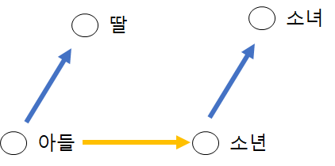
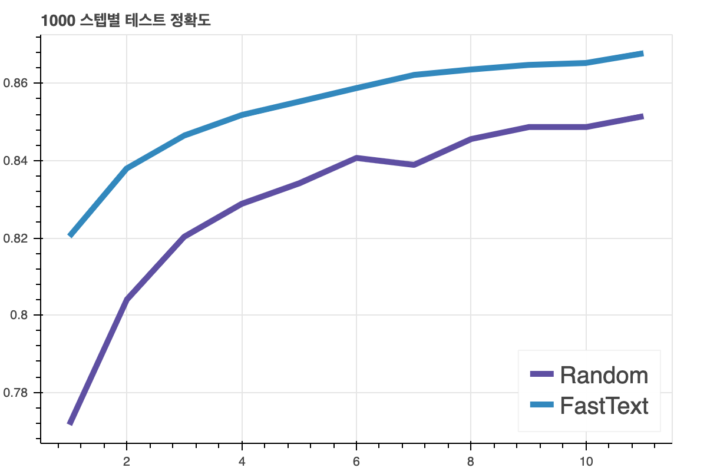
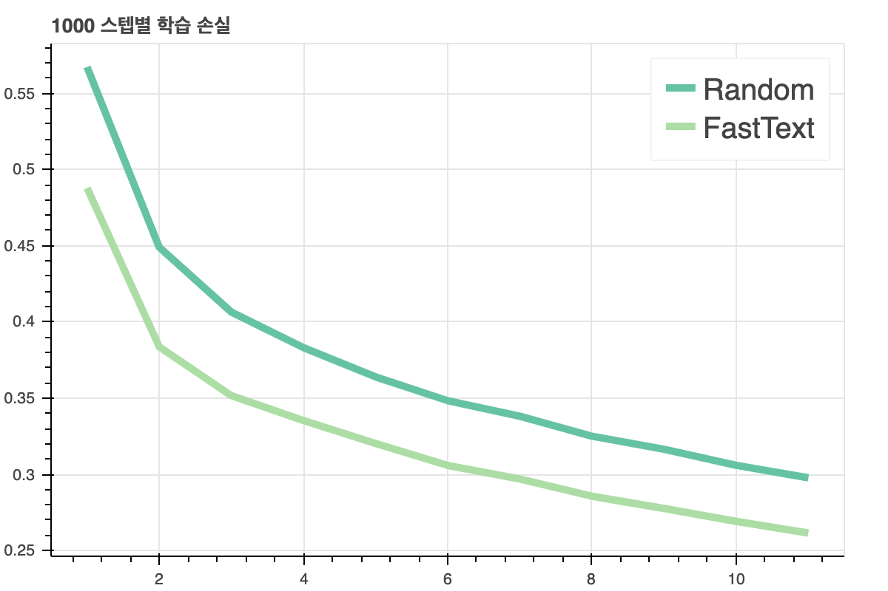

# 1.2 임베딩의 역활

* **단어 / 문장 간 관련도 계산**
* **의미적 / 문법적 정보 함축**
* **전이 학습(Transfer Learning)**

## 1.2.1 단어 / 문장 간 관련도 계산

**수식 1-1 '희망' 의 word2vec 임베딩**

### `[-0.00209,...........................,0.09300]`

​                                                                      **100개(100차원)**

word2vec 임베딩이란 2013년 구글 연구팀이 발표한 임베딩 기법이다.  

##### **`단어를 벡터로 임베딩 하는 순간 단어 사이의 유사도를 계산하는 일이 가능해진다.`**

**표1-2 코사인 유사도 기준 상위 5개 단어 목록**

| **희망** | **절망** | **학교** | **학생** |
| :------: | :------: | :------: | :------: |
|   소망   |   체념   |   초등   |  대학생  |
|   행복   |   고뇌   |  중학교  | 대학원생 |
|  희망찬  |  절망감  | 고등학교 |  고학생  |
|    꿈    |  상실감  |  야학교  |  교직원  |
|   열망   |   번민   |   중학   |  학부모  |

코사인 유사도란 단어 벡터 간 유사도 측정 기법의 일종이다.

위에 표는 한국어 위키백과, KorQuAD, 네이버 영화 리뷰 등을 바탕으로  word2vec 임베딩을 한 뒤 단어별로 벡터 간 유사도 측정 기법의 일종일 코사인 유사도 기준으로 만들어 낸 표이다.

'희망' 이라는 단어는 '소망' 이라는 단어와 가장 코사인 유사도가  높다.

## 1.2.2 의미적 / 문법적 정보 함축

**그림 1-1 단어 유추 평가 word analogy test**

임베딩은 벡터로서 사칙연산이 가능하다. 단어 벡터 간 덧셈, 뺄셈을 통해 단어들 사이에 의미적, 문법적 관계를 도출해 낼 수 있다. 

### 구체적으로 **`단어1 - 단어2 + 단어3` ** 를 계산하는 것 이다.

예를 들어 **`아들 - 딸 + 소녀 =  소년` ** 이 성립한다면 성공적인 임베딩이라 할 수 있다.

왜냐하면 **`아들 - 딸 = 소년 - 소녀`** 관계가 임베딩에 함축되있기 때문이다.

**표 1-3 Word2Vec 임베딩에 단어 유추 평가를 수행한 결과**

| 단어1 | 단어2 | 단어3 | 결과 |
| :---: | :---: | :---: | :--: |
| 아들  |  딸   | 소년  | 소녀 |
| 아들  |  딸   | 아빠  | 엄마 |
| 아들  |  딸   | 남성  | 여성 |

위에 표는 한국어 위키백과, KorQuAD, 네이버 영화 리뷰 등 공개된 데이터로 학습한 Word2Vec 임베딩에 단어 유추 평가를 수행한 결과다.

**`단어1 - 단어2 + 단어3`** 연산을 수행한 벡터와 코사인 유사도가 가장 높은 단어들이 결과의 단어들이다.

## 1.2.3 전이학습(Transfer Learning)

임베딩을 다른 딥러닝 모델의 입력값으로 쓰는 기법을 전이학습이라고 한다.

임베딩에는 의미적, 문법적 정보 등이 녹아있다. 이러한 임베딩을 입력값으로 쓰는 전이학습 모델은 더욱 높은 정확도와 빠른 학습을 할 수 있다.

**그림 1-2 임베딩 종류별 긍정/부정 문서 분류 정확도**

**그림 1-3 임베딩 종류별 학습 손실**

위에 그림은 학습 과정별 단순 정확도(**accuracy**) 와 학습 손실(**training loss**) 를 그래프로 나타낸 것 이다. 학습 데이터는 네이버 영화를 사용했다. 

두 가지의 방법을 사용했다. 하나는 FastText(Word2Vec의 발전된 버전) 임베딩을 입력값으로 사용한 학습 모델과 입력 벡터를 랜덤으로 초기화 한 학습 모델이다. 랜덤으로 초기화 했다는 것을 아무것도 없는 상태에서 학습했다는 것이다. 

그림을 보면 임베딩을 한 모델이 정확도가 높고 학습 손실이 작다는 것을 알 수 있다.