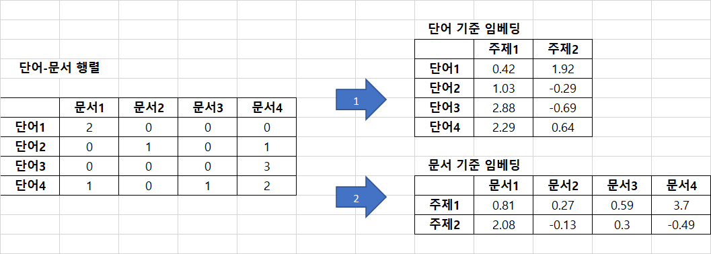
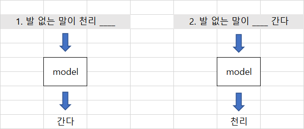
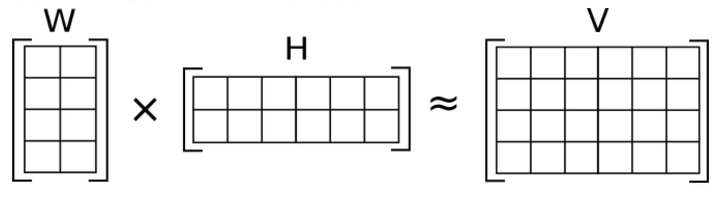
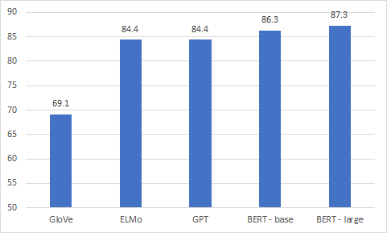

# 1.3 임베딩 기법의 역사와 종류

## 1.3.1 통계기반에서 뉴럴 네트워크 기반으로

### (1) 통계기반

초기 임베딩 기법은 말뭉치의 통계량을 직접적으로 활용하는 경향이 있었다. 

##### `대표적인 기법이 잠재 의미 분석(**Latent Semantic Analysis**)`

잠재 의미 분석이란 단어 사용 빈도 등 말뭉치의 통계량 정보가 들어 있는 커다란 행렬에 **특이값 분해(Singular Value Decomposition)** 등 수학적 기법을 적용해 행렬에 속한 벡터들의 차원을 축소하는 방법을 말한다.

**그림 1-4 잠재 의미 분석**

행렬을 자르는 이유는 **행 또는 열의 개수가 많고**, 대부분 행렬의 요소에 값이 0인 **희소 행렬(sparse matrix)** 이기 때문이다.  행렬이 지나치게 크면 계산량이 늘어나고 메모리 소비량이 커진다.

잠재의미 분석 수행 대상 행렬은 여러 종류가 될 수 있다.

* 단어-문서 행렬
* TF - IDF 행렬 (Term Frequency - Inverse Document Frequency)
* 단어 - 문맥 행렬 (Word - Context Matrix)
* 점별 상호 정보량 행렬 (Pointwise Mutual Information Matrix)

### (2) 뉴럴 네트워크 기반 

최근에는 **뉴럴 네트워크 (Neural Network)** 기반의 임베딩 기법들이 주목받고 있다.

단어들이 주어졌을때, 다음 단어가 뭐가 될지 예측하거나, 문장 내 일부분에 구멍을 뜷어 놓고 (masking)  해당 단어가 무엇일지 맞추는 과정에서 학습된다.

**그림 1-5 뉴럴 네트워크 기반의 임베딩 기법**

## 1.3.2 단어 수준에서 문장 수준으로

### (1) 단어 수준 임베딩 기법

단어 임베딩 기법들은 각각의 벡터에 해당 단어의 문맥적 의미를 함축한다. 하지만 단어 수준 기법의 단점은 동의이의어를 분간하기 어렵다.

* ex) NPLM, Word2Vec, Glove, FastText, Swivel 등

### (2) 문장 수준 임베딩 기법

문장 수준 임베딩 기법은 개별단어가 아닌 단어 시퀀스 전체의 의미를 함축하기 때문에 단어 임베딩 기법 보다 전이학습 효과가 좋은 것으로 알려져 있다.

* ex) ELMo, BERT, GPT  등

## 1.3.3 룰 > 엔드투엔드 > 프리트레인 / 파인 튜닝

### (1) 룰 (Rule)

1990년대까지 자연어 처리 모델 대부분은 사람이 피처를 직접 뽑았다. 피처란 모델의 입력 값을 가르킨다. 한국어 문장을 구문분석(parsing)하는 모델을 만든 다고 하자. 이때 피처 추출은 언어학적인 지식을 활용한다. 한국에서는 명사 앞에 관형사가 올 수 있고 조사가 명사 뒤에 오는 경향이 있으므로 이러한 **규칙(Rule)** 을 모델에 알려준다.

### (2) 엔드투엔드 (end - to - end model)

2000년대 중반 이후, 딥러닝 모델을 활용했다. 딥러닝 모델은 입력과 출력 사이의 관계를 잘 근사(approximation)하기 때문에 사람이 모델에 규칙을 굳이 직접 알려주지 않아도 된다.. 데이터를 통째로 모델에 넣고 입출력 사이의 관계를 사람의 개입 없이 모델 스스로 처음부터 끝까지 이해하도록 유도한다.

### (3) 프리트레인 / 파인 튜닝

2018년 ELMo 모델이 제안된 이후, 프리트렌인/ 파인 튜닝 방식으로 발전하고 있다. 우선 대규모 말뭉치로 임베딩을 만든다(**프리트레인**). 이후 임베딩을 입력값으로 하는 딥러닝 모델을 만들고 우리가 풀고 싶은 구체적 문제에 맞는 소규모 데이터에 맞게 임베딩을 포함한 모델 전체를 업데이트한다(**파인 튜닝, 전이학습**).

### (4) 다운 스트림 태스크 / 업 스트림 태스크

* 다운 스트림 태스크 : 우리가 풀고자 하는 자연어 처리의 구체적 문제

  * ex) 품사 판별, 개체명 인식, 의미 분석 등

    

* 업 스트림 태스크 : 다운 스트림 태스크에 앞서 해결해야하는 과제

  * ex) 프리트레인

## 1.3.4 임베딩의 종류와 성능

* **행렬 분해 (factorization)**
* **예측**
* **토픽기반**

### (1) 행렬 분해 기반 방법

말뭉치 정보가 들어있는 원래 행렬을 두 개 이상의 작은 행렬로 쪼개는 방식의 임베딩 기법을 가리킨다. 분해한 이후엔 둘 중에 하나의 행렬만 쓰거나 둘을 더하거나(sum) 이어붙여(concatenate) 임베딩으로 사용한다. 

* ex) Glove, Swivel 등

**그림 1-6 행렬 분해 기반 방법**

### (2) 예측 기반 방법

어떤 단어 주변에 특정 단어가 나타날지 예측하거나, 이전 단어들이 주어졌을 때, 다음 단어가 무엇일지 예측하거나, 문장 내 일부 단어를 지우고 해당 단어가 무엇일지 맞추는 과정에서 학습하는 방법이다. 뉴럴 네트워크 방법들이 예측기반 방법에 속한다

* ex) Word2Vec, FastText, BERT, EMLo, GPT 등

### (3) 토픽 기반 방법

주어진 문서에 잠재된 주제(latent topic)를 추론(inference)하는 방식으로 임베딩을 수행하는 기법도 있다. **잠재 디리클레 할당(Latent Dirichlet Allocation)**이 대표적인 기법이다. LDA 같은 모델은 학습이 완료되면 각 문서가 어떤 주제 분포를 갖는지 확률 벡터 형태로 반환하기 때문에 임베딩 기법의 일종으로 이해할 수 있다.

### (4) 임베딩 성능 평가

Tenney et al. (2019) 은 영어 기반 다운스트림 태스크에 대한 임베딩 종류별 성능을 분석했다. 파인 튜닝 모델의 구조는 고정했다.

**그림 1-7 임베딩 종류별 성능**

한국어는 공개되있는 데이터가 많지 않아 성능 측정이 어렵다.