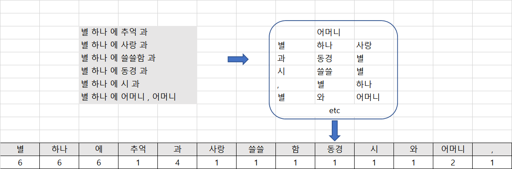
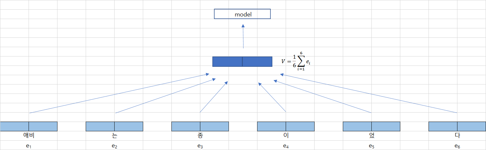

# 2.2 어떤 단어가 많이 쓰였는가

## 2.2.1 백오브워즈 가정

* 수학에서 백(bag) 이란 중복 원소를 허용한 집합 (multiset) 을 뜻한다. 

  원소의 순서는 고려하지 않는다.

  

* 자연어 처리 분야에서 백오브워즈 (bag of words) 란 단어의 등장 순서에 관계 없이 문서 내 단어의 등장 빈도를 임베딩으로 쓰는 기법을  말한다.

  경우에 따라서는 빈도 역시 단순화해 등장여부 ( 0 or 1 ) 만을 백오브워즈 임베딩으로 쓰기도 한다.

**그림 2-1 백오브워즈 임베딩**

**표 2-2 단어 - 문서 행렬**

| **구분** | **메밀꽃 필 무렵** | **운수 좋은 날** | **사랑 손님과 어머니** | **삼포 가는길** |
| :------: | :----------------: | :--------------: | :--------------------: | :-------------: |
|   기차   |         0          |        2         |           10           |        7        |
|  막걸리  |         0          |        1         |           0            |        0        |
|  선술집  |         0          |        1         |           0            |        0        |

* 백오브워즈 임베딩에는 단어 빈도가 클수록 주제와 강한 관련이 있을 거란 가정을 한다.

  * ex) `표 2-2` 사랑 손님과 어머니 와 삼포가는 길 의 문서 관련성이 높다. 왜냐하면 단어 빈도 수 가 비슷하기 때문이다.

  * ex) 백오브워즈 임베딩은 `정보검색분야` 에서 많이 활용된다.

  ​		사용자 질의에 가장 적절한 문서를 보여줄때, 질의를  백오브워즈 임베딩으로 변환하고 질		의와 검색 대상 문서 임베딩 간 코사인 유사도를 구해 가장 높은 문서를 사용자에게 제공함.

## 2.2.2 TF - IDF

* 단어 빈도 또는 등장 여부를 그대로 임베딩으로 쓰는 것에는 큰 단점이 있다. 어떤 문서에든 쓰여서 해당 단어가 (많이) 나타났다 하더라도 문서의 주제를 가늠하기 어려운 경우가 있기 때문이다.
  * ex) 을/를, 이/가
* 이러한 단점을 보완하기 위해 제안된 기법이 Term Frequency - Inverse Document Frequency

**수식 2-1 TF - IDF**
$$
TF-IDF(w)=TF(w) * log(N/DF(w))
$$

* TF (Term Frequency) : 어떤 단어가 특정 문서에 얼마나 많이 쓰였는 지에 대한 빈도.

  * ex) `단어 A 가 문서 1에 10번 등장 = TF 10`	`단어 A 가 문서 2에 5번 등장 = TF 5`

  * TF 가 크다는 것은 중요한 단어라는 의미

    

* DF (Document Frequency) : 특정 단어가 나타난 문서의 수.

  * ex) `단어 A 가 문서1, 문서2에 등장 = DF 2`

  * DF 가 크다는 것은 범용적인 단어라는 의미

    

* IDF (Inverse Document Frequency) : 
  $$
  log(N/DF(w))
  $$

  * IDF 가 크다는 것은 특이한 단어라는 뜻.
  * 이는 단어의 주제 예측 능력 (해당 단어만 보고 문서의 주제를 가늠해 볼 수 있는 정도) 과 직결된다.

**표 2-3 TF - IDF 행렬**

| **구분** | **메밀꽃 필 무렵** | **운수 좋은 날** | **사랑 손님과 어머니** | **삼포 가는길** |
| :------: | :----------------: | :--------------: | :--------------------: | :-------------: |
|  어머니  |       0.066        |       0.0        |         0.595          |       0.0       |
|    것    |       0.2622       |      0.098       |         0.145          |     0.0848      |

* `표 2-3`은 `표 2-2` 에 TF - IDF 가중치를 계산해 행렬원소 (matrix element) 바꾼 표이다.
* 사랑 손님과 어머니에서 `어머니`의 TF - IDF 값이 `것` 보다 큰 것을 봤을때 `어머니`란 단어가 더욱 큰 의미를 가진다는 것을 알 수 있다.
* TF - IDF 가 지향하는 원리는 어떤 단어의 주제 예측 능력이 강할 수록 가중치가 커지고 반대의 경우는 작아진다. 정보성이 없는 단어들은 그 가중치가 줄어들게 되 불필요한 정보가 사라진다.
* `표 2-2` 보다 `표 2-3`이 품질이 좋은 임베딩이라고 할 수 있다.
* TF - IDF 역시 단어 등장 순서를 고려하지 않는 다는 점에서 백오브워즈 임베딩이라고 할 수 있다.

## 2.2.3 Deep Averaging Network

Deep Averaging Network 는 백오브워즈 가정의 뉴럴 네트워크 버젼이다.

**그림 2-2 Deep Averaging Network**

* {에비, 는,  종, 이, 었, 다} 라는 문장의 임베딩을 평균을 취해서 모델을 만든다. 벡터의 덧셈은 교환법칙이 성립하기에 {에비, 종, 이, 었, 다, 는} 같이 순서로 써도 임베딩 같은 동일하다.

* DAN 이 백오브워즈 가정과 연결될 수 있는 지점은 단어의 순서를 고려하지 않는 다는 점이다.

* DAN 문장 내 어떤 단어가 쓰였는지, 쓰였다면 얼마나 쓰였는지 빈도만 따진다.

* DAN 은 이러한 문장 임베딩을 입력 받아 해당 문서가 어떤 범주인지 분류 (classification) 한다.

  
