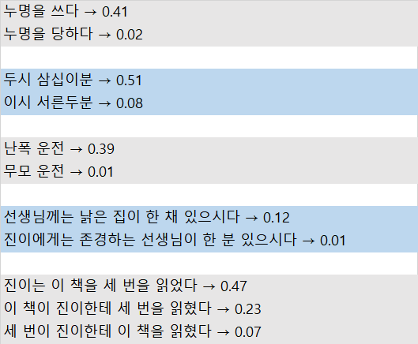
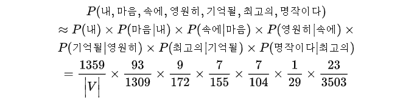
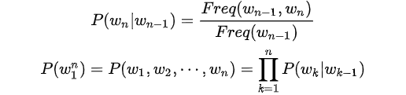
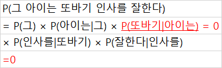
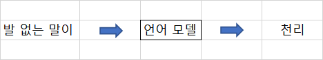
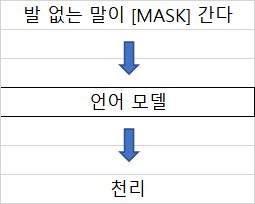

# 2.3 단어가 어떤 순서로 쓰였는가

## 2.3.1. 통계 기반 언어 모델

* 언어 모델 (language model) 이란 단어 시퀀스에 확률 (probability) 을 부여 (assign) 하는 모델
* 백오브워즈의 대척점에 있는 모델이라고 할 수 있다.

---

* 언어가 n개 주어진 상황이라면 언어 모델은 n개 단어가 동시에 나타날 확률 P(w~1~, ... , w~n~) 을 반환한다.
* 통계기반의 언어모델은 말뭉치에서 해당 단어 시퀀스가 얼마나 자주 등장 하는지 빈도를 세어 학습한다.
* 잘 학습된 언어 모델이 있다면 어떤 문장이 자연스러운지 알 수 있다.

**그림 2-3 한국어 언어 모델 예시**

* n - gram 이란 n개 단어를 뜨하는 용어이다.

  * ex) 난폭, 운전 → 2 - gram 또는 바이그램(bigram)

    ​	   명, 을, 쓰다 → 3 - gram 또는 트라이그램(trygram)

  * 경우에 따라서 n - gram 은 n - gram 을 기반한 언어 모델을 의미하기도 한다. 

    즉, 말뭉치 내 단어들을 n개씩 묶어서 그 빈도를 학습했다는 뜻이다.

**표 2-4 네이버 영화 말뭉치의 각 표현별 등장 횟수**

| 표현                                       | 빈도 |
| ------------------------------------------ | ---- |
| 내                                         | 1309 |
| 마음                                       | 172  |
| 속에                                       | 155  |
| 영원히                                     | 104  |
| 기억될                                     | 29   |
| 최고의                                     | 3503 |
| 명작이다                                   | 298  |
| 내 마음                                    | 93   |
| 마음 속에                                  | 9    |
| 속에 영원히                                | 7    |
| 영원히 기억될                              | 7    |
| 기억될 최고의                              | 1    |
| 최고의 명작이다                            | 23   |
| 영원히 기억될 최고의 명작이다              | 1    |
| 내 마음 속에 영원히 기억될 최고의 명작이다 | 0    |

* 네이버 영화 리뷰 말뭉치에서 각각의 표현이 등장한 횟수
* `내 마음 속에 영원히 기억될 최고의 명작이다` 는 자연스러운 문장임에도 해당 표현이 등장하지 않아 확률은 0 (자연스럽지 않는 문장 취급) 이다.

**수식 2-2 '내 마음 속에 영원히 기억될 최고의' 다음에 '명작이다' 가 나타날 확률**

* 조건부확률 (conditional probability) 의 정의를 활용해 최대우도측정법 (Maximum Likelihood Estimation) 으로 유도한 식
* Freq 란 문자열 시퀀스가 말뭉치에서 나타난 빈도
* Freq(내, 마음, 속에, 영원히, 기억될, 최고의, 명작이다) 가 0 이므로 전체값은 0이다.

**수식 2-3 바이그램 근사 예시 (1)**

* n - gram 모델을 쓰면 전체의 값이 0 이 되는 문제를 일부 해결할 수 있다.

  * 직전 n - 1 개 단어의 등장 확률로 전체 단어 시퀀스 등장 확률을 근사 (approximation) 하는 것 이다.

  * 한 상태의 확률은 그 직전 상태에만 의존한다는 마코프 가정(Markov auumption) 에 기반한 것 이다.

    

**수식 2-4 바이그램 근사 예시 (2)**

* |V| 는 어휘 집합 (vocabulary) 에 속한 단어 수를 가리킨다.

**수식 2-5 바이그램 모델**

**그림 2-4 n - gram 모델의 한계 예시**

* 데이터에 한번도 등장하지 않는 n - gram 이 존재할 때(빈도수 0 존재), 문제가 발생한다.

  이를 위해 **백오프 (back - off)**,** 스무딩 (smoothing)** 등의 방식이 제안됐다.

**수식 2-6 백오프 기법 예시**

* 백오프란 n - gram 등장빈도를 n 보다 작은 범위의 단어 시퀀스 빈도로 근사하는 방식
* α, β 는 실제 빈도와의 차이를 보정해주는 **파라미터 (parameter)** 다. 

* 스무딩(or Add - k 스무딩)은 `표 2-4` 와 같은 등장빈도 표에 *k* 만큼 더하는 기법이다.
  * ` 내 마음 속에 영원히 기억될 최고의 명작이다` 의 빈도는 *k* 가 된
* *k* = 1 을 설정 할 경우, **라플라스 스무딩 (laplace smoothing)** 이라 한다.
* 스무딩을 시행하면 높은 빈도를 가진 문자열 등장 확률을 일부 깍고 데이터에 전혀 등장하지 않는 케이스들에게는 작게 나마 일부 확률을 부여한다. 

## 2.3.2 뉴럴 네트워크 기반 언어 모델

* 통계기반 언어 모델은 단어들의 빈도를 세어서 학습한다.
* 뉴럴 네트워크는 입력과 출력 사이의 관계를 유연하게 포착해 낼 수 있고, 그 자체로 확률 모델로 기능할 수 있다.

**그림 2-5 뉴럴 네트워크 기반 언어 모델을 활용한 임베딩**

* 뉴럴 네트워크 기반 언어 모델은 주어진 단어 시퀀스를 가지고 단어 맞추는 (prediction) 과정에서 학습된다. 학습이 완료되면 이들 모델의 중간 혹은 말단 계산 결과물을 단어나 문장의 임베딩으로 활용한다.
  * ex) ELMo, GPT 등

**그림 2-6 마스크 언어 모델 기반 임베딩 기법**

* **마스크 언어 모델 (masked language model)** 은 문장 중간에 마스크를 씌워 놓고, 해당 마스크 위치에 어떤 단어가 올지 예측하는 과정에서 학습한다.
  * ex) BERT
* 언어 모델 기반 기법은 단어를 순차적으로 입력받아 다음 단어를 맞춰야 하기 때문에 태생적으로 **일방향 (uni - direction)** 이다.
* 마스크 언어 모델 기반 기법은 문장 전체를 다 보고 중간에 있는 단어를 예측하기 때문에 **양방향 (bi - direction)** 학습이 가능하다.
* 마스크 언어 모델 기반의 방법들이 기존 언어 모델 기법들에 비해 임베딩 품질이 좋다.