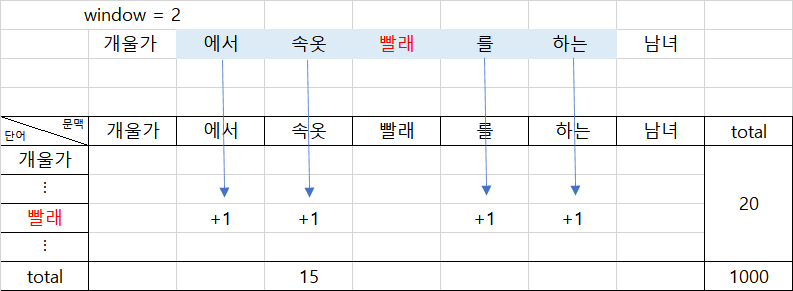
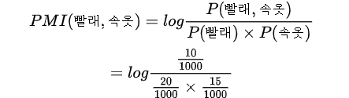
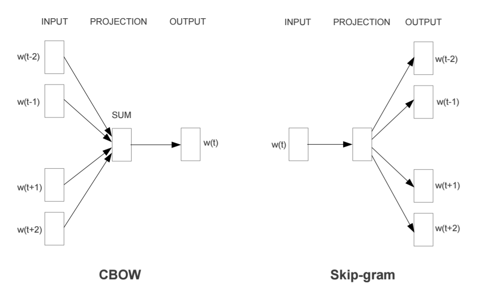

# 2.4 어떤 단어가 같이 쓰였는가

## 2.4.1 분포가정

* 자연어 처리에서 **분포(distribution)** 란 특정 범위, 즉 **윈도우 (window)** 내에 동시에 등장하는 이웃 단어 또는 **문맥 (context)** 의 집합을 가리킨다.
* 개별 단어의 분포는 그 단어가 문장 내에서 주로 어느 위치에 나타나는지, 이웃한 위치에 어떤 단어가 자주 나타나는지에 따라 달라진다.
* 어떤 단어 쌍(pair) 이 비슷한 문맥 환경에서 자주 등장한다면 그 의미 또한 유사할 것이라는 게 **분포 가정 (distributional hypothesis)** 의 전제다.

---

* 분포 가정은 "단어의 의미는 곧 그 언어에서의 활용이다" 라는 언어학자 비트겐슈타인의 철학에 기반해 있다.
* 다시 말해 모국어 화자들이 해당 단어를 실제 어떻게 사용하고 있는지 문맥을 살핌으로써 그 단어의 의미를 밝힐 수 있다는 이야기이다.

**그림 2-7 한국어 위키백과에 언급된 빨래, 세탁**

* `빨래`,`세탁` 은 **타깃 단어(target word)** 이고, `청소`,`물`  등은 그 주위에 등장하는 **문맥단어(context)**  이다.

* `빨래` 는 `청소`, `요리`, `물`, `속옷` 과 같이 등장했다.

  `속옷` 는 `청소`, `요리`, `물`, `옷` 과 같이 등장했다.

  `빨래` 와 `속옷` 은 이웃한 단어가 비슷하기에 비슷한 의미를 지닐 가능성이 높다

* `빨래` 와 `청소`, `요리`, `물`, `속옷` 과 같이 같이 등장하는 경향을 보아 이들 사이에 직간접적인 관계를 가질 가능성이 있다.

* 하지만 분포정보가 곧 의미라는 분포 가정에 의문점이 생긴다.

  다음 절에 어떤 관계가 있는지 언어학적 관점에서 살펴보자.

## 2.4.2 분포의 의미 (1): 형태소

* 언어학에서 **형태소 (morpheme)** 란 의미를 가지는 최소 단위를 말한다.

  * ex) 철수 → 철, 수 는  의미가 사라지기에 철수는 형태소

    ​      밥 → 바, ㅂ 는  의미가 사라지기에 밥은 형태소

* 언어학자들은 형태소를 분석하는 방법이 다르다. 대표적인 기준으로 **계열관계 (paradigmatic relation)** 가 있다.

  * 계열관계는 해당 형태소 자리에 다른 형태소가 '대치' 돼 쓰일 수 있는 가를 따지는 것 이다.

  * 언어학자들이 대량의 한국어 말뭉치 분석으로 

    `철수가 밥을 먹었다`  `철수` → 영희, `밥` → `빵` 으로 쓸 수도 있다는 사실을 확인 했다고 가정 하면 이를 근거로 `철수` 와 `밥` 에 형태소 자격을 부여한다.

* 언어학자들이 계열관계를 바탕으로 형태소를 분석했다.

  이는 언어학자들이 특정 타깃 단어 주변의 문맥 정보를 바탕으로 형태소를 확인했다는 이야기와 일맥상통하다. 말뭉치의 분포 정보와 형태소가 밀접한 관계를 이루고 있다는 것이다.

## 2.4.3 분포와 의미 (2): 품사

* 품사란 단어를 문법적 성질의 공통점에 따라 분류한 것.
* 품사의 분류 기준은 **기능(function)**, **의미(meaning)**, **형식(form)** 등이 있다.

> 이샘의 **깊이**가 얼마냐?
>
> 저 산의 **높이**가 얼마냐?
>
> 이 샘이 **깊다**.
>
> 저 산이 **높다**.

* **기능** 은 한 단어가 문장 가운데서 다른 단어와 맺는 관계를 가리킨다. 위 예시에서 `깊이`, `높이`는 문장의 주어로 쓰이고 있고, `깊다`,`높다`는 서술어로 사용되고 있다.
* **기능** 은 특정 단어가 문장 내에서 어떤 역활을 하는지, **분포**는 그 단어가 어느 자리에 있는 지를 나타낸다.  기능과 분포는 개념적으로 엄밀히 다르지만, 둘 사이에는 밀접한 관련을 지닌다.
* 형태소의 경계를 정하거나 품사를 나누는 것과 같은 다양한 언어학적 문제는 말뭉치의 분포 정보와 깊은 관계를 갖고 있다. 이 덕분에 임베딩에 분포 정보를 함축하게 되면 해당 벡터에 해당 단어의 의미를 자연스레 내제 시킬 수 있게 된다.

## 2.4.4 점별 상호 정보량

**수식 2-7 점별 상호 정보량 (PMI)**

* **점별 상호 정보량 (Pointwise Mutual Information)** 은 두 **확률변수 (random variable)** 사이의 상관성을  계량화하는 단위이다.

  두 확률 변수가 완전히 **독립 (indepent)** 인 경우 **PMI 는 0이 된다**.

  * ex) 단어 A 와 단어B 가 자주 같이 등장하면 PMI 값은 커진다.

* 이렇게 구축한 PMI 행렬의 행 벡터 자체를 해당 단어의 임베딩ㅇ으로 사용할 수 있다.

**그림 2-8 단어 - 문맥 행렬 구축**

* 윈도우가 2 라면 타깃 단어 앞뒤로 2개의 문맥 단어 빈도를 계산한다. 

**수식 2-8 빨래 - 속옷의 PMI 계산**

* 단어를 훑어 단어 - 문맥 행렬을 모두 구했다고 하자. 그리고 전체 빈도수 1000회, `빨래` 가 등장한 횟수 20회, `속옷`이 등장한 횟수 15회, `빨래`,`속옷`  이 동시에 등장한 빈도는 10회라고 가정하자.

## 2.4.5 Word2Vec

* 분포 가정의 대표적인 모델은 2013년 구글 연구팀이 발표한 **Word2Vec** 이라는 임베딩 기법이다.

**그림 2-9 CBOW와 Skip - gram 모델**

* **CBOW 모델**은 문맥 단어들을 가지고 타깃 단어 하나는 맞추는 과정에서 학습한다.
* **Skip - gram 모델**은 타깃 단어를 가지고 문맥 단어가 무엇일지 예측하는 과정에서 학습한다.
* 둘 모두 특정 타깃 단어 주변의 문맥, 즉 분포 정보를 임베딩에 함축한다.