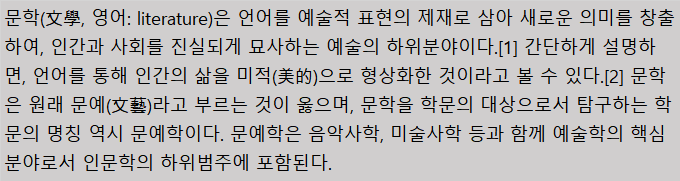
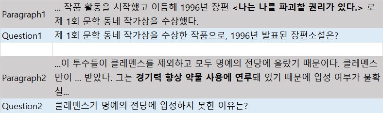
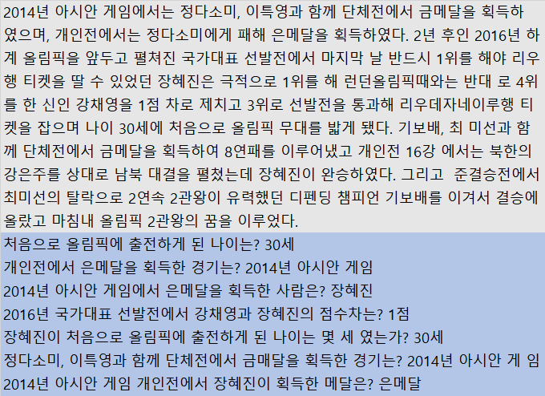
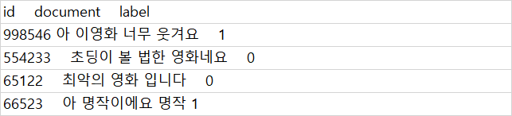
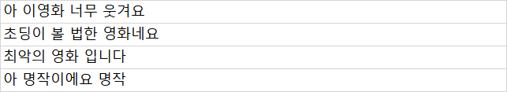

# 3장 한국어 전처리


* 3자에서는 임베딩 학습을 위한 한국어 데이터의 전처리 (preprocess) 과정을 다룬다. 웹 문서나 json 파일 같은 형태의 데이터를 순수 텍스트 파일로 바꾸고 여기에 형태소 분석을 실시하는 방법을 설명한다. 
* 형태소 분석 방법에는 국어학 전문가들이 태깅 (tagging) 한 데이터로 학습된 모델로 분석하는 지도 학습 (supervised learnig) 기법과 우리가 가진 말뭉치의 패턴을 학습한 모델을 적용하는 비지도 학습 (unsupervised learnig) 기법 등이 있다.


# 3.1 데이터 확보


## 3.1.1 한국어 위키백과


* 위키백과는 (wikipedia) 는 누구나 자유롭게 수정, 편집할 수 있는 인터넷 백과사전이다.

* 한국어 말뭉치로서는 한국어 위키백과만큼 방대한 데이터가 없다.

  

**그림 3-1 한국어 위키백과의 '문학' 항목**


* 전처리할 데이터는 `그림 3-1` 과 같이 웹 페이지를 구성하는 데이터이다.


**코드 3-1 한국어 위키백과 XML 문서상의 '문학' 항목**

```html
	**(중략)**
<a href="/wiki/%EC%9D%B8%EB%AC%B8%ED%95%99" title="인문학">인문학</a>의 하위범주에 포함된다.
</p><p>일반적으로 문학의 정의는 텍스트들의 집합이다. 각각의 국가들은 고유한 문학을 가질 수 있으며, 이는 <a href="/wiki/%EA%B8%B0%EC%97%85" class="mw-redirect" title="기업">기업</a>이나 <a href="/wiki/%EC%B2%A0%ED%95%99" title="철학">철학</a> 조류, 어떤 특정한 역사적 시대도 마찬가지이다. 흔히 한 국가의 문학을 묶어서 분류한다. 예를 들어 <a href="/wiki/%EA%B3%A0%EB%8C%80_%EA%B7%B8%EB%A6%AC%EC%8A%A4%EC%96%B4" title="고대 그리스어">고대 그리스어</a>, <a href="/wiki/%EC%84%B1%EA%B2%BD" title="성경">성서</a>, <a href="/wiki/%EB%B2%A0%EC%98%A4%EC%9A%B8%ED%94%84" title="베오울프">베오울프</a>, <a href="/wiki/%EC%9D%BC%EB%A6%AC%EC%95%84%EB%93%9C" class="mw-redirect" title="일리아드">일리아드</a>, 그리고 <a href="/wiki/%EB%AF%B8%EA%B5%AD_%ED%97%8C%EB%B2%95" class="mw-redirect" title="미국 헌법">미국 헌법</a> 등이 그러한 분류의 범주에 들어간다. 좀 더 일반적으로는 문학은 특정한 주제를 가진 이야기, 시, 희곡의 모음이라 할 수 있다. 이 경우, 이야기, 시, 그리고 희곡은 민족주의적인 색채를 띨 수도 아닐 수도 있다. 문학의 한 부분으로서 특정한 아이템을 구분 짓는 일은 매우 어려운 일이다. 어떤 사람들에게 "문학"은 어떠한 상징적인 기록의 형태로도 나타날 수 있는 것이다. (이를테면 이미지나 <a href="/wiki/%EC%A1%B0%EA%B0%81" title="조각">조각</a>, 또는 문자로도 나타날 수 있다.) 그러나 또다른 사람들에게 있어 문학은 오직 문자로 이루어진 텍스트로 구성된 것만을 포함한다. 좀 더 보수적인 사람들은 그 개념이 꼭 물리적인 형태를 가진 텍스트여야 하고, 대개 그러한 형태는 종이 등의 눈에 보이는 매체에서 디지털 미디어까지 다양할 수 있다.
</p><p>
    **(중략)**
```

* 한국어 위키백과를 데이터 추출하면 XML 문서로 되있다.

  쉽게 설명하고자 일부분을 살펴보자.

  많은 항목 중에서 '문학' 항목은 `코드 3-1과 같이 구성돼있다.

* `코드 3-1` 을 살펴보면 필요한 내용은 </a> 태그 안에 숨어 있다.

  `코드 3-3` 에서는 전체 XML 문서에서 우리가 필요로 하는 텍스트만  뽑아낸다.


**코드 3-2 한국어 위키백과 다운로드 `bash`**

```bash
git pull origin master
bash preprocess.sh dump-raw-wiki
```

* 최신판 한국어 위키백과를 도커 컨테이너 로컬 디렉터리인 `/notebooks/embedding/data/raw `에 내려받는다.


**코드 3-3 한국어 위키백과 전처리 `python`**

```python
from gensim.corpora import WikiCorpus, Dictionary
from gensim.utils import to_unicode

in_f = "/notebooks/embedding/data/raw/kowiki-latest-pages-articles.xml.bz2" 
out_f = "/notebooks/embedding/data/processed/processed_wiki_ko.txt"
output = open(out_f, 'w')
wiki = WikiCorpus(in_f, tokenizer_func=tokenize, dictionary=Dictionary())
i = 0
for text in wiki.get_texts():
    output.write(bytes(' '.join(text), 'utf-8').decode('utf-8') + '\n')
    i = i + 1
    if (i % 10000 == 0):
        print('Processed ' + str(i) + ' articles')
output.close()
print('Processing complete!')
```

* `코드 3-3`가 수행하는 역활을 원문 XML 문서에서 우리가 필요로 하는 본문 텍스트만을 추출하는 데 있다.


**코드 3-4 사용자 정의, 한국어 위키 토크나이저 `python`**

```python
import re
from gensim.utils import to_unicode

WIKI_REMOVE_CHARS = re.compile("'+|(=+.{2,30}=+)|__TOC__|(ファイル:).+|:(en|de|it|fr|es|kr|zh|no|fi):|\n", re.UNICODE)
WIKI_SPACE_CHARS = re.compile("(\\s|゙|゚|　)+", re.UNICODE)
EMAIL_PATTERN = re.compile("(^[a-zA-Z0-9_.+-]+@[a-zA-Z0-9-]+\.[a-zA-Z0-9-.]+$)", re.UNICODE)
URL_PATTERN = re.compile("(ftp|http|https)?://(?:[a-zA-Z]|[0-9]|[$-_@.&+]|[!*\(\),]|(?:%[0-9a-fA-F][0-9a-fA-F]))+", re.UNICODE)
WIKI_REMOVE_TOKEN_CHARS = re.compile("(\\*$|:$|^파일:.+|^;)", re.UNICODE)
MULTIPLE_SPACES = re.compile(' +', re.UNICODE)

def tokenize(content, token_min_len=2, token_max_len=100, lower=True):
    content = re.sub(EMAIL_PATTERN, ' ', content)  # remove email pattern
    content = re.sub(URL_PATTERN, ' ', content) # remove url pattern
    content = re.sub(WIKI_REMOVE_CHARS, ' ', content)  # remove unnecessary chars
    content = re.sub(WIKI_SPACE_CHARS, ' ', content)
    content = re.sub(MULTIPLE_SPACES, ' ', content)
    tokens = content.replace(", )", "").split(" ")
    result = []
    for token in tokens:
        if not token.startswith('_'):
            token_candidate = to_unicode(re.sub(WIKI_REMOVE_TOKEN_CHARS, '', token))
        else:
            token_candidate = ""
        if len(token_candidate) > 0:
            result.append(token_candidate)
    return result
```

* `코드 3-4` 사용하는 사용자 정의 함수이다. 

  이 함수의 역활은 특수문자, 공백, 이메일 주소, 웹 페이지 주소 등을 제거 한다.

  

**그림 3-2 전처리가 완료된 한국어 위키백과 `문학` 항목**




**코드 3-5 한국어 위키백과 전과정 자동 전처리 `bash`**

```bash
git pull origin master
bash preprocess.sh dump-raw-wiki
bash preprocess.sh process-wiki
```

* 한국어 위키백과 원본 파일을  내려받고 전처리하는 과정을 자동으로 수행하려면 `코드 3-5`를 실행하면 된다.

* 원본 파일은 `/notebooks/embedding/data/raw`

  전처리를 수행한 결과는 `/notebooks/embedding/data/processed` 에 저장된다.


>* wikiextractor 위키백과 정제라이브러리 또한 많이 쓰인다.
>  * 사용법은 다음 링크 참고
>  * https://github.com/attardi/wikiextractor


## 3.1.2 KorQuAD


* KoQuAD (https://korquad.github.jo) 는 한국어 **기계 독해 (Machine Reading comprehension)** 를 위한 데이터 셋이다. 한국어 위키백과의 양질의 문서를 수집해 이 가운데 일부 문단으로부터 파생될 수 있는 질문과 답변 쌍을 사람들이 직접 만들었다.


**그림 3-3 KorQuAD 지문(paragraph) - 질문(Question) 답변 예시 (볼드 표시는 답변 정답)**




**코드 3-6 KorQuAD 말뭉치 다운로드 `bash`**

```bash
git pull origin master
bash preprocess.sh dump-raw-korquad
```

* KorQuAD 말뭉치를 도커 컨테이너 로컬 디렉터리인

   `/notebooks/embedding/data/raw `에 내려받는다.


**코드 3-7 KorQuAD 전처리 `python`**

```python
import json

corpus_fname = "/notebooks/embedding/data/raw/KorQuAD_v1.0_train.json"
output_fname = "/notebooks/embedding/data/processed/processed_korquad_tr
ain.txt"

with open(corpus_fname) as f1, open(output_fname, 'w', encoding='utf-8') as f2:
        dataset_json = json.load(f1)
        dataset = dataset_json['data']
        for article in dataset:
            w_lines = []
            for paragraph in article['paragraphs']:
                w_lines.append(paragraph['context'])
                for qa in paragraph['qas']:
                    q_text = qa['question']
                    for a in qa['answers']:
                        a_text = a['text']
                        w_lines.append(q_text + " " + a_text)
            for line in w_lines:
                f2.writelines(line + "\n")
```

* 학습 데이터 (KorQuAD_v1.0_train.json) 를 전처리하는 코드는 `코드 3-8` 과 같다.

  데브 데이터 (KorQuAD_v1.0_dev.json) 를 처리하려면 파일 이름만 바꿔주면 된다.


**그림 3-4 전처리가 완료된 KorQuAD 데이터셋 일부**




* 정답 토큰이 지문의 어느 위치에 있는지는 Word2Vec, ELMo 등 앞으로 수행할 임베딩 기법에는 크게 중요하지 않아 처리에서 제외했다.
* 지문 (paragraphs) 은 원문 그대로 처리하고, 질문과 답변은 공백으로 연결해 한 라인 (line) 으로 처리했다. 결과적으로 텍스트 파일의 라인 하나가 일종의 문서처럼 취급될 수 있도록 했다.


**코드 3-8 KorQuAD 전과정 자동 전처리 `bash`**

```bash
git pull origin master
bash preprocess.sh dump-raw-korquad
bash preprocess.sh process-korquad
```

* KorQuAD 원본 파일을  내려받고 전처리하는 과정을 자동으로 수행하려면 `코드 3-8`를 실행하면 된다.

* 원본 파일은 `/notebooks/embedding/data/raw`

  전처리를 수행한 결과는 `/notebooks/embedding/data/processed` 에 저장된다.


## 3.1.3 네이버 영화 리뷰 말뭉치


* 네이버 영화 리뷰 말뭉치 (NAVER sentiment movie corpus v1.0, http://github.com/e9t/nsmc) 는 네이버 영화 페이지의 영화 리뷰들을 평점과 함께 수록한 한국어 말뭉치다.
* **감성 분석 (sentiment analysis)** 이나 **문서 분류 (documentj classfication)** 태스크 수행에 제격인 데이터 셋이다.


**그림 3-5 네이버 영화 리뷰 말뭉치 일부**



* 레코드 하나는 문서(리뷰)에 대응 한다. 문서 ID, 문서 내용, 레이블(긍정1, 부정0) 로 구성돼 있으며 각 열(column)은 탭(tap) 문자로 구분돼 있다. 데이터 크기는 20만개이며 이 가운데 절반이 긍정, 나머지 절반이 부정 레이블이 달린 문서다.


**코드 3-9  네이버 영화 리뷰 데이터셋 다운로드 `bash`**

```
git pull origin master
bash preprocess.sh dump-raw-nsmc
```

* namc 말뭉치를 도커 컨테이너 로컬 디렉터리인

   `/notebooks/embedding/data/raw `에 내려받는다.


**코드 3-10 네이버 영화리뷰 전처리 코드 `python`**

```python
corpus_path = "/notebooks/embedding/data/raw/ratings.txt"
output_fname = "/notebooks/embedding/data/processed/processed_ratings.txt"
with_label = False

with open(corpus_path, 'r', encoding='utf-8') as f1, \
		open(output_fname, 'w', encoding='utf-8') as f2:
    next(f1) #skip head line
    for line in f1:
        _, sentence, label = line.strip().split('\t')
        if not sentence: continue
        if with_label:
            f2.writelines(sentence + '\u241E' + label + '\n')
        else:
            f2.writelines(sentence + '\n')
         
```

* 레이블과 함께 저장하고 싶다면 `with_label = True` 로  지정하면 된다.


**그림 3-6 전처리가 완료된 네이버 영화 리뷰 데이터셋 일부**




**코드 3-11 네이버 영화 리뷰 자동 전처리 `bash`**

```bash
git pull origin master
bash preprocess.sh dump-raw-nsmc
bash preprocess.sh process-nsmc
```

* nsmc 원본 파일을  내려받고 전처리하는 과정을 자동으로 수행하려면 `코드 3-11`를 실행하면 된다.

* 원본 파일은 `/notebooks/embedding/data/raw`

  전처리를 수행한 결과는 `/notebooks/embedding/data/processed` 에 저장된다.


## 3.1.4 전처리 완료된 데이터 다운로드


**코드 3-12 전처리 완료된 데이터 다운로드 `bash`**

```bash
git pull origin master
bash preprocess.sh dump-processed
```

* 전처리에 시간을 투자하고 싶지 않으면 `코드 3-12`을 실행하면 전처리가 완료된 데이터 셋들을 한꺼번에 내려받을 수 있다.


**표 3-1 전처리 완료된 데이터 목록**

| 파일명                       | 내용                                                         | 관련 장 |
| ---------------------------- | ------------------------------------------------------------ | ------- |
| processed_wiki_ko.txt        | 한국어 위키백과                                              | 3.1.1   |
| processed_korquad.txt        | KorQuAD 학습/데브셋                                          | 3.1.2   |
| processed_ratings.txt        | 네이버 영화말뭉치 학습/데이터셋(극성 레이블 없음)            | 3.1.3   |
| processed_ratings_train.txt  | 네이버 영화말뭉치 학습셋(극성 레이블 있음)                   | 3.1.3   |
| processed_ratings_test.txt   | 네이버 영화말뭉치 데스트셋(극성 레이블 있음)                 | 3.1.3   |
| space-correct.model          | 네이버 영화 말뭉치로 학습한 띄어쓰기 교정 모델               | 3.3.3   |
| corrected_ratings_train.txt  | 띄어쓰기 교정한 네이버 영화 말뭉치 학습셋(레이블 있음)       | 3.3.3   |
| corrected_ratings_test.txt   | 띄어쓰기 교정한 네이버 영화 말뭉치 테스트셋(레이블 있음)     | 3.3.3   |
| soyword.model                | 띄어쓰기 교정한 네이버 영화 말뭉치로 학습한 soynlp 형태소 분석 모델 | 3.3.1   |
| processed_review_movieid.txt | 네이버 영화 말뭉치 전체 데이터셋 (영화 ID 포함)              | 3.1.3   |

