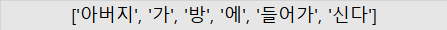
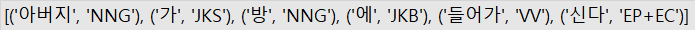
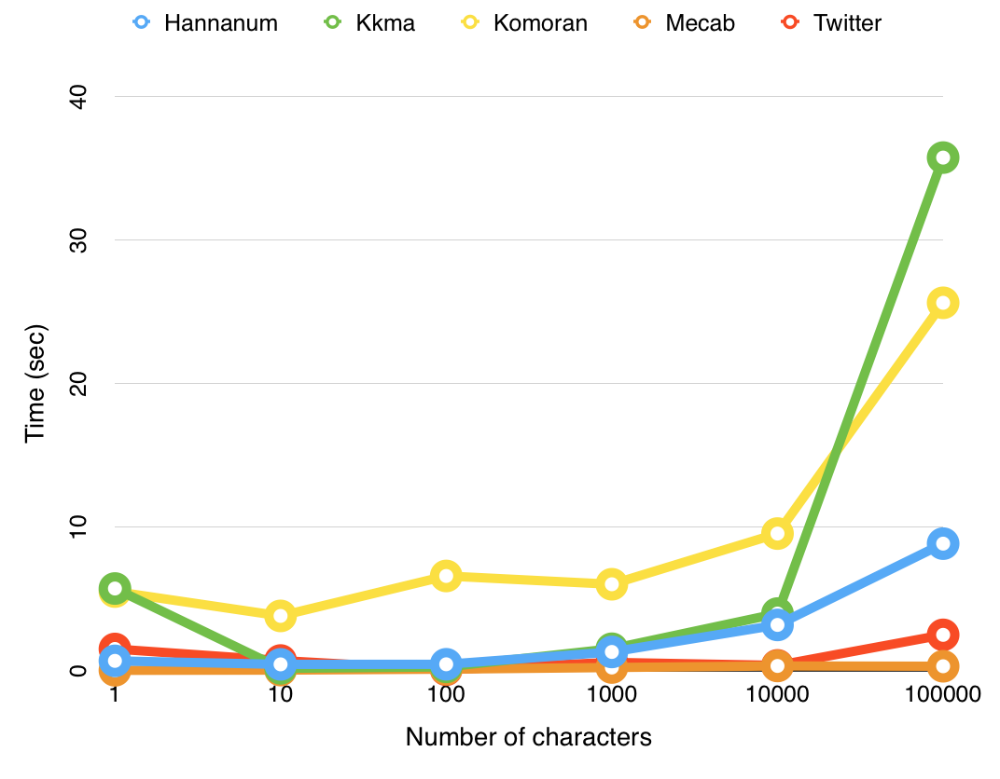
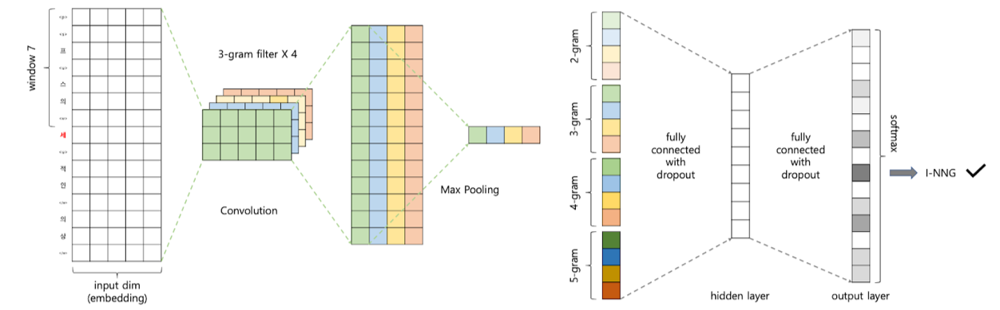

# 3.2 지도 학습 기반 형태소 분석


* 품질 좋은 임베딩을 만들기 위해서는 문장이나 단어의 경계를 컴퓨터에 알려줘야 한다. 그렇지 않으면 어휘 집합에 속한 단어 수가 기하급수저긍로 늘어나서 연상의 비효율이 발생한다. 특히 한국어는 조사와 어미가 발달한 **교착어 (agglutinative language)** 이기 때문이다.


**그림 3-7 한국어 동사 '가다'의 활용**


* 활용형을 모두 어휘 집합에 넣는 다면 새로운 활용형이 나타날 때마다 어휘 집합을 계속 늘려야한다는 단점이 있다.


**그림 3-8 `그림 3-7`의 형태소 분석 결과**


* `그림 3-8` 처럼 형태소를 분석한 뒤에 각 형태소들을 단어로 취급한다면 어휘 집합은 총 4개가 된다. 여기에 `가겠더라` 라는 활용형이 말뭉치에 추가됐다고 가정해보자 `가겠더라`는 `가,겠,더라`로 분석된다. 따라서 어휘 집합을 수정하지 않고도 `가겠더라`라는 활용형을 처리할 수 있게 된다.
* 형태소 분석기만 잘 활용해도 자연어 처리의 효율성을 높일 수 있다.


* **지도 학습 (supervised learnig)** 이란 정답이 있는 데이터의 패턴을 학습해 모델이 정답을 맞도록 하는 기법을 가리킨다.
* 이 절에서 설명하는 형태소 분석기들은 언어학 전문가들이 태깅한 형태소 분석 망뭉치로부터 학습된 지도 학습 기반 모델이다.
* **태깅 (tagging)** 이란 아래처럼 모델 입력과 출력 쌍을 만드는 작업을 가리킨다.
  * 입력: 아버지가방에들어가신다.
  * 출력: 아버지, 가, 방, 에, 들어가, 신다


## 3.2.1 KoNLPy 사용법


*  **KoNLPy**(http://konlpy.org/en/latest)는 은전한닢, 꼬꼬마, 한나눔, Okt, 코모란 등 5개 오픈소스 형태소 분석기를 파이썬 환경에서 사용할 수 있도록 인터페이스를 통일한 한국어 자연어 처리 패키지다. C++, 자바 등  각기 다른 언어로 개발된 오픈소스들을 한군데에 묶은 것이다.


**코드 3-14 은전한닢 분석기 사용법 `python`**

```python
from konlpy.tag import Mecab
tokenizer = Mecab()
tokenizer.morphs("아버지가방에들어가신다")
```


**그림 3-9 은전한닢 형태소 분석 결과**





**코드 3-15 은전한닢 품사 정보 확인 `python`**

```python
tokenizer.pos("아버지가방에들어가신다")
```


**그림 3-10 은전한닢 품사 정보 분석 결과**





**코드 3-16 get_tokenizer 함수 `python`**

```python
from konlpy.tag import Okt, Komoran, Mecab, Hannanum, Kkma

def get_tokenizer(tokenizer_name):
    if tokenizer_name == "komoran":
        tokenizer = Komoran()
    elif tokenizer_name == "okt":
        tokenizer = Okt()
    elif tokenizer_name == "mecab":
        tokenizer = Mecab()
    elif tokenizer_name == "hannanum":
        tokenizer = Hannanum()
    elif tokenizer_name == "kkma":
        tokenizer = Kkma()
    elif tokenizer_name == "khaiii":
        tokenizer = KhaiiiApi()
    else:
        tokenizer = Mecab()
    return tokenizer

# 코모란 사용 예시
tokenizer = get_tokenizer("komoran")
tokenizer.morphs("아버지가방에들어가신다")
tokenizer.pos("아버지가방에들어가신다")
```

* 꼬꼬마, 한나눔, Okt 등 KoNLPy에 속한 다른 형태소 분석기의 사용법은 은전한닢과 동일하다. 다만 처음 tokenizer를 선언할 때만 다른게 해주면 된다.
* 어떤 형태소 분석기를 사용하고 싶은지 이 함수 인자(argument)로 넘기면 해당 분석기를 반환한다.


## 3.2.2 KoNLPy 내 분석기별 성능 차이 분석


**그림 3-11 문자 개수 대비 실행 시간 (출처: KoNLPy)**



* 은전한닢이 다른 분석기 대비 속도가 빠른 것을 알 수 있다.
* 자세한 사항을 확인하려면 [이곳](https://konlpy.org/ko/latest/morph/#comparison-between-pos-tagging-classes) 을 참고하자.
* 어떤 형태소 분석기를 사용할지는 자신이 가진 데이터로 시험 삼아 형태소 분석을 해보고 속도나 품질을 비교해서 고르는 것이 좋다.


## 3.2.3 Khaiii 사용법


* **Khaiii**(kakao hangul analyzer 3, http://tech.kakao.com/2018/12/13/khaiii)는 카카오가 2018년 말 공개한 오픈소스 한국어 형태소 분석기다. **CNN (Convolution Neural Network)** 모델을 적용해 학습했다.


**그림 3-12 Khaiii 아키텍쳐**



* 입력 문장을 문자 단위로 읽어 들인 뒤 **컨볼루션 필터 (convolution filter)** 가 이 문자들을 슬라이딩해 가면서 정보를 추출한다. 이 네트워크의 말단 레이어에서는 이렇게 모은 정보들을 종합해 형태소의 경계와 품사 태그를 예측한다.
* 카카오 측 설명에 따르면 C++로 구현해 GPU 없이도 형태소 분석이 가능하며 실행 속도 역시 빠르다고 한다.


**코드 3-17 Khaiii 클래스 선언 `python`**

```
```

