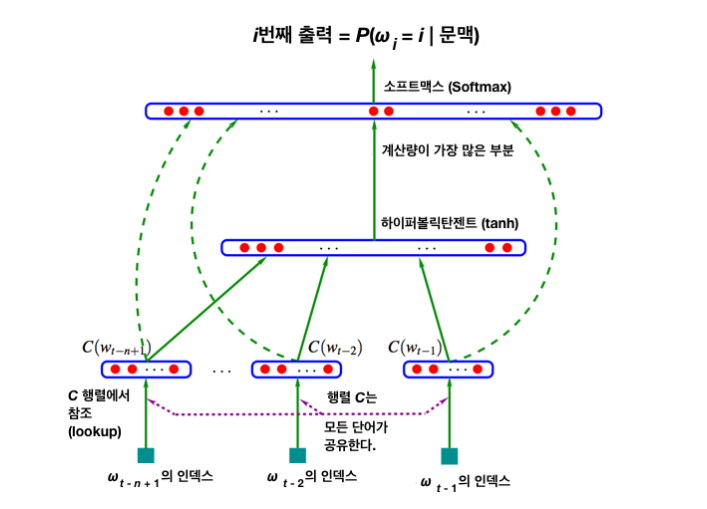
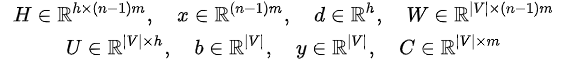
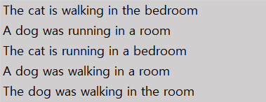
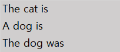

# 4장 단어 수준 임배딩

* **예측 (prediction) 기반 모델**: NPLM, Word2Vec, FastText 등

* **행렬 분해 (matrix factorization) 기반 모델**:  LSA, GloVe, Swivel 등

* **가중 임베딩 (Weighted Embedding)**은 단어 임베딩을 문장 수준으로 확장하는 방법

  

# 4.1 NPLM

## 4.1.1 모델 기본 구조

* Neural Probabilistic Language Model (NPLM) 은 통계 기반의 전통적인 언어 모델의 한계를 극복하는 과정에서 탄생했다. NPLM을 제안한 연구팀은 기존 언어 모델의 단점을 다음과 같이 정리했다.
  * 학습 데이터에 존재하지 않는 n - gram이 포함된 문장이 나타날 확률 값을 0으로 부여한다. 물론 **백오프**나 **스무딩**으로 이런 문제를 일부 보완할 수 있지만 완전한 것은 아니다.
  * 문장의 **장기 의존성 (long-term dependency)**을 포착해내기 어렵다. 다시 말해 n -gram 모델의 n을 5 이상으로 길게 설정할 수 없다. n이 커질수록 그 등장 확률이 0인 단어 시퀀스가 기하급수적으로 늘어난다.
  * 단어/문장 간 유사도를 계산할 수 없다.

* NPLM 은 기존 언어 모델의 한계를 일부 극복한 언어 모델이라는 점에서 의의가 있다. 그뿐만 아니라 NPLM 자체가 단어 임베딩 역활을 수행할 수 있다.

## 4.1.2 NPLM의 학습

* NPLM은 단어 시퀀스가 주어졌을때 n-1 개의 단어들로 n번째 단어를 맞추는 n-gram 언어 모델이다.

  * ex) '발', '없는', '말이' 라는 세 단어가 주어졌을때, 4번째 단어인 '천리'를 예측한다.

  

**그림 4-1 NPLM**

* 파란색 레이어가 각각 밑에서부터 **입력층(input layer)**, **은닉층(hidden layer)**, **출력층(output layer)** 이다.

**수식 4-1 NPLM의 입력(1)**

+ 문장 내 t 번째 단어(w~t~)에 대응하는 단어 벡터 x~t~ 를 만드는 과정이다.
+ |V| × m 크기의 행렬 C에서 w~t~에 해당하는 벡터는 **참조 (lookup)**한 형태다.
+ |V|는 어휘 집합 크기, m은 x~t~의 차원 수, 행렬 C의 원소값은 초기에 랜덤 설정한다.

**그림 4-2 행렬 C 참조하기**

* 어휘 집합에 속한 단어가 5개 뿐이고 w~t~가 이 가운데 네번째라고 가정하자. 그러면 C(w~t~) 는 행렬 C와 w~t~에 해당하는 **원핫벡터(one-hot-Vector)**를 **내적(inner product)**한 것과 같다. 이는 C라는 행렬에서 w~t~에 해당하는 행(row)만 참조하는 것과 동일하다
* 원핫벡터란 한 요소만 1이고 나머지는 0인 벡터를 가리킨다.

**수식 4-2 NPLM의 입력(2)**

* 각 단어의 인덱스값을 확인한 다음 `수식 4-1` 처럼 열 벡터를 참조한 뒤, 단어를 묶어주면 (concatenate) NPLM의 입력벡터 x가 된다.

**수식 4-3 NPLM 스코어 벡터 y 계산 (은닉층)**

* 마지막으로 스코어 벡터에 소프트맥스 함수를 적용한 뒤 이를 정답 단어 인덱스와 비교해 **역전파(backpropagation)** 하는 방식으로 학습이 이루어지게 된다. NPLM 학습이 종료되면 우리는 행렬 C를 각 단어에 해당하는 m차원 임베딩으로 사용한다.

**수식 4-4 NPLM의 출력**

* NPLM 구조 말단의 출력은 |V| 차원의 스코어 벡터에 **소프트맥스(softmax)** 함수를 적용한 |V| 차원의 확률 벡터다. 이는 곧 `수식 4-4`에 정의된 조건부확률과 같다
* NPLM은 `수식 4-4`을 최대화하려고 한다. 즉 조건부 확률을 최대화 할려고 한다.

**수식 4-5 NPLM의 학습 파라미터**

* NPLM 은 다른 단어 임베딩 기법들과 비교하면 학습해야하는 파라미터 종류가 많고 그 크기가 크다는 단점이 있다.

## 4.1.3 NPLM과 의미 정보

* NPLM이 단어의 의미를 임베딩에 녹이는 원리는 다음과 같다.

**그림 4-3 예시 문장**

* - 3-gram을 생각해보자. 그렇다면 NPLM은 직전 3개의 단어를 가지고 그 다음 단어 하나를 맞추는 과정에서 학습된다. 네번째 단어가 `walking` 인 문장은 다음 `그림 4-4`와 같다.

**그림 4-4 타깃 단어 walking을 공유하는 3 - gram**

* NPLM은 `그림 4-4`의 입력을 받으면 `walking`이 출력되도록 학습한다. 
* 따라서 `The`, `A`, `cat`, `dog`, `is`, `was` 등은 `walking`이라는 단어와 모종의 관계가 형성된다. 바꿔 말하면 `The`, `A`, `cat`, `dog`, `is`, `was` 등에 해당하는 C 행렬의 행 벡터들은 `walking`을 맞추는 과정에서 발생한 **학습 손실(train loss)**을 최소화하는 **그래디언트(gradient)**를 받아 동일하게 업데이트된다. 결과적으로는 `The`, `A`, `cat`, `dog`, `is`, `was` 벡터가 벡터 공간에서 같은 방향으로 조금 움직인다는 이야기이다.
* 이렇게  문장 내 모든 단어들을 한 단어씩 훑으면서 말뭉치 전체를 학습하게 된다면 NPLM 모델의 C 행렬에 각 단어의 문맥 정보를 내재할 수 있게 된다.

* 기존의 통계 기반 n - gram 모델은 학습데이터에 한번도 등장하지 않은 패턴에 대해서는 그 등장 확률을 0으로 부여하는 문제점을 가지고 있다.
* 하지만 NPLM은 `The mouse is running in a room`이라는 문장이 말뭉치에 없어도 문맥이 비슷한 다른 문장을 참고해 확률을 부여한다. 결과적으로 `그림 4-3`의 문장들과 비슷하게 추론하게 되는 것이다.
