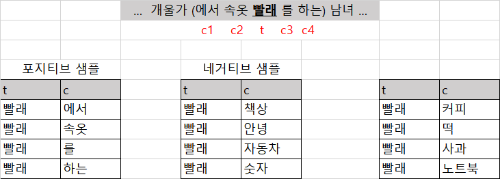
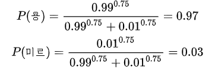
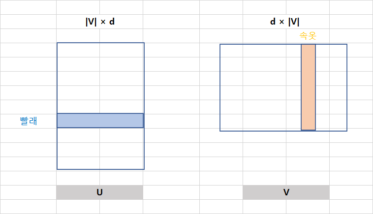

# 4.2 Word2Vec


* Word2Vec은 구글 연구 팀이 발표한 기법으로 가장 널리 쓰이고 있는 임베딩 모델이다.
* 두 개의 논문으로 나누어 발표했다. 
  * A논문은 **Skip-Gram**과 **CBOW**라는 모델을 제안했다.
  * B논문은 위에 두 모델을 근간으로 하되 네거티브 샘플링(negative sampling) 등 학습 최적화 기법을 제안한 내용이다.


## 4.2.1 모델 기본 구조


**그림 4-7 CBOW와 Skip-gram 모델**


* CBOW는 주변에 있는 **문맥 단어(context word)**들을 가지고 **타깃 단어(target word)** 하나를 맞추는 과정에서 학습된다.

* Skip-gram 모델은 타깃단어를 가지고 주변 문맥단어가 무엇일지 예측하는 과정에서 학습된다.

* CBOW의 경우 입력과 출력 학습데이터 쌍이 하나이다.(문맥 단어4+타깃 단어1)

  Skip-gram의 경우 입력과 출력 학습데이터 쌍이 4 쌍이다.(타깃 직전 단어+타깃 단어 1,2,3,4)

  Skip-gram이 같은 말뭉치로도 더 많은 학습 데이터를 확보할 수 있어서 CBOW 보다 임베딩 품질이 좋은 경향이 있다. 따라서 4장에서는 Skip-gram 모델을 중심으로 Word2Vec 기법을 설명하겠다.


## 4.2.2 학습 데이터 구축


**그림 4-9 Skip-gram 모델의 학습 데이터 구축**



* `개울가 에서 속옷 빨래를 하는 남녀` 라는 예시 문장으로 Skip-gram 모델 학습데이터를 구축해보자.
* **포지티브 샘플(positive sample)**이란 타깃 단어(t)와 그 주변에 실제로 등장한 문맥 단어(c) 쌍을 가리킨다.
* **네거티브 샘플(negative sample)**은 타깃 단어와 그 주변에 등장하지 않은 단어(말뭉치 전체에서 랜덤 추출)쌍을 의미한다.
* **윈도우(window)**는 2로 설정했다. 포지티브 샘플을 만들 때 타깃 단어 앞뒤 두개씩만 고려한다는 뜻이다.


* Skip-gram 모델은 전체 말뭉치를 단어별로 슬라이딩해 가면서 학습 데이터를 만든다. 다시 말해 이 다음 학습 데이터를 만들 때는 `를`이라는 단어가 타깃 단어(t)가 되고 `빨래`는 문맥 단어(c)가 된다. 결과적으로 Skip-gram 모델은 같은 말뭉치를 두고도 엄청나게 많은 학습 데이터 쌍을 만들어낼 수 있다.
* Skip-gram 모델이 처음 제안된 논문 A에서는 타깃 단어가 주어졌을 때 문맥 단어가 무엇일지 맞추는 과정에서 학습됐다. 하지만 이 방식은 소프트맥스 때문에 계산량이 비교적 큰 편이다. 조금 구체적으로 말하자면 이렇다. 타깃 단어를 입력받아 문맥 단어를 직접 출력하는 모델을 학습하려면, 정답 문맥 단어가 나타날 확률은 높이고 나머지 단어들 확률은 그에 맞게 낮춰야 한다. 그런데 어휘 집합에 속한 단어 수는 보통 수십만 개나 된다. 이를 모두 계산하려면 비효율적이다.
* 논문 B에서 제안한 Skip-gram 모델은 타깃 단어와 문맥 단어 쌍이 주어졌을 때 해당 쌍이 포지티브 샘플(+)인지 네거티브 샘플(-)인지 **이진 분류(binary classification)** 하는 과정에서 학습된다. 이렇게 학습하는 기법은 **네거티브 샘플링(negative sampling)**이라고 한다.
* 네거티브 샘플링 방식으로 학습하게 되면 1개의 포지티브 샘플과 k개의 네거티브 샘플만 계산(=정확히는 매 스텝마다 차원 수가 2인 시그모이드를 k+1회 계산)하면 되기 때문에 모델을 1스텝에 전체 단어를 모두 계산(=정확히는 매 스텝마다 어휘 집합크기만큼의 차워 수를 가진 소프트맥스 1회계산) 해야 하는 기존 방법보다 계산량이 훨씬 적다.
* `그림 4-9`는 k를 2로 설정한 예시다. 이 경우 하나의 스텝에서 1개의 포지티브 샘플과 2개의 네거티브 샘플, 즉 3개만 학습하면 된다.
  * ex) 첫번째 스텝: `빨래-에서`포지티브 샘플, `빨래-극장`,`빨래-커피` 네거티브 샘플 2개 학습
  * 논문 B에 따르면 작은 데이터에는 k를 5~20, 큰 말뭉치에는 k를 2~5로 하는 것이 성능이 좋다고 한다.


**수식 4-6 네거티브 샘플 확률**


* 네거티브 샘플은 말뭉치에 자주 등장하지 않는 희귀한 단어로 뽑는 것으로 설계했다.
* U(w~t~) 란 해당 단어의 유니그램 확률 (해당 단어 빈도/전체 단어 수)을 의미한다.


**수식 4-7 네거티브 샘플 확률 예시**



* 예를 들어 우리가 가진 말뭉치에 있는 단어가 용과 미르 둘 뿐이라고 하자. 구성 비율은 각각 0.99, 0.01 이라고 하자. 그렇다면 용과 미르가 네거티브로 뽑힐 확률은 `수식 4-7` 과 같다. 원래라면 용은 0.99의 확률로 네거티브 샘플이 됐겠지만 0.97로 살짝 낮아지고 반대로 미르는 살짝 높아졌다.


**수식 4-8 서브샘플링 확률**


* 논문 B에서는 네거티브 샘플 말고도 **서브샘플링(subsampling)**이라는 기법도 적용했다.
* 서브샘플링이란 자주 등장하는 단어는 학습에서 제외하는 기법이다. Skip-gram 모델은 말뭉치로 부터 엄청나게 많은 학습 데이터 쌍을 만들어낼 수 있기 때문에 고빈도 단어의 경우 등장 횟수만큼 모두 학습시키는 것이 비효율적이라고 본 것이다.
* f(w~i~)는 w~i~의 빈도를 가리키며, t는 하이퍼파라미터다. 논문 B에서는 t를 10^-5^ 로 계산했다.
* 만일 f(w~i~)가 0.01로 나타나는 빈도 높은 단어 ( 예를들어 `은/는` ) 는 위 식으로 계산하면 0.9684가 돼서 해당 단어가 가질 수 있는 100번의 학습 기회 가운데 96번 정도는 학습에서 제외하게 된다. 반대로 P~subsampling~ (w~i~) 가 0에 가깝다면 해당 단어가 나올 때마다 빼놓지 않고 학습을 시키는 구조다.


## 4.2.3 모델 학습


**수식 4-9 t,c가 포지티브 샘플(=t 주변에 c가 존재)일 확률**


* Skip-gram 모델은 타깃 단어와 문맥 단어 쌍이 주어졌을 때 해당 싸이 포지티브 샘플인지 아닌지를 예측하는 과정에서 학습된다. 따라서 타깃 단어와 문맥 단어 쌍이 실제 포지티브 샘플이라면 `수식 4-9` 에 정의된 조건부확률을 최대화해야한다. 모델이 포지티브 샘플 단어 쌍을 입력받았을 때 이 쌍이 정말 포지티브 샘플이라고 잘 맞춰야 한다는 이야기다.
* 조건부 확률을 최대화하며면 분모의 exp(-u~t~v~c~) 를 줄여야 한다. 그러려면 포지티브 샘플에 대응하는 단어 벡터인 u~t~ 와 v~c~ 의 **내적(inner product)** 값을 키워야 한다.
* 단어 벡터인 u~t~ 와 v~c~ 의 내적은 **코사인 유사도(cosine similarity)** 와 비례한다. 따라서 내적 값의 상향은 포지티브 샘플 t와 c에 해당하는 단어 벡터 간 유사도를 높인다(=벡터 공간상 가깝게)는 의마로 이해할 수 있다.


**그림4-9 Skip-gram 모델 파라미터**



* Skip-gram 모델 파라미터는 U와 V 행렬 두 개 뿐이다. 둘의 크기는 어휘 집합 |V| × 임베딩 차원 수 d 로 동일하다. U와 V는 각각 타깃 단어와 문맥 단어에 대응한다.

* `그림 4-9`와 연관지어 예를 들면 u~t~ 는 타깃 단어(t) `빨래`에 해당하는  U의 행벡터,

  v~c~ 는 문맥 단어(c)`속옷`에 해당하는  V의 열벡터가 된다.


**수식 4-10 t,c가 포지티브 샘플(c를 t와 무관하게 말뭉치 전체에서 랜덤 샘플)일 확률**


* `수식 4-10`의 조건부 확률을 최대화해야한다. 다시말해 네거티브 샘플을 모델에 입력하면 모델은 이 데이터가 정말 네거티브 샘플이라고 잘 맞춰야 한다는 이야기다.
* `수식 4-10`을 최대화하려면 우변의 분자를 최대화해야 한다. 분자를 최대화하려면 단어 벡터인 u~t~ 와 v~c~ 의 내적 값을 줄여야 한다. 내적 값의 하향은 네거티브 샘플 t와 c에 해당하는 단어 벡터 간 코사인 유사도를 낮춘다(=벡터 공간상 멀게)는 의미로 이해할 수 있다.


**수식 4-11 Skip-gram 모델의 로그우도 함수**


* Skip-gram 모델이 최대화해야 하는 **로그우도 함수(log - likelihood function)** 다. 모델 파라미터 θ 를 한 번 업데이트할 때 1개 쌍의 포지티브 샘플(t~p~, c~p~) 과 k개 쌍의 네거티브 샘플(t~n(i)~, c~n(i)~) 이 학습된다는 의미다. `수식 4-11`을 최대화하는 과정에서 결과적으로 Skip-gram 모델은 말뭉치의 분포 정보를 단어 임베딩에 함축시키게 된다.
* Skip-gram 모델은 `수식 4-11`을 계산할 때 타깃 단어에 해당하는 단어 벡터 u~t~는 행렬 U에서, 문맥 단어에 해당하는 단어 벡터 v~c~는 행렬 V에서 참조한다.
* 모델 학습이 완료되면 U만 d차원의 임베딩으로 쓸 수도 있고, U + V^T^ 행렬을 임베딩으로 쓸 수도 있다. 혹은 U, V^T^ 를 이어 붙여 2d 차원의 단어 임베딩으로 사용할 수도 있다.


## 4.2.4 튜토리얼


**코드 4-1 형태소 분석 완료된 데이터 다운로드 `bash`**

```bash
git pull origin master
bash preprocess.sh dump-tokenized
```


**코드 4-2 데이터 합치기 `bash`**

```bash
cd /notebooks/embedding
cat data/tokenized/wiki_ko_mecab.txt data/tokenized/ratings_mecab.txt data/tokenized/korquad_mecab.txt > data/tokenized/corpus_mecab.txt
```


**코드 4-3 Word2Vec Skip-gram 모델 학습 `python`**

```python
corpus_fname = "/notebooks/embedding/data/tokenized/corpus_mecab.txt"
model_fname = "/notebooks/embedding/data/word-embeddings/word2vec/word2vec"

from gensim.models import Word2Vec
corpus = [sent.strip().split(" ") for sent in open(corpus_fname,'r').readlines()]
model = Word2Vec(corpus, size=100, workers=4, sg=1)
model.save(model_fname)
```

* size 는 임베딩의 차원 수, workers는 CPU 스레드 개수, sg는 Skip-gram 모델인지 여부를 나타내는 하이퍼파라미터다. sg가 1이면 Skip-gram, 0이면 CBOW 모델로 학습 된다. 나머지 하이퍼파라미터는 기본값을 적용한다.


**코드 4-4 Word2Vec Skip-gram 모델 학습 `bash`**

```bash
cd /notebooks/embedding
mkdir -p data/word-embedding/word2vec
python models/word_utils.py --method train_word2vec \
--input_path data/tokenized/corpus_mecab.txt \
--output_path data/word-embeddings/word2vec/word2vec
```

* `코드 4-3` 과 동일한 코드이다


**코드 4-5 코사인 유사도 상위 단어 목록 체크 코드와 결과 예시 `python`**

```python
from models.word_eval import WordEmbeddingEvaluator
model = WordEmbeddingEvaluator("/notebooks/embedding/data/word-embeddings/word2vec/word2vec", method="word2vec", dim=100, tokenizer_name="mecab")
model.most_similar("희망", topn=5)

#결과 예시
[('소망',0.79329586),
 ('행복',0.7861444),
 ('희망찬',0.76918393),
 ('꿈',0.76410115),
 ('열망',0.7336163)]
```


**표4-1 Word2Vec Skip-gram 모델의 코사인 유사도 기준 상위 5개 단어 목록**

| **희망** | **절망** | **학교** | **학생** |
| :------: | :------: | :------: | :------: |
|   소망   |   체념   |   초등   |  대학생  |
|   행복   |   고뇌   |  중학교  | 대학원생 |
|  희망찬  |  절망감  | 고등학교 |  고학생  |
|    꿈    |  상실감  |  야학교  |  교직원  |
|   열망   |   번민   |   중학   |  학부모  |

* Word2Vec 임베딩 기법은 대개 망물치위 분포 정보를 벡터에 녹이고, 분포가 유사한 단어 쌍은 그 속성 또한 공유할 가능성이 높다. 다만 어떤 단어 쌍이 특정 속성을 공유한다고 해서 해당 쌍이 반드시 유의 관계인 것은 아니다. 여기에는 반의 관계도, 상하 관계도 있을 수 있다. 따라서 most_similar 함수는 해당 쿼리 단어와 유의 관계에 있는 단어를 보여준다기보다는, 관련성이 높은 단어를 출력한다는 의미로 이해하는 것이 좋다.