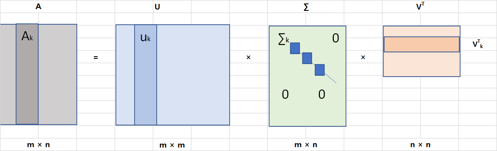
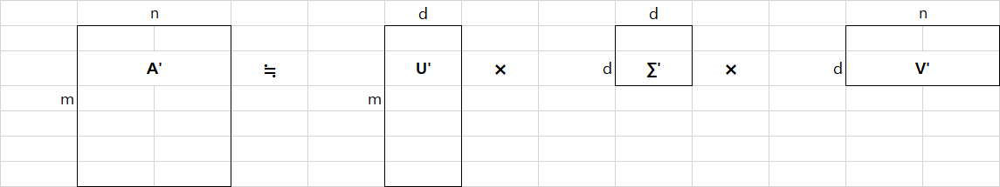
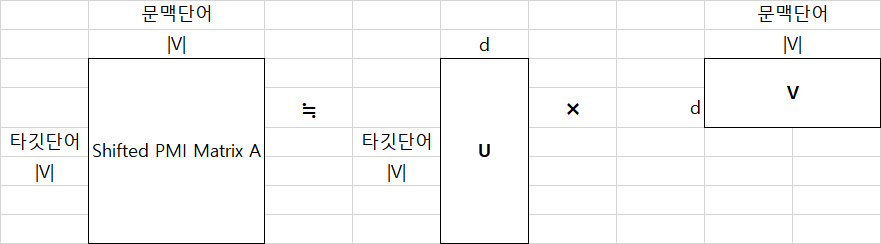

## 4.4 잠재 의미 분석


* **잠재 의미 분석 (LSA, Latent Semantic Analysis)** 이란 단어 - 문서 행렬이나 TF - IDF 행렬, 단어 - 문맥 행렬 같은 커다란 행렬에 차원 축소 방법의 일종인 특이값 분해를 수행해 데이터의 차원 수를 줄여 계산 효율성을 키우는 한편 행간에 숨어 있는 잠재 의미를 이끌어내기 위한 방법론이다.
* 단어 - 문서 행렬이나 단어 - 문맥 행렬 등에 특이값 분해를 시행한 뒤 그 결과로 도출되는 행 백터들을 단어 임베딩으로 사용할 수 있다. 잠재 의미 분석은 GloVe 나 Swivel과 더불어 행렬 분해(matrix factorization) 기반의 기법으로 분류된다.


## 4.4.1 PPMI 행렬


*  단어 - 문서 행렬(1장), TF - IDF(2장), 단어 - 문맥 행렬(2장), **점별 상호 정보량(PMI)**(2장) 에 모두 잠재 의미 분석을 수행할 수 있다.
* 이 절에서는 PMI 행렬의 특수한 버젼인 PPMI 행렬을 살펴보겠다.


**수식 4-16 점별 상호 정보량(PMI)**


* PMI란 두 확률변수 사이의 상관성을 계량화한 지표다. 자연어 처리 분야에서 PMI는 두 단어의 등장이 독립을 가정했을 때 대비 얼마나 자주 같이 등장하는지를 수치화한 것으로 이해할 수 있다.
* `수식 4-16` 로그 안 우변의 분자가 분모보다 작을 경우 PMI는 음수가 된다. A, B 두 단어가 동시에 등장할 확률이 두 단어가 독립일 때보다 작을 때 발생한다. 하지만 이러한 수치는 우리가 가진 말뭉치의 크기가 충분히 크지 않는 한 신뢰하기 어렵다. 보통 말뭉치에서 단어 하나의 등장 확률은 0.001 이하로 작은 편이다. 예컨대 단어 A, B 각각의 등장 확률이 0.0001로 같은데 PMI가 음수가 되려면 두 단어가 동시에 나타날 확률 P(A, B) 는 0.000000001보다 작아야 한다. 두 단어가 동시에 나타난 경우는 10억 개 가운데 1개 꼴로 매우 적다는 뜻이다. 더구나 단어 A, B가 단 한번도 같이 등장하지 않는 경우 PMI(A, B) = log() = -∞ 가 된다.


**수식 4-17 양의 점별 상호 정보량**


* 위와 같은 이유때문에 자연어 처리 분야에서는 PMI 대신 **양의 점별 상호 정보량(PPMI, Positive Pointwise Mutual Informmation)** 이란 지표를 사용한다. PMI 가 양수가 아닐 경우 그 값을 신뢰하기 어려워 0으로 치환해 무시한다는 뜻이다.


**수식 4-18 Shifted PMI**


* **Shifted PMI(SPMI)** 란 PMI에서 log k 를 빼준 값이다. k 는 임의의 양의 상수이다. 
* SPMI 는 Word2Vec 과 깊은 관련이 있다.


## 4.4.2 행렬 분해로 이해하는 잠재 의미 분석


**그림 4-12 특이값 분해**



* **특이값 분해 (Singular value Decomposition)** 는 임의의 m × n 사각행렬 A를 분해하는 것.


**그림 4-13 truncated SVD**



* **truncated SVD**는 특이값(∑의 대각성분) 가운데 가장 큰 d 개만 가지고, 해당 특이값에 대응하는 특이 벡터(singular vector) 들로 원래 행렬 A를 근사하는 기법이다.
* 예컨대 m개 단어, n개 문서로 이루어진 단어 - 문서 행렬에 truncated SVD를 수행, 즉 LSA를 시행했다고 가정해보자. 그러면 U'는 단어 임베딩, V'는 문서 임베딩에 대응한다. n개 문서로 표현됐던 단어 벡터들이 U'에서 d차원만으로도 표현이 가능해졌다. 아울러 m개 단어로 표현됐던 문서 벡터들 역시 V'에서 d차원만으로도 커버할 수 있게 됐다. 마찬가지로 m개 단어,  m개 단어로 이루어진 PMI 행렬에 LSA를 수행하면 d차원 크기의 단어 임베딩을 얻을 수 있다.
* 각종 연구들에 따르면 LSA를 적용하면 단어와 문맥 간의 내재적인 의미(latent/hidden meaning)를 효과적으로 보존할 수 있게 돼 결과적으로 문서 간 유사도 측정 등 모델의 성능 향상에 도움을 줄 수 있다고 한다. 또한 입력 데이터의 노이즈, 희소성(sparsity) 을 줄일 수 있다.


## 4.4.3 행렬 분해로 이해하는 Word2Vec


* **네거티브 샘플링 기법으로 학습된 Word2Vec의 Skip-gram 모델(SGNS,Skip-gram with Negative Sampling)** 은 행렬 분해 관점에서 이해할 수 있다. 다시 말해 Word2Vec의 학습은 Shifted PMI(SPMI) 행렬을 U와 V로 분해하는것과 같다는 이야기다.


**그림 4-14 행렬 분해 관점에서 이해하는 Word2Vec**




**수식 4-19 행렬 분해 관점에서 이해하는 Word2Vec**


* A~ij~는 SPMI 행렬 A의 i번째 행, j번째 열에 대응하는 행렬 원소다. U는 타깃 단어(t)에 대응되는 임베딩 행렬, V는 문맥 단어(c)에 대응되는 임베딩 행렬을 가리킨다. 우변의 k는 Skip-gram 모델의 네거티브 샘플 수를 가리킨다. 네거티브 샘플 수가 1개인 Skip-gram 모델은 PMI 행렬을 분해하는 것과 같다. log1은 0이기 때문이다.
* `수식 4-19`를 직관적으로 이해하면 이렇다. Skip-gram 모델은 말뭉치 전체를 단어별로 슬라이딩해 가면서 타깃 단어의 실제 문맥 단어들(포지티브 샘플) 과 가짜 문맥 단어들(네거티브 샘플)을 이진 분류(binary) 하는 과정을 통해 학습한다. 학습이 완료되면 U와 V 행렬을 얻을 수 있다.
* 그런데 U와 V의 내적은 SPMI 행렬이 된다. 다시말해 i번째 타깃 단어에 해당하는 U~i~ 벡터와 j번째 문맥단어에 해당하는 V~j~ 벡터의 내적이 단어 i, j 의 PMI 값에 log k 를 빼준 값 (SPMI) 이 된다. 말뭉치에서 두 단어 i, j가 자주같이 등장한다면 SPMI 가 높고 그 반대 경우라면 낮다. SPMI가 높다는 얘기를 2.4절 분포 가정(distributional hypothesis) 을 감안해 곱씹어 보면 이는 두 단어가 의미상 관련이 있을 가능성이 높다고 이해할 수 있다.
* 따라서 i와 j 단어가 의미상 얼마나 관련이 있는지 정도가 U~i~와 V~j~ 내적 값으로 나타나고, 관련성이 높을수록 그 내적 값이 크게 나타난다. 내적 값은 코사인 유사도에 비례하기 때문에 그 내적값이 클수록 U~i~와 V~j~  벡터가 벡터 공간상에 가깝게 표현된다는 뜻이 된다. 결과적으로 Skip-gram과 그 변종(FastText)은 단어 임베딩에 말뭉치 전체의 글로벌한 분포 정보를 성공적으로 녹여낼 수 있다.


## 4.4.4 튜토리얼


* 단어 - 문맥 행렬과 PPMI 행렬에 대한 LSA 임베딩을 각각 구축해보자.
* 데이터로는 KorQuAD 와 네이버 영화 말뭉치를 사용했다.


**코드 4-17 형태소 분석된 데이터 다운로드 `bash`**

```bash
git pull origin master
bash preprocess.sh dump-tokenuzed
```


**코드 4-18 데이터 합치기 `bash`**

```bash
cd /notebooks/embedding
cat data/tokenized/ratings_mecab.txt data/tokenized/korquad_mecab.txt > data/tokenized/for-lsa-mecab.txt
```


**코드 4-19 단어-문맥 행렬을 활용한 LSA `python`**

```python
from sklearn.decomposition import TruncatedSVD
from soynlp.vectorizer import sent_to_word_contexts_matrix

corpus_fname = "notebooks/embedding/data/tokenized/for-lsa-mecab.txt"

corpus = [sent.replace('\n','').strip() for sent in open(corpus_fname, 'r').readlines()]
input_matrix, idx2vocab = sent_to_word_contexts_matrix(
		corpus,
		window = 3,
		min_rf = 10,
		dynamic_weight = True,
		verbose = True)
cooc_svd = TruncatedSVD(n_components = 100)
cooc_vecs = cooc_svd.fit_transform(input_matrix)
```

* `코드 4-19`는 단어 - 문맥 행렬에 LSA를 적용하는 코드다. soynlp에서 제공하는 sent_to_word_contexts_matrix 함수를 활용하면 2장에서 언급한 방식의 단어 - 문맥 행렬을 구축할 수 있다. window = 3 은 타깃 단어 앞뒤 3개 단어를 문맥으로 고려한다는 뜻이다. dynamic_weight = True는 타깃 단어에서 멀어질수록 카운트하는 동시 등장 점수(co-occurrence score) 를 조금씩 깎는다는 의미다.
* 예컨대 `나 오늘 집 에 가서 밥 먹 었어`라는 문장이 있고 윈도우가 3이며 타깃 단어가 `가서`라면 `예`와 `밥`의 동시 등장 점수는 1, `집`과 `먹`은 0.66, `오늘`과 `었어`는 0.33이 된다. dynamic_weight = False 라면 윈도우 내에 포함된 문맥 단어들의 동시 등장 점수는 타깃 단어와의 거리와 관계없이 모두 1로 계산한다. verbose는 구축 과정을 화면에 출력할지 여부를 결정하는 파라미터다.
* 이렇게 만든 단어 - 문맥 행렬의 차원수는 어휘 수 × 어휘 수의 **정방행렬(square matrix)**이다. 말뭉치 단어 수가 보통 10만 개를 넘는 점을 고려하면 매우 큰 행렬이다. 여기에 sckit-learn에서 제공하는 TruncatedSVD 함수를 적용해 그 차원 수를 100으로 축소한다. 최종적으로는 어휘 수 × 100 크기의 단어 임베딩 행렬이 만들어진다.


**코드 4-20 PPMI 행렬을 활용한 LSA `python`**

```python
from soynlp.word import pmi
ppmi_matrix, _, _ =pmi(input_matrix, min_pmi = 0)
ppmi_svd = TruncatedSVD(n_components = 100)
ppmi_vecs = ppmi_svd.fit_transform(input_matrix)
```

* PPMI 행렬에 LSA를 적용하는 코드다. `코드 4-19`에서 구축한 단어 - 문맥 행렬 (input_matrix)에 soynlp에서 제공하는 pmi 함수를 적용한다. min_pmi 보다 낮은 PMI 값은 0으로 치환한다. 따라서 min_pmi = 0 으로 설정하면 정확히 PPMI 와 같다. pmi_matrix의 차원 수는 또한 어휘 수 × 어휘 수의 정방행렬이다.  여기에 TruncatedSVD 함수를 적용해 그 차원 수를 100으로 축소한다. 최종적으로는 단어 수 × 100 크기의 단어 임베딩 행렬이 만들어진다.


**코드 4-21 LSA 학습 스크립트 `bash`**

```bash
cd /notebooks/embedding
mkdir -p data/word-embeddings/lsa
python models/word_utils.py --method latent semantic_analysis \
	--input_path /notebooks/embedding/data/tokenized/for-lsa-mecab.txt \
	--output_path /notebooks/embedding/data/word-embeddings/lsa/lsa
```

* `코드 4-21`을 실행하면 `코드 4-19`와 `코드 4-20`을 모두 수행한다.


**코드 4-22 LSA 코사인 유사도 상위 단어 목록 체크(단어 - 문맥 행렬 + LSA) `python`**

```python
from models.word_eval import WordEmbeddingEvaluator
model = WordEmbeddingEvaluator("data/word-embeddings/lsa/lsa-cooc.vecs", method = "lsa", dim = 100, tokenizer_name = "mecab")
model.most_similar("희망", topn = 5)
```


**코드 4-23 코사인 유사도 상위 단어 목록 체크(PPMI + LSA) `python`**

```python
from models.word_eval import WordEmbeddingEvaluator
model = WordEmbeddingEvaluator("data/word-embeddings/lsa/lsa-pmi.vecs", method = "lsa", dim = 100, tokenizer_name = "mecab")
model.most_similar("희망", topn = 5)
```

