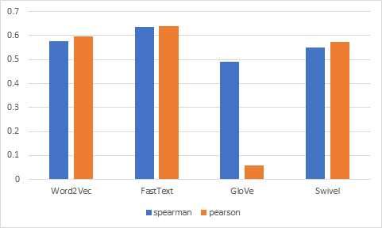
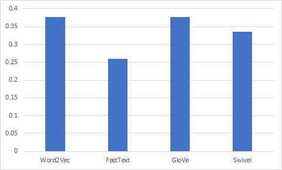

# 4.7 어떤 단어 임베딩을 사용할 것인가


* 자연어 단어 간 통사적(syntactic), 의미론적(semantic) 관계가 임베딩에 얼마나 잘 녹아 있는지 정량적으로 평가해보자. 크게 단어 유사도 평가(word similarity test) 와 단어 유추 평가(word analogy test) 가 있다.


## 4.7.1 단어 임베딩 다운로드


**코드 4-32 이미 학습된 단어 임베딩 다운로드 `bash`**

```bash
git pull origin master
bash preprocess.sh dump-word-embeddings
```

* `코드 4-32`를 실행하면 학습이 완료된 한국어 단어 임베딩을 다운로드할 수 있다. 4장에서 실습한 Word2Vec, FastText, GloVe, Swivel 네 종류가 포함돼 있다. 네개 모두 한국어 위키백과, 네이버 영화 리뷰 말뭉치, KorQuAD 말뭉치로 학습됐으며 그 차원 수는 100이다.


* 카카오 브레인 박규병님께서 한국어, 일본어, 중국어 등 30개 언어의 단어 임베딩을 학습해 공개했다. 모델은 주로 해당 언어의 위키백과 등으로 학습됐으며 벡터 차원 수는 100, 300 차원 두 종류가 있다. 
  * https://github.com//Kyubyong/wordvector


## 4.7.2 단어 유사도 평가


**표 4-6 단어유사도 평가 데이터셋(이동준 외. 2018)**

| 단어1  | 단어2  | 유사도 |
| ------ | ------ | ------ |
| 사랑   | 섹스   | 6.77   |
| 호랑이 | 고양이 | 7.35   |
| 호랑이 | 호랑이 | 10     |
| 책     | 종이   | 7.46   |
| 컴퓨터 | 키보드 | 7.62   |


* **단어 유사도 평가**는 일련의 단어 쌍을 미리 구성한 후에 사람이 평가한 점수와 단어 벡터 간 코사인 유사도 사이의 **상관 관계(correlation)**를 계산해 단어 임딩의 품질응ㄹ 평가하는 방법이다. 이동준 외(2018) 가 구축한 데이터셋을 바탕으로 평가를 진행한다. 이 데이터셋은 영어 임베딩 평가를 위해 만들어진 **WordSim** 이라는 데이터를 한국어로 번역해 구축한 것이다. **WordSim**데이터는 단어 간 유사도를 0~10점 척도로 사람이 직접 평가했다. 평가셋 건수는 총 322개이다.


**코드 4-33 단어 유사도 평가 데이터셋 다운로드 `bash`**

```bash
wget https://github.com/dongjun-Lee/kor2vec/raw/master/test_dataset/kor_ws353.csv 
-P /notebooks/embedding/data/raw
```


**코드 4-34 평가 클래스 로드 `python`**

```python
from models.word_eval import WordEmbeddingEvaluator

model_name = "word2vec"

if model_name == "word2vec":
	model = WordEmbeddingEvaluator(
			vecs_txt_fname = "data/word-embeddings/word2vec/word2vec",
			method = "word2vec", dim = 100, tokenizer_name = "mecab")
elif model_name == "fasttext":
	model = WordEmbeddingEvaluator(
			vecs_txt_fname = "data/word-embeddings/fasttext/fasttext.vec",
			vecs_bin_fname = "data/word-embeddings/fasttext/fasttext.bin",
			method = "fasttext", dim = 100, tokenizer_name = "mecab
elif model_name == "glove":
	model = WordEmbeddingEvaluator(
			vecs_txt_fname = "data/word-embeddings/glove/glove.txt",
			method = "glove", dim = 100, tokenizer_name = "mecab")
elif model_name == "sivel":
	model = WordEmbeddingEvaluator(
			vecs_txt_fname = "data/word-embeddings/swivel/row_embedding.tsv",
			method = "swivel", dim = 100, tokenizer_name = "mecab")
else:
	print("model name error!")
```

* 각 임베딩을 평가하기 위해서는 WordEmbeddingEvaluator라는 클래스를 선언해야한다. `코드 4-34`에서 클래스의 vecs_txt_fname을 임베딩 모델 경로로 맞추고, model_name을 각 임베딩 이름으로 바꿔주면 해당 임베딩 모델에 맞게 읽어 들인다. /notebooks/embedding 위치에서 실행한다.


**코드 4-35 단어 유사도 평가 수행 코드`python`**

```python
model.word_sim_test("data/raw/kor_ws353.csv")
```

* `코드 4-34`에서 내려받은 평가 데이터셋 경로를 인자로 하는 word_sim_test 함수를 호출하면 단어 유사도 평가가 시작된다. 평가는 `표 4-6`처럼 사람이 평가한 유사도 점수와 각 단어 벡터 쌍 간 코사인 유사도 사이의 상관관계를 계산하는 것으로 갈음한다. 상관관계 척도는 스피어만(spearman), 피어슨(pearson)을 사용하며 1에 가까울수록 둘 사이의 상관관계가 강하다는 뜻이다.


**그림 4-17 단어 유사도 평가 결과**



* Word2Vec과 FastText 같은 예측 기반 임베딩 기법들이 GloVe, Swivel 등 행렬 분해 방법들에 비해 상관관계가 상대적으로 강한 것을 알 수 있다. 평가 데이터셋 크기가 충분치 않아 조심스럽지만, 단어 유사도 평가 기준에 있어서는 예측 기반 임베딩 기법이 행렬 분해 방법들보다 의미적 관계가 잘 녹아 있다고 해석할 수 있다.


## 4.7.3 단어 유추 평가


**표 4-7 단어 유추 평가 데이터셋(이동준 외, 2018)**

| 갑       | 을   | 병     | 정     |
| -------- | ---- | ------ | ------ |
| 대한민국 | 서울 | 일본   | 도쿄   |
| 대한민국 | 서울 | 중국   | 베이징 |
| 대한민국 | 서울 | 미국   | 워싱턴 |
| 대한민국 | 서울 | 영국   | 런던   |
| 대한민국 | 서울 | 프랑스 | 파리   |


* **단어 유추 평가(word analogy test)**는 1장 서론에서 이미 소개했던 것처럼 `갑과 을의 관계는 정과 병의 관계와 같다`는 의미론적 유추에서 단어 벡터 간 계산을 통해 `갑-을+병`이라는 질의에 `정`을 도출해낼 수 있는지를 평가한다. 이 평가에서는 `갑-울+병`에 해당하는 벡터에 대해 코사인 유사도가 가장 높은 벡터에 해당하는 단어가 실제 `정`인지를 확인한다. 이동준 외(2018)는 구글에서 만들 Goolen anlogy를 참고해 단어 유추 평가를 위한 데이터셋을 구축해 공개했다. 평가셋 총 건수는 420개이다. 이 절에서는 이 데이터로 평가를 진행한다.


**코드 4-36 단어 유추 평가 데이터셋 다운로드 `bash`**

```bash
wget https://github.com/dongjun-Lee/kor2vec/blob/master/test_dataset/kor_analogy_semantic.txt -P /notebooks/embedding/data/raw
```


**코드 4-37 단어 유추 평가 수행 코드 `python`**

```python
model.word_analogy_test("data/raw/kor_analogy_semantic.txt", verbose=False)

#결과
# of correct answer:158 , # of data: 420 , # of errors:0
```


* 단오 유추평가 역시 평가 데이터셋과 단어 임베딩이 사전에 준비돼 있어야 한다. `코드 4-36`, `코드 4-32`를 실행하면 각각 평가 데이터셋과 단어 임베딩을 내려받을 수 있다. 이후 코드 `4-34`를 실행해 단어 임베딩 평가 클래스 WordEmbeddingEvaluator 를 선언하고 `코드 4-37`처럼 word_analogy_test 함수를 호출해 각 임베딩별로 평가를 시작한다.
* `코드 4-37`의 수행 결과는 Word2Vec 모델을 평가한 예시다. 실행 결과 가운데 "#of data" 와 "#of correct answer" 는 각각 전체 데이터와 정답을 맞춘 개수, "of errors" 는 해당 단어의 임베딩 벡터가 존재하지 않는 경우의 수를 가리킨다. verbose 옵션을 True로 켜 놓으면 모든 평가 데이터에 대해 `갑-을+병`에 해당하는 벡터와 코사인 유사도가 가장 높은 벡터에 해당하는 단어가 출력된다.


**그림 4-18 단어 유추 평가 결과**



* 맞춘 개수(#of correct answer) 를 처리 데이터 수(#of data - #of errors) 로 나눈 수치다.
* 단어 유추 평가에 있어서는 Word2Vec과 GloVe가 상대적으로 선방하고 있음을 확인할 수 있다.


## 4.7.4 단어 임베딩 시각화


* 시각화(visualization) 또한 단어 임베딩을 평가하는 한 방법이다. 의미가 유사한 단어를 사람이 쉽게 이해할 수 있는 형태의 그림으로 표현해 임베딩의 품질을 정성적, 간접적으로 확인하는 기법이다. 다만 단어 임베딩은 보통 고차원 벡터이기 때문에 사람이 인식하는 2, 3차원으로 축소해 시각화를 하게 된다. 이번 절에서는 Word2Vec을 기준으로 시각화하는 방법을 설명하겠다.


**코드 4-38 이미 학습된 단어 임베딩 다운로드 `bash`**

```bash
git pull origin master
bash preprocess.sh dump-word-embeddings
```


**코드 4-39 평가 클래스 로드 `python`**

```python
from models.word_eval import WordEmbeddingEvaluator
model = WordEmbeddingEvaluator("/notebooks/embedding/data/word-embeddings/word2vec/word2vec",
method = "word2vec", dim = 100, tokenizer_name = "mecab")
```

* 우선 `코드 4-38`을 실행해 시각화 대상 단어 임베딩을 확보한 후 `코드 4-39`를 입렬해 평가  클래스를 읽어 들인다. 물론 `코드 4-39`에 다른 종류의 임베딩을 인자로 주면 다른 임베딩을 시각화하는 것 역시 가능하다.


**코드 4-40 단어 임베딩의 t-SNE 2차원 시각화 `python`**

```python
model.visualize_words("data/raw/kor_analogy_semantic.txt")
```

* `코드 4-40`은 **t-SNE(t-Stochastic Neighbor Embedding)**를 적용해 고차원의 임베딩을 2차원으로 축소해 시각화하는 함수다. t-SNE는 고차원의 원공간에 존재하는 벡터 x의 이웃 간의 거리를 최대한 보존하는 저차원 벡터 y를 학습하는 방법론이다.
* 스토캐스틱(Stochastic)이란 이름이 붙은 이유는 거리 정보를 확률적으로 나타내기 때문이다. 원 공간의 데이터 확률 분포(P)와 축소된 공간의 분포 (Q) 사이의 차이를 최소화하는 방향으로 벡터 공간을 조금씩 바꿔 나간다. t-SNE는 보통 단어나 문장 임베딩을 시각화하는데 많이 쓰인다.


**그림 4-19 Word2Vec의 시각화 결과**


*  `그림 4-19`는 단어 유사도 평가 데이터셋에 포함된 단어들을 해당 임베딩의 벡터로 바꾼 후 t-SNE를 적용해 2차원으로 줄이고, 파이썬 시각화 라이브러리인 Bokeh의 도움을 받아 그림으로 나타낸 것이다. `코드 4-40`을 실행하면 확인할 수 있다.


**코드 4-41 단어 벡터 간 유사도 시각화 `python`**

```python
model.visualize_between_words("data/raw/kor_analogy_semantic.txt")
```


**그림 4-20 Word2Vec 단어 벡터간 유사도 시각화 결과**


* `코드 4-41`을 실행하면 `그림 4-20`처럼 단어 벡터 간 유사도 시각화 결과를 얻을 수 있다. visualize_between_words 함수는 단어 유사도 평가 데이터셋에 포함된 모든 단어 쌍 간 코사인 유사도를 구하고 이를 Bokeh 라이브러리로 그림으로 출력한다. 색이 보라색으로 진할수록 유사도가 높다. 
