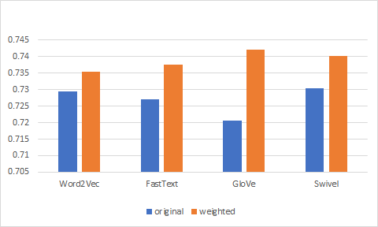

# 4.8 가중 임베딩


* 이번 절에서는 단어 임베딩을 문장 수준 임베딩으로 확장하는 방법을 설명한다.


## 4.8.1 모델 개요


* 연구팀은 문서 내 단어의 등장은 저자가 생각한 주제에 의존한다고 가정했다. 다시 말해 주제에 따라 단어의 사용 양상이 달라진다는 것이다. 이를 위해 연구팀은 주제 벡터(discourse vector) 라는 개념을 도입했다.


**수식 4-25 단어 등장 확률**


* 연구팀은 주제 벡터 c~s~가 주어졌을때 어떤 단어 w가 나타날 확률을 정의했다. `수식 4-25`에서는 c~s~(악센트) 는 c~s~로부터 어떤 절차를 거쳐 도출하는 벡터이긴 하나, 이 책에서는 설명의 편의를 위해 주제 벡터 c~s~와 거의 비슷한 역활응ㄹ 하는 임의의 어던 벡터라고 보겠다. Z는 `수식 4-25` 우변 두 번째 항이 확률 값이 되도록 해주는 노멀라이즈 팩터(normalize factor)다.
* `수식 4-25`를 직관적으로 이해해보면 이렇다. 우변의 첫번째 항은 단어 w가 주제와 상관없이 등장할 확률을 가리킨다. 한국어를 예로 들면 조사 `을/를`, `이/가` 같은 경우 P(w)가 높은 축에 속할 것이다. 우변 두번째 항은 단어 w가 주제와 관련을 가질 확률을 의미한다. 주제 벡터 c~s~(악센트) 와 w에 해당하는 단어 벡터 v~w~가 유사할수록(=내적 값이 클수록) 그 값이 커진다. 예컨대 주제가 `정치`인 상황에서 `사퇴`,`경제`에서 `인수`같은 단어가 우변 두 번째 항이 높은 축에 속할 것이다. 마지막으로 첫번째 항과 두번째항을 가중합을 취해 최종적인 등장 확률을 계산한다. α는 사용자가 지정하는 하이퍼파라미터다.


**수식 4-26 문장 등장 확률**


* 단어 시퀀스는 곧 문장이다. 문장 등장 확률(=단어들이 동시에 등장할 확률)은 문장에 속한 모든 단어들이 등장할 확률의 누적 곱으로 나타낼 수 있다. 그런데 확률을 누적해서 곱하는 것은 컴퓨터 연산에서 그 값이 넘 작아지는 언더플로(underflow) 문제가 발생하기 때문에, 보통은 로고를 취해 덧셈을 하는 것으로 대체한다. `수식 4-26`은 log P(w|c~s~)를 f~w~(c~s~(악센트))로 둬 정리했다.


**수식 4-27 단어 등장 확률의 테일러 근사**


* 테일러 급수(Talor series)는 항의 무한합으로 함수를 표현하는 한 방법이다. 테일러 급수를 쓰면 무한합의 n번째 항까지만 써서 원래 함수를 근사할 수 있다. 연구팀이 `수식 4-26`을 테일러 근사를 활용해 다시 적은 결과는 `수식 4-27`과 같다.


**수식4-28 단어의 등장 확률을 최대화하는 주제 벡터**


**수식 4-29 단어의 등장 확률을 최대화하는 주제 벡터**


* 우리가 관찰하고 있는 단어 w가 등장할 확률을 최대화하는 주제 벡터 c~s~/c~s~(악센트) 를 찾는 것이 목표다. w가 등장할 확률을 최대화 하는 c~s~/c~s~(악센트)를 찾게 된다면 이 c~s~/c~s~(악센트)는 해당 단어의 사용을 제일 잘 설명하는 주제 벡터가 될 것이다.
* `수식 4-28`은 `수식 4-27`의 (1-α)/αZ 를 α로 치환한 후 argmax를 취해 정리한 결과다. 그런데 연구팀에 따르면 임의의 상수(constant) C에 대해 argmax(C+ c · g) = g/∥g∥ 임이 성립한다고 한다. 따라서 우리는 우리가 관찰하고 있는 문장의 등장 확률을 최대한으로 높이는 주제 벡터를 `수식 4-29`와 같이 정리할 수 있다. (벡터 크기^norm^정규화는 생략)
* `수식 4-29`를 직관적으로 이해해보면 이렇다. 우리가 관찰하고 있는 문장이 등장할 확률을 최대화하는 주제 벡터 c~s~/c~s~(악센트)는 문장에 속한 단어들에 해당하는 단어 벡터에 가중치를 곱해 만들 새로운 벡터들의 합에 비례한다. 새로운 단어 벡터를 만들 때의 가중치는 해당 단어가 말뭉치에 얼마나 자주 등장하는지, 즉 P(w)를 감안해 만든다. 다시 말해 희귀한 단어(=P(w)가 작다)라면 높은 가중치를 곱해 해당 단어 벡터의 크기^norm^ 를 키우고, 고빈도 단어라면 해당 벡터의 크기를 줄인다.
* 이는 정보성이 높은, 희귀한 단어에 가중치를 높게 주는 TF - IDF의 철학과도 맞닿아 있는 부분이다. 아울러 문장 내 단어의 등장 순서를 고려하지 않는다는 점에서 백오브워즈 가정과도 연결되는 지점이 있다.


## 4.8.2 모델 구현


* 가중 임베딩을 구현한 클래스의 이름은 CBoWModel이다. Continuous Bag of Words Model이라는 취지에서 이렇게 이름을 붙였다. 문장을 토큰으로 나눈 뒤 해당 토큰들에 대응하는 벡터들의 합으로 문장의 임베딩을 구하기 때문이다. 단어의 등장 순서에 관계없기 때문에 Bag of Words, 해당 언어 벡터들이 연속적인 벡터 공간에 존재하기 때문에 continuous라는 개념어를 차용했다.
* 이 모델은 네이버 영화 말뭉치를 염두에 두고 만들었다. 이 데이터는 `문장(영화 댓글)+레이블(긍정/부정)` 구성으로 돼 있다. 모델은 학습 데이터 문장 각각을 해당 문장에 속한 토큰에 해당하는 벡터들의 (가중)합으로 표현하고, 레이블 정보 또한 같이 저장해 둔다. 이것이 CBowModel의 학습이다.
* 예측은 이렇게 한다. 테스트 문장이 들어오면 이 문장 또한 토큰 벡터의 (가중)합으로 만들고, 이 벡터와 코사인 유사도가 가장 높은 학습 데이터 문장의 임베딩을 찾는다. 이후 해당 학습 데이터 문장에 달려 있는 레이블을 리턴하는 방식이다. 예컨대 테스트 문장이 `이 영화 정말 재밌어요`이고 이 문장 임베딩과 가장 유사한 학습 데이터가 `이 영화 너무 재밌어요+긍정`이라면, CBoWModel은 테스트 문장을 `긍정`이라고 예측한다.


**코드 4-42 CBoWModel (1) - 선언부 `python`**

```python
class CBoWModel(object):

	def __init__(self, train_fname, embedding_fname,
				 model_fname, embedding_corpus_fname,
				 embedding_method = "fasttext", is_weighted = True,
				 average = False, dim = 100, tokenizer_name = "mecab"):
		#configurations
		make_save_path(model_fname)
		self.dim = dim
		self.average = average
		if is_weighted:
			model_full_fname = model_fname + "-weighted"
		else:
			model_full_fname = model_fname + "-original"
		self.tokenizer = get_tokenizer(tokenizer_name)
		if is_wrighted:
		# weighted embeddings
			self.embeddings = \
			  self.load_or_construct_weighted_embedding(embedding_fname,
			  embedding_method, embedding_corpus_fname)
			print("loading weighted embeddings, complete!")
		else:
			#original embeddings
			words, vectors = self.load_word_embeddings(embedding_fname,
													   embedding_method)
			self.embeddings = defaultdict(list)
			for word, vector in zip(words, vectors):
				self.embeddings[word] = vector
			print("loading original embeddings, complete!")
		if not os.path.exists(model_full_fname):
			print("train Continuous Bag of Words model")
			self.model = self.train_model(train_fname, model_full_fname)
		else:
			print("load Continuous Bag of Words model")
			self.model = self.load_model(model_full_fname)
```

* `코드 4-42`는 CBoWModel의 선언부다. 이 클래스가 호출되면 각종 설정 정보를 저장해두고 형태소 분석기를 읽어 들인다.(get_tokenizer) 그런데 4.8.1에서 설명한 사중 임베딩 방식이 얼마나 효과가 있는지 검증하기 위해 대조군(토큰 벡터의 단순 합)을 설정해 둘 필요가 있다. 이에 연구팀의 가중합 방식으로 임베딩을 만들 것인지(weighted = True) 아닌지에 따라 분기 처리가 될 수 있도록 했다.
* 전자라면 `코드 4-44`를 수행하고 후자라면 임베딩에 별도 처리를 하지 않고 그대로 읽어 들이기만 한다. 마지막으로 이렇게 단어 임베딩을 준비한 상태에서 CBoWModel을 한 번도 학습한 적이 없으면 모델을 학습하고(train_model), 이미 모델이 있다면 로드한다.(load_model).


**코드 4-43 CBoWModel (2) - 임베딩 학습 말뭉치 내 단어별 빈도 확인 `python`**

```python
def compute_word_frequency(self, embedding_corpus_fname):
		total_count = 0
		words_count = defaultdict(int)
		with open(embedding_corpus_fname, "r") as f:
			for line im f:
				tokens = line.strip().split()
				for token in tokens:
					words_count[token] += 1
					total_count += `
		return words_count, total_count
```

* `코드 4-43`과 `코드 4-44`는 CBoWModel의 핵심이다. 우선 `코드 4-43`에서 임베딩 학습 말뭉치에 쓰인 모든 문장, 모든 단어의 빈도를 일일이 세어 둔다. `코드 4-43`에 입력되는 데이터는 이미 형태소 분석이 완료됐다고 가정한다. 우리는 3장에서 각 단어 임베딩을 만들 때 한국어 위키백과, 네이버 영화 리뷰 말뭉치, KorQuAD 세 가지 데이터를 합쳐 사용했으므로 이 데이터들이 모두 `코드 4-43`의 입력값이 된다.


**코드 4-44 CBoWModel (3) - 가중 임베딩 만들기 `python`**

```python
def load_or_construct_weighted_embedding(self, embedding_fname, 													 embedding_method, 															 embedding_corpus_fname, a=0.0001):
        dictionary = {}
        if os.path.exists(embedding_fname + "-weighted"):
            # load weighted word embeddings
            with open(embedding_fname + "-weighted", "r") as f2:
                for line in f2:
                    word, weighted_vector = line.strip().split("\u241E")
                    weighted_vector = \
                    	[float(el) for el in weighted_vector.split()]
                    dictionary[word] = weighted_vector
        else:
            # load pretrained word embeddings
            words, vecs = self.load_word_embeddings(embedding_fname, 															embedding_method)
            # compute word frequency
            words_count, total_word_count =														self.compute_word_frequency(embedding_corpus_fname)
            # construct weighted word embeddings
            with open(embedding_fname + "-weighted", "w") as f3:
                for word, vec in zip(words, vecs):
                    if word in words_count.keys():
                        word_prob = words_count[word] / total_word_count
                    else:
                        word_prob = 0.0
                    weighted_vector = (a / (word_prob + a)) * np.asarray(vec)
                    dictionary[word] = weighted_vector
                    f3.writelines(word + "\u241E" + " ".join([str(el) for el in weighted_vector]) + "\n")
        return dictionary
```

* `코드 4-44`에서는 `코드 4-43`에서 확인한 임베딩 말뭉치 통계량을 바탕으로 가중 임베딩을 만든다. 우선 가중 임베딩을 만든 적이 있다면 계산하지 않고, 해당 임베딩을 그냥 읽어 들이기만 한다. 가중 임베딩을 한 번도 만든 적이 없다면 비로소 계산을 시작한다. 모든 단어 벡터 각각에 `수식 4-29`를 적용해 해당 단어 등장 확률을 반영한 가중치를 곱해 준다. 그 값은 a/(word_prob+a)이다. a는 상수로 취급하며 그 기본값은 0.0001이다. 가중 임베딩은 정해진  경로 (embedding_fname) + "-weighted")에 저장하고 딕셔너리 형태고 만들어 CBoWModel 학습에 쓸 수 있도록 한다.


**코드 4-45 CBoWModel (4) - 모델 학습 `python`**

```python
def train_model(self, train_data_fname, model_fname):
        model = {"vectors": [], "labels": [], "sentences": []}
        train_data = self.load_or_tokenize_corpus(train_data_fname)
        with open(model_fname, "w") as f:
            for sentence, tokens, label in train_data:
                tokens = self.tokenizer.morphs(sentence)
                sentence_vector = self.get_sentence_vector(tokens)
                model["sentences"].append(sentence)
                model["vectors"].append(sentence_vector)
                model["labels"].append(label)
                str_vector = " ".join([str(el) for el in sentence_vector])
                f.writelines(sentence + "\u241E" + " ".join(tokens) + "\u241E" + str_vector + "\u241E" + label + "\n")
        return model
```

* `코드 4-45`는 CBoWModel 의 학습 과정을 정의해 놓은 것이다. 형태소 분석이 완료된 영화 리뷰(token)에 `코드 4-46`에 정의된 get_sentence_vector를 적용해 문장 벡터로 만든다. 원 문장(sentence)과 형태소 분석된 문장(tokens), 극성 레이블(label)을 묶어 저장한다. 학습 데이터 모든 문장에 이 작업을 실시한다.


**코드 4-46 CBoWModel (5) - 문장 임베딩 만들기 `python`**

```python
 def get_sentence_vector(self, tokens):
        vector = np.zeros(self.dim)
        for token in tokens:
            if token in self.embeddings.keys():
                vector += self.embeddings[token]
        if not self.average:
            vector /= len(tokens)
        vector_norm = np.linalg.norm(vector)
        if vector_norm != 0:
            unit_vector = vector / vector_norm
        else:
            unit_vector = np.zeros(self.dim)
        return unit_vector
```

* `코드 4-46`은 단어 임베딩들의 합으로 문장 임베딩을 만드는 코드다. 만약 가중 임베딩을 쓴다면 (weighted = True) 이때 계속 더해지는 임베딩은 `코드 4-44`에서 만들었던 가중 임베딩일 것이다. 가중 임베딩을 쓰지 않는다면(False) 계속 더해지는 임베딩은 그 어떤 처리도 하지 않은 원본 벡터들이 된다. 예측 단계에서 코사인 유사도를 계산하기 편하도록 그 그 크기가 1인 단위 벡터(unit vector) 형태로 바꿔 리턴한다. `코드 4-46`은 CBoWModel 학습과 예측 단계에서 모두 공유한다.


**코드 4-47 CBoWModel (6) - 문장 1개 예측 `python`**

```python
def predict(self, sentence):
        tokens = self.tokenizer.morphs(sentence)
        sentence_vector = self.get_sentence_vector(tokens)
        scores = np.dot(self.model["vectors"], sentence_vector)
        pred = self.model["labels"][np.argmax(scores)]
        return pred
```

* `코드 4-47`에 정의된 예측 단계에서는 테스트 문장을 형태소 분석을 한 귀 get_sentence_vector를 적용해 문장 임베딩으로 변환한다. 이 문장 벡터(임베딩 차원 수 ) 와 학습 데이터 문장 임베딩 행렬(학습데이터 문장 수 × 임베딩 차원 수)을 내적(np.dot)하면 코사인 유사도 벡터(학습 데이터 문장 수)가 도출된다. get_sentence_vector 함수는 단위 벡터를 반환하고, 단위 벡터 간 내적은 곧 코사인 유사도이기 때문이다. 여기에 argmax를 취해 가장 큰 유사도를 가진 문장의 인덱스를 뽑아내 이 인덱스에 해당하는 학습 데이터의 레이블(긍정 혹은 부정)이 이 모델의 예측값(pred)이 된다. 이 예측값과 테스트 데이터에 달려 있는 정답이 일치하면 평가 점수를 1점 올린다.


**코드 4-48 CBoWModel (7) - 배치 단위 예측 `python`**

```python
def predict_by_batch(self, tokenized_sentences, labels):
        sentence_vectors, eval_score = [], 0
        for tokens in tokenized_sentences:
            sentence_vectors.append(self.get_sentence_vector(tokens))
        scores = np.dot(self.model["vectors"], np.array(sentence_vectors).T)
        preds = np.argmax(scores, axis=0)
        for pred, label in zip(preds, labels):
            if self.model["labels"][pred] == label:
                eval_score += 1
        return preds, eval_score
```

* 그런데 테스트할 데이터가 많으면 테스트 문장 벡터와 학습 데이터 임베딩 행렬을 내적하는 과정에서 병목이 생긴다. 파이썬 numpy 라이브러리는 행렬 - 행렬 내적 계산이 최적화돼 있으므로 테스트 데이터 문장 벡터 하나와 학습 데이터 행렬 내적을 여러 번하는 것보다는, 테스트 문장 벡터 여러 개를 묶어 행렬을 만들고 여기에 학습 데이터 행렬을 한 번 내적하는 것이 좀 더 효율적인 계산 방식이 될 수 있다. 이 경우 도출되는 코사인 유사도 행렬의 크기는 `학습 데이터 문장 수 × 테스트 데이터 문장 수 `가 된다. 여기에 argmax를 취하면 예측값 벡터(preds) 크기는 테스트 문장 수와 일치한다. 이를 각각의 정답(label)과 비교해 평가 점수를 만든다.


## 4.8.3 튜토리얼


**코드 4-49 CBoWModel 학습 데이터 다운로드 `bash`**

```bash
git pull origin master
bash preprocess.sh dump-processed
bash preprocess.sh dump-tokenized
bash preprocess.sh dump-word-embeddings
```

* 4.8.2절에서 구현한 CBoWModel을 직접 학습하고 임베딩 종류별로 평가해보자. `코드 4-49`를 실행하면 CBoWModel 학습에 필요한 말뭉치와 단어 임베딩을 내려받을 수 있다.


**코드 4-50 Word2Vec 임베딩을 활용한 CBoWModel 학습 및 평가 `bash`**

```bash
cd /notebooks/embedding
python models/word_utils.py \
	--train_corpus_path data/processed/processed_ratings_train.txt \
	--test_corpus_path data/processed/processed_ratings_test.txt \
	--embedding_path data/word-embeddings/word2vec/word2vec \
	--output_path data/word-embeddings/cbow/word2vec \
	--embedding_name word2vec --method cbow --is_weighted False
	
#결과
loading original embeddings, complete!
train Continuous Bag of Words model
evaluation start!
# of correct: 36468, total: 49997, score: 0.7294037642258535
```


**코드 4-51 Weighted Word2Vec 임베딩을 활용한 CBoWModel 학습 및 평가 `bash`**

```bash
cd /notebooks/embedding
python models/word_utils.py \
	--train_corpus_path data/processed/processed_ratings_train.txt \
	--test_corpus_path data/processed/processed_ratings_test.txt \
	--embedding_corpus_path data/tokenized/corpus_mecab.txt \
	--embedding_path data/word-embeddings/word2vec/word2vec \
	--output_path data/word-embeddings/cbow/word2vec \
	--embedding_name word2vec --method cbow --is_weighted True
	
#결과
oading weighted embeddings, complete!
train Continuous Bag of Words model
evaluation start!
# of correct: 36769, total: 49997, score: 0.7354241254475269
	
	
```

* `코드 4-50`과 `코드 4-51`은 각각 원본 임베딩, 가중 임베딩을 활용해 CBoWModel을 만드는 코드다. 네이버 영화 리뷰 말뭉치의 학습 데이터와 테스트 데이터의 위치를 각각 train_corpus_path, test_corpus_path 에 인자로 넣어준다. 원본 임베딩의 위치 (embedding_path), 원본 임베딩의 종류(embedding_name) 역시 입력해야 하며 CBoWModel 학습이 완료되면 모델은 output_path에 저장된다. CBoWModel을 학습할때 원본 임베딩을 쓰지(False), 가중 임베딩을 쓸지 (True)는 is_weighted에 정의해준다. 가중 임베딩을 쓸 경우 임베딩을 만들 때 사용한 말뭉치의 통계량을 확인해야 하기 때문에 embedding_corpus_path에 해당 말뭉치 경로를 추가로 입력해줘야 한다. corpus_mecab.txt를 만드는 방법은 `코드 4-2`를 참고하자.


**코드 4-52 Word2Vec, FastText, GloVe,Swivel 에 대한 CBoWModel 학습 `bash`**

```bash
git pull origin master
bash wordmodel.sh cbow
```


**그림 4-21 임베딩 종류별 CBoWModel 정확도**



* `코드 4-52`를 실행하면 4가지 임베딩 각각에 관해 원본, 가중 임베딩 방식의 CBoWModel 학습 및 평가를 한 번에 진행한다. 그 결과를 정리해 놓은 그래프가 바로 `그림 4-21`이다. `그림 4-21`을 보면 단어 벡터의 단순 합으로 해당 문장의 임베딩으로 사용하더라도 비교적 나쁘지 않은 분류 성능을 보일 수 있다. 품질 좋은 임베딩만 확보돼 있다면 복잡한 모델을 쓰지 않고서도 원하는 태스크를 수행할 수 있다는 이야기다. 아울러 가중 임베딩 방식의 정확도가 임베딩 종류를 가리지 않고 원본보다 높다. 가중 임베딩 방식을 현업에서 써볼 만하다.